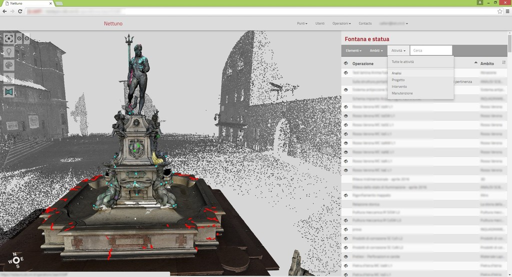
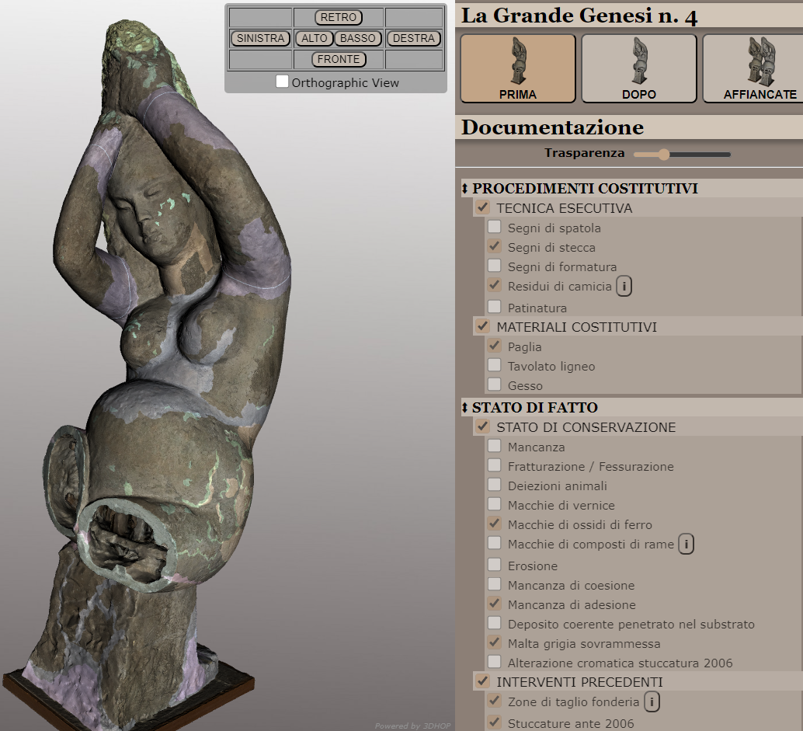

### Description

From Grant Agreement:

“This task will define, implement, and deploy the VA for the CRP. The
CRP’s main innovative aspect involves the use of efficient 3D
technologies for indexing, mapping and collecting heritage science data,
like the results of investigations and analysis, and visual information
over the HDT (8.2.1). It will provide functionalities for intelligent
snapping and refinements for annotation onto 3D models and the
time-aware management of visual annotations.”

This Vertical Application is an online, web-based tool for the
collaborative annotation of 3D assets, primarily designed to help the
workflows in conservation-restoration.

The core idea of this platform is a 3D-centric management of the data,
referencing all the annotations to a 3D reference space and 3D surface
of digital representations of CH objects.

Using advanced multiresolution techniques, and specialized 3D
visualization, it is possible to work on complex, high-resolution 3D
assets of CH objects, enabling the users to annotate directly on
detailed geometries from the browser, in a collaborative, multi-user
environment.

The platform allows the users to set up a project by defining
hierarchical roles and tasks, to establish a working area populated with
3D assets, and to define the semantic mapping of the annotations.

Advanced editing function enables the users to trace spatial annotations
onto the geometries of 3D assets with multiple primitives (points,
polylines, areas) and then map these annotations to semantic data. The
semantic mapping links spatial annotations to the concepts used in the
project, and ensures interoperability across tools and institutions. The
3D spatial nature of these annotations makes them metric, enabling an
easy and accurate extraction of measurements and statistics.

Annotations and mappings can be browsed and are presented online
interactively, they can be exported as 3D structures to other tools, but
also used to generate structured documentation output.

Provisional name: **OCRA** - **O**nline **C**onservation-**R**estoration
**A**nnotator.

*A presentation of this VA can be found in the Teams WP08 folder.*

|  |
|----|
|  |
| Examples of online systems mapping with spatial annotations on 3D surfaces with semantic-rich data describing conservation-restoration actions. |

### Scope, context, and concepts

This VA is primarily oriented in managing 3D assets of “objects”, i.e.,
entities that exists on their own, and can be represented effectively
with the kind of non-structured, non-semantic 3D models produced by 3D
scanning and photogrammetry (unstructured, dense polygonal meshes). This
category encompasses a variety of CH objects like movable artefacts
(from small to large), statues, architectural elements, portions of
built structures. This concept is not limited by size, but more by
identity / purpose / point of view. This annotation workflow treats the
CH object as a geometric entity, without other levels of representation
and meaning. In this sense, it would not be a problem to manage a
façade, an intricately carved column, or a large fountain, but it would
be well suited to manage a structured *building* (i.e., where the focus
of the work would also need to consider what makes a structure a
*building*, from its geographical presence to its functional structure).
The aim of this VA is not to replicate or surpass what is already
available in BIM or GIS tools, that are used to manage annotations and
information mapping on architectural structures and terrains from a
different perspective. Similarly, restoring an antique steam engine or a
clock mechanism, taking care also of their workings, would probably
require a completely different kind of digital representation, and a set
of instruments normally found in parametric CAD tools. While the support
of this class of objects this could be useful, the initial focus of this
VA is the management of non-structured, typical result of 3D scanning
acquisition campaigns.

In the context of this VA, a *spatial 3D annotation* is a geometrical
data structure that describes a location or part of a 3D surface. 3D
annotation can be represented as a collection of points, and/or
polylines and/or areas, marked on the surface of a 3D model. This
geometric information exists and is referenced in the 3D space of the
asset. This spatial annotation data structure is then connected to
semantic concepts that have a specific *meaning* in the framework of the
specific project, like, for example, the kind of material of a specific
part expressed using a standard reference thesauri.

To populate the workspace, and as target of the spatial 3D annotations,
the VA will use 3D assets created through digitization, primarily via 3D
scanning and/or photogrammetry. These 3D models only represent the
visible surface of the object, as a thin shell of triangles; even in
those cases where the surface is completely closed, the inner volume is
not explicitly represented. Moreover, due to the limitations of said
digitization technologies, some parts of the physical object might not
be represented in the 3D model, because the area was occluded, not
reached by the sensor or made of an uncooperative material. This limited
representation will also limit the placement and management of 3D
spatial annotations. The VA will only allow the annotation of the
surface of the 3D models, thus limiting the geometrical mapping of
annotation process to the external, visible surface of the objects.
While it is technically possible to add geometric entities “inside” the
objects, or on areas not explicitly represented in the 3D model, this
would significantly complicate the interface, making it less usable, and
would break the idea of visually annotate the objective data.

In this description of the VA, the terms “map” and “mapping” are used
with different meanings and contexts, causing ambiguity. The following
examples will try to clarify the more common meaning of the words used
in this document.

- *A 3D spatial annotation is mapped on a 3D asset*: it means that the
  geometric information in the annotation data structure is in the 3D
  space of the asset.

- *An annotation is* *semantically-mapped*: it means the annotation data
  structure is linked to a semantic concept in the project ontology, and
  in the knowledge base.

- *Mapping the condition of a CH object*: it means to use spatial
  annotations to mark, on the 3D asset surface, the location/extent of a
  specific alteration of the object. Thus, producing a visual/geometric
  “condition map”.

### Use Scenarios 

The Collaborative Conservation-Restoration Platform is primarily focused
at helping the standard workflow of conservator-restorers.

**Assessment of the condition of a CH object**. The 3D spatial
annotations are suitable to map onto the 3D surface of the CH object all
the analyses, autoptic observation, and notes taken during the field
assessment. The platform can effectively support and store the mapping
of alteration over the 3D surface.

**Documenting** **a conservation-restoration action**. A
conservation-restoration action produces a large amount of
documentation. The platform, through the mapping on the 3D asset, can
help organize the corpus of data in a spatial way, following the
workflow of object study and analyses, mapping of degradation,
conservation–restoration action, assessment of the result.

**Monitoring** a CH object. By comparing successive data mappings, it is
possible to assess the evolution of the condition of an object and track
changes of the condition across time.

While designed to support the work of conservation-restoration, the
platform can also be exploited in different ways, building on the idea
of a flexible, semantic system to annotate 3D assets of CH objects:

**Spatial study of a CH object**. Being able to spatially explore the 3D
asset and annotate its surface using semantically-rich data makes it
possible to use the 3D data as a support to study the geometry and
appearance characteristics of a CH object. The user can use annotations
on the surface of the object to mark ROIs, highlight traces of its
manufacturing process, add spatial notes, and assign specific semantic
meanings to its parts.

**Annotation for dissemination purposes**. The annotations over a 3D
asset produced using this tool can then be used in interactive systems
oriented to teaching and public engagement, to convey specific,
localized information on the very geometry of the object.

### Key features and functionalities

**3D-centric.** 3D is the core of the project, all the annotations must
be mapped in a 3D reference space, on the 3D surface of the 3D models of
the artefact. All data mapped in the system is somehow referenced into
this working space and can be explored and visualized spatially.

**Hierarchical, collaborative approach**. The tool supports
collaborative work of multiple users using a hierarchical paradigm. The
project leader, at the start of the project, defines a hierarchy of
roles, to support the collaborative interaction, task assignment and
coordination, and track the provenance of authored data.

**Customizable workspace**. The workspace of the project is defined as a
3D reference space, populated by 3D assets. The project leader, and a
small group of administrators, setup this space and assets at the
beginning of the project.

**Semantic management of annotations**. All the information mapped onto
the 3D space needs to be semantically mapped. The platform supports the
definition of project-specific ontologies for the information needed by
the specific case or institution, starting from standardized ontologies
and vocabularies.

**Output of reporting data**. The platform supports interactive
visualization and browsing of the annotations directly in the 3D space,
but also exporting of reports in the form of 2D raster and vector
representation, to be compatible with those parts of the documentation
workflows that require 2D representation (digital or physical), and to
fulfill legal/national requirements of producing 2D representation as
official documentation.

### Technical requirements

The platform will exploit services offered by the ECCCH platform:

- **Identity / login**: the users will authenticate through the ECCCH,
  and maintain their identity throughout the project using the support
  of ECCCH unified EU-wide identity provider.

- **Storage**: the platform uses ECCCH storage services in different
  ways. The 3D assets to be annotated may come from datasets already in
  ECCCH or, once uploaded by the creator of the project, they should
  become part of ECCCH. Similarly, the project space used to carry out
  the annotation and reporting, and where the working data is stored is
  part of ECCCH.

- **Knowledge Base**: all the 3D annotations are semantically mapped.
  While each CH institution has its own standards, everything must be
  interoperable at EU level, and must be mapped on ECCCH knowledge base
  for interoperability.

- **Visualization components**: the 3D data is visualized and
  manipulated using the components and libraries provided by ECCCH. Some
  of the specific interaction mechanisms, e.g., the process of 3D area
  mappings may also rely on components and libraries provided by ECCCH.

#### Deployment. 

The ideal deployment scheme for this VA could be as a service, running
on a server that is part of ECCCH. With the idea of a federated cloud,
it might be possible to think of having multiple instances of the web
application running on servers in different nations/institutions, all
connected to the same infrastructure.

Ideally, this VA should exist as a package that can be installed and
configured.

Each instance (*shard*) of the service would then run independently but
still using ECCCH as the main infrastructure for identity/login,
storage, semantic (knowledge base). Users would choose which shard to
use, based on multiple factors (location, national rules and
limitations, availability). Each project would be managed by an
individual shard but, ideally, the data produced (e.g., the annotations
and 3D-mapped information) should later be accessible via ECCCH from
other shards of the same VA, or by other tools/services.

#### Data Management.

The VA will have to deal with different classes of data.

**The 3D data used as a substrate/reference space for the annotations**.
This is the core 3D used in visualization, to display the CH objects,
and as a base to create the annotations. It is also used internally as
3D geometrical information for measurement and geometrical processing
purposes.

For visualization and interaction purposes, as the VA works as an online
tool, this 3D data should be available in a format that is suitable for
remote streaming and rendering. This means that the file(s) must reside
on a web server, accessible to the web application. This storage and
access paradigm is the most basic one, and will be certainly needed in
this VA, to enable most of the functionalities.

Depending on the needed VA features, some geometrical
checks/measurements/processing may also require direct access to the
whole geometric/texture dataset, and computational power to carry out
the operation. This would require a different storage method, and the
possibility of having services that, on demand, would apply the required
operation/calculation, and send the result to the web-app.

Ideally, the 3D models should already be part of ECCCH (i.e., exist as
entities in the knowledge graph). If not, the possible choices are: (a)
the VA has to provide an assisted workflow to add a new 3D model to
ECCCH, (b) the model has to be added to ECCCH via other tools, and then
will be available from within the VA, (iii) this VA also supports models
that are not part of ECCCH but hare somehow accessible with the same
paradigms highlighted above.

**The “project” data**. This is the information that defines the
specific instance of the annotation workflow: the project leader, with
all the individuals involved and their hierarchy/roles; the 3D working
space, with all the 3D models used; all the project-related settings.
This data also includes the ontology specific to the project, i.e., the
concepts and terms of the project mapped on ECCCH knowledge base.

This data must clearly be associated with the shard that is on the
server that is managing the project. Data can be stored on that specific
server, or as an entity on ECCCH.

**The annotation data**. This contains all the user-generated
geometric/semantic information that make up the annotations. This is the
actual bulk of the user-created information, that can be seen as new
knowledge associated to the 3D model(s) as a result of the use of this
VA.

This kind of data, as in the previous class, is associated to the
specific project, and thus to the specific server managing the project.
However, the 3D-mapped annotations can also have a wider meaning as data
associated to the 3D model(s): in this sense, the annotations/mappings
may exist also as individual entities of the knowledge graph.

As these last two categories (project + annotation data) can be seen as
an interconnected dataset, and they make sense as a whole, it might be
possible to collate and manage them together.

**Any other data linked to / mapped by the annotations**. This includes
documents and information referenced in the annotations metadata and

This last class can be managed, for the most part, independently from
the rest of the data, and may or may not be part of ECCCH. However,
having all data linked to the annotations on ECCH would provide a deeper
level of connection and expressiveness.

Most of this external data may be referenced with an URI or some other
identifier.

As an exception, 2D data that is referenced to the 3D space, and used as
a support for annotations will require a management similar to the 3D
models described above, to be used for streaming, realtime visualization
(and maybe computation).

### Implementation 

The platform will heavily use multiresolution techniques, to manage
high-resolution 3D assets, transmit the data effectively over the
network, and efficiently render it for interactive inspection, measuring
and annotation.

NEXUS is a development library already used in similar projects to
manage multiresolution data, developed by ISTI-CNR.

http://vcg.isti.cnr.it/vcgtools/nexus/

The 3D frontend of the web application will manage the interactive
visualization of 3D data, navigation and manipulation of the 3D space
and 3D assets, and provide the interface for tracing the annotations.
The development of this frontend, based on HTML5 and WebGL, is a complex
task that can be simplified by using one of the available
tools/frameworks designed to this aim.

3DHOP is a framework developed by ISTI-CNR to create web-based
interactive visualization of high-resolution 3D data for the Cultural
Heritage Field.

<https://3dhop.net/>

### Bibliography

3DHOP: 3D heritage online presenter

M. Potenziani, M. Callieri, M. Dellepiane, M. Corsini, F. Ponchio, R.
Scopigno

Computers & graphics 52, 129-141, 2015

Multiresolution and fast decompression for optimal web-based rendering

F. Ponchio, M. Dellepiane

Graphical Models 88, 1-11, 2016

A 3D-centered information system for the documentation of a complex
restoration intervention

F.I. Apollonio, V. Basilissi, M. Callieri, M. Dellepiane, M. Gaiani, F.
Ponchio, F. Rizzo, A. R. Rubino, R. Scopigno

Journal of Cultural Heritage 29, 89-99, 2018

Effective annotations over 3D models

F Ponchio, M Callieri, M Dellepiane, R Scopigno

Computer Graphics Forum 39 (1), 89-105, 2020

A digital platform for the centralization and long-term preservation of
multidisciplinary scientific data belonging to the Notre Dame de Paris
scientific action

A. Néroulidis, T. Pouyet, S. Tournon, M. Rousset, M. Callieri, A.
Manuel, V. Abergel, O. Malavergne, I. Cao, R. Roussel, X. Granier, X.
Rodier, L. De Luca

Journal of Cultural Heritage 65, 210-220, 2024
