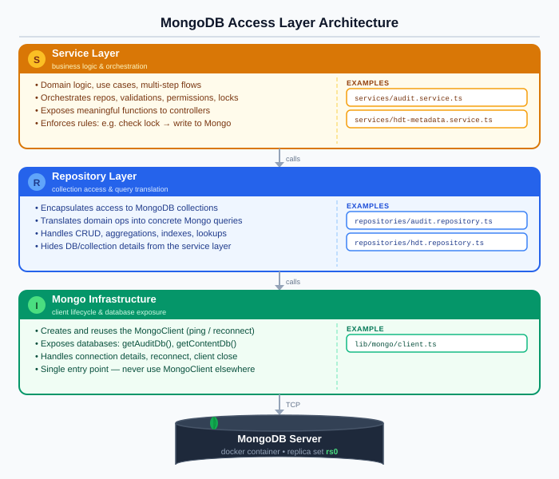
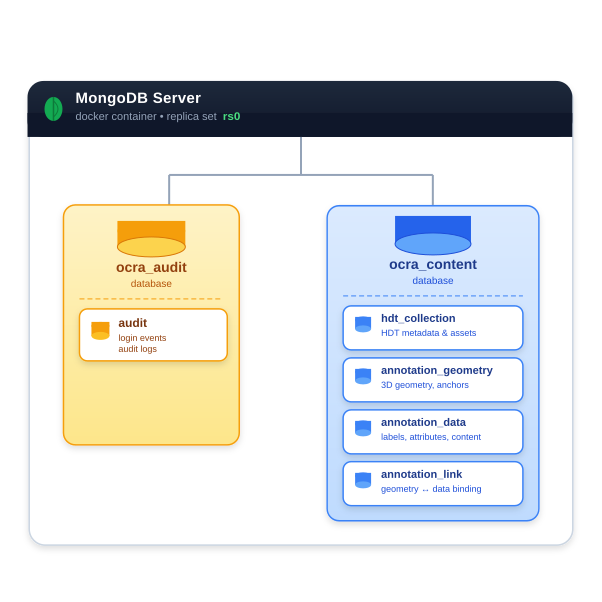

# Annotation API

## Introduction

This document defines the Annotation API for OCRA. It is described along two complementary dimensions:

- **Backend API**: internal operations used by backend components to manage the lifecycle of annotation entities (`annotationGeometry`, `annotationData`, `annotationLink`) and to integrate annotation logic into broader project workflows.
- **REST API (Frontend)**: authenticated HTTP endpoints that expose selected backend operations to the frontend.

The backend API is implemented across **three technical layers**, each with a single, well-defined responsibility:

- **Mongo Infrastructure** (`lib/mongo/`) manages the MongoDB client lifecycle — creating and reusing the `MongoClient`, handling connection details and reconnects, and exposing the two application databases (`getAuditDb()`, `getContentDb()`). No other layer should instantiate a `MongoClient` directly.
- **Repository Layer** (`repositories/`) encapsulates all access to individual MongoDB collections. Each repository translates domain operations into concrete MongoDB queries, handles CRUD, aggregations, indexes, and lookups, and hides all database and collection details from the layer above.
- **Service Layer** (`services/`) contains all business logic and orchestration. It calls one or more repositories, enforces cross-collection invariants, checks and manages session locks, and exposes meaningful operations to controllers. This is the layer that guarantees system-wide consistency.



### Database Layout

The backend uses two dedicated MongoDB databases, both hosted in the same container and replica set:

- **`ocra_audit`** — append-only audit trail. Contains login events, admin actions, and audit logs. Write-once and compliance-oriented.
- **`ocra_content`** — all mutable application data. Contains the collections `hdt_collection`, `annotation_geometry`, `annotation_data`, and `annotation_link`.



The split is logical, not physical: no extra infrastructure is required. It provides a clear ownership boundary, separate backup and retention strategies, and a foundation for future per-concern replica or shard policies.

### API Organization in This Document

This document is organized primarily as a content index, in the same order in which the sections appear:

- **Backend API / Annotation editing**: the main service-layer operations for validation, import/export, scene-aware reads, and per-entity mutations.
- **Repository Layer**: the low-level MongoDB operations for `annotationGeometry`, `annotationData`, and `annotationLink`.
- **Mongo Infrastructure**: the shared MongoDB client and database-access utilities.
- **REST API (Frontend)**: the authenticated HTTP endpoints exposed to frontend clients.
- **Project Structuring Backend API**: backend-only operations for reading-session coordination, Social Lock presence, and destructive cleanup after project, scene, or asset deletion.

Two cross-cutting distinctions still matter throughout the document:

- **Exposure surface**: some APIs are backend-only, while others are exposed as REST endpoints for the frontend.
- **Backend functional area**: backend operations belong either to annotation editing or to project structuring.

Within the backend API, the technical layering remains explicit:

- **Service Layer**: orchestration and business rules across collections.
- **Repository Layer**: single-collection MongoDB access.
- **Mongo Infrastructure**: MongoDB client lifecycle and database access.

All operations that mutate `annotationGeometry`, `annotationData`, or `annotationLink` use **optimistic concurrency control** (OCC): a conditional write based on `expectedVersion` ensures that a stale client cannot silently overwrite a more recent state. `updatedAt` remains available for audit and debugging, but it is not the OCC token. See [Collaborative Annotation Editing](collaborative-annotation-editing.md) for the full concurrency model.

All timestamps are server-assigned. All identifiers are treated as opaque strings. All operations are scoped to a `projectId`.

---

## Backend API

The backend API is the internal annotation API used by OCRA services and controllers. It is divided functionally into **project structuring** and **annotation editing**, and implemented technically across the Service, Repository, and Mongo Infrastructure layers.

### Service Layer

The Service Layer (`services/`) contains all business logic and orchestration. It calls repositories, enforces cross-collection invariants, validates pre-conditions, manages session locks, and exposes meaningful operations to controllers. This is the layer that guarantees system-wide consistency.

**Annotation Editing Backend API.** These operations implement annotation-editing workflows. They cover scene-aware reads, per-entity mutations, and import/export flows used by editors and other annotation-aware services.

#### Maintenance Operations

##### `validateLink(projectId, linkId): ValidationReport`

Verifies all invariants for a given `annotationLink`:

1. Referential integrity: both referenced entities exist and belong to the same project.
2. Uniqueness: the (`geometryId`, `dataId`) pair is not duplicated.
3. Scene consistency: the geometry–data scope combination satisfies the [scene consistency rules](annotation-model.md#scene-consistency-rules).

Returns a structured `ValidationReport` listing any violated constraints.

---

##### `validateAllLinks(projectId?): ValidationReport[]`

Runs `validateLink` on every `annotationLink` in the project (or across all projects if `projectId` is omitted). Intended for data integrity audits and post-migration verification.

---

##### `deleteOrphanedGeometries(projectId): number`

Physically deletes all `annotationGeometry` documents in the project that are both `erasable` and have zero incoming `annotationLink` records.

Returns the count of deleted documents.

> This is a garbage-collection operation, not a user-facing endpoint.

---

##### `deleteOrphanedData(projectId): number`

Physically deletes all `annotationData` documents in the project that are both `erasable` and have zero incoming `annotationLink` records.

Returns the count of deleted documents.

> This is a garbage-collection operation, not a user-facing endpoint.

---

#### Import and Export

##### `exportAnnotationsForScene(projectId, sceneId, format?): ExportDocument`

Exports all annotations visible in a given scene as a structured document. Resolves geometry, data, and link records into a single payload. Useful for reporting, archiving, or interoperability with external tools.

Supported formats: `json` (default), `csv`.

---

##### `importAnnotations(projectId, payload, sceneId?): ImportSummary`

Imports a structured set of annotation records (geometry, data, links), validating all invariants before persisting any document. The import may optionally be scoped to a specific scene.

| Field | Description |
| --- | --- |
| `imported` | Number of records successfully created |
| `skipped` | Number of records not created because they already exist |
| `rejected` | Number of records rejected due to constraint violations |
| `errors` | List of validation errors per rejected record |

---

#### Scene-Aware Read Queries

All read operations return only `non-erasable` `annotationLink` records by default. For `annotationGeometry` and `annotationData`, normal reads return `non-erasable` entities and `erasable` entities that still have at least one incoming non-erasable `annotationLink`, unless `includeErasable: true` is passed. Editor-oriented reads should pass this flag to allow display and restoration of pending-erasure entities.

When `includeErasable: true` is enabled, these queries may also surface `erasable` entities that no longer have incoming links but are still physically present in the database because garbage collection has not run yet. This visibility is temporary: once a fully detached `erasable` entity is physically removed by maintenance, it disappears from query results entirely. The flag does not preserve or resurrect entities after deletion.

For visibility purposes, only non-erasable links count toward reachability. Having only incoming links that are themselves `erasable` is equivalent to having zero incoming links.

These queries are implemented at the service layer because they cross multiple repositories.

**`annotationGeometry` Reads**

##### `getAnnotationGeometry(projectId, geometryId, includeErasable?): annotationGeometry`

Returns a single `annotationGeometry` element identified by `geometryId`.

---

##### `getAnnotationGeometriesForScene(projectId, sceneId, includeErasable?): annotationGeometry[]`

Returns all `annotationGeometry` elements whose `referenceType == "scene"` and `referenceId == sceneId`.

---

##### `getAnnotationGeometriesForAsset(projectId, assetId, includeErasable?): annotationGeometry[]`

Returns all `annotationGeometry` elements whose `referenceType == "asset"` and `referenceId == assetId`.

---

##### `getAnnotationGeometriesForSceneAssets(projectId, sceneId, sceneAssetIds[], includeErasable?): annotationGeometry[]`

Returns all `annotationGeometry` elements that reference either the scene itself or any of the assets currently present in the scene.

**System actions:**
1. Call `findAnnotationGeometriesByReference(projectId, "scene", sceneId)`.
2. Call `findAnnotationGeometriesByReferenceIds(projectId, "asset", sceneAssetIds)`.
3. Merge and return.

---

**`annotationData` Reads**

##### `getAnnotationData(projectId, dataId, includeErasable?): annotationData`

Returns a single `annotationData` element identified by `dataId`.

---

##### `getAnnotationDataForScene(projectId, sceneId, includeErasable?): annotationData[]`

Returns all `annotationData` elements whose `visibilityType == "scene"` and `visibilityId == sceneId`.

---

##### `getAnnotationDataForAsset(projectId, assetId, includeErasable?): annotationData[]`

Returns all `annotationData` elements whose `visibilityType == "asset"` and `visibilityId == assetId`.

---

##### `getAnnotationDataForSceneAssets(projectId, sceneId, sceneAssetIds[], includeErasable?): annotationData[]`

Returns all `annotationData` elements visible within a given scene (scoped to the scene itself or any of its assets).

**System actions:**
1. Call `findAnnotationDataByVisibility(projectId, "scene", sceneId)`.
2. Call `findAnnotationDataByVisibilityIds(projectId, "asset", sceneAssetIds)`.
3. Merge and return.

---

**`annotationLink` Reads**

##### `getAnnotationLink(projectId, linkId, includeErasable?): annotationLink`

Returns a single `annotationLink` identified by `linkId`.

---

##### `getAnnotationLinksForProject(projectId, includeErasable?): annotationLink[]`

Returns all `annotationLink` records associated with the given project. Used for full project exports and integrity audits.

---

##### `getAnnotationLinksForGeometry(projectId, geometryId, includeErasable?): annotationLink[]`

Returns all links referencing a specific `annotationGeometry`.

---

##### `getAnnotationLinksForData(projectId, dataId, includeErasable?): annotationLink[]`

Returns all links referencing a specific `annotationData`.

---

##### `getAnnotationLinksForScene(projectId, sceneId, includeErasable?): annotationLink[]`

Returns all `annotationLink` records that reference the given scene (through geometry or data).

**System actions:**
1. Collect geometry ids: `findAnnotationGeometriesByReference(projectId, "scene", sceneId)`.
2. Collect data ids: `findAnnotationDataByVisibility(projectId, "scene", sceneId)`.
3. Return links via `findAnnotationLinksByGeometryIds` ∪ `findAnnotationLinksByDataIds`.

---

##### `getAnnotationLinksForAsset(projectId, assetId, includeErasable?): annotationLink[]`

Returns all `annotationLink` records that reference the given asset (through geometry or data).

**System actions:**
1. Collect geometry ids: `findAnnotationGeometriesByReference(projectId, "asset", assetId)`.
2. Collect data ids: `findAnnotationDataByVisibility(projectId, "asset", assetId)`.
3. Return links via `findAnnotationLinksByGeometryIds` ∪ `findAnnotationLinksByDataIds`.

---

##### `getAnnotationLinksForSceneAssets(projectId, sceneId, sceneAssetIds[], includeErasable?): annotationLink[]`

Returns all `annotationLink` records visible within a given scene, including links involving assets present in the scene.

**System actions:**
1. Collect all geometry ids for the scene and its assets.
2. For each geometry, collect matching links.
3. Retain only those links whose `annotationData` is visible in the scene or in one of the scene's assets.

**Post-conditions:** every returned link satisfies one of the four scene consistency combinations in the [annotation model](annotation-model.md#scene-consistency-rules).

---

#### Per-Entity Mutations

These operations create, update, or change the erasability state of individual annotation entities. Each mutating write is conditional on `expectedVersion` for OCC. Pre-conditions are validated at the service layer before the repository is called.

**`annotationGeometry` Mutations**

##### `createAnnotationGeometry(projectId, shapes, referenceType, referenceId): string | null`

Creates a new `annotationGeometry` element.

**Pre-conditions:**
- `projectId` must reference an existing project.
- `referenceType` must be `"scene"` or `"asset"`.
- `referenceId` must reference an existing `HDTScene` or `DigitalAsset`.
- `shapes` must be a non-empty array of valid shape objects.

**System actions:**
1. Generate a new unique `id`.
2. Call `insertAnnotationGeometry` with `version = 0` and server-assigned timestamps.

**Returns:** `id` on success; `null` if the element already exists.

---

##### `updateAnnotationGeometryShapes(projectId, geometryId, expectedVersion, newShapes): number | false`

Updates the `shapes` field of an existing `annotationGeometry`.

**Pre-conditions:**
- `geometryId` must reference an existing `annotationGeometry`.
- `newShapes` must be a non-empty array of valid shapes.

**System actions:** call `conditionalUpdateAnnotationGeometry` with filter `{ id, version: expectedVersion }` and update `{ $set: { shapes: newShapes, updatedAt, updatedBy }, $inc: { version: 1 } }`.

**Returns:** the new `version` on success; `false` on OCC mismatch or not found.

---

##### `markAnnotationGeometryErasable(projectId, geometryId, expectedVersion): number | false`

Transitions an `annotationGeometry` to the `erasable` state.

**System actions:** conditional update setting `erasableAt`, `erasableBy`, incrementing `version`, and updating `updatedAt`/`updatedBy`.

**Returns:** the new `version` on success; `false` otherwise.

---

##### `markAnnotationGeometryNonErasable(projectId, geometryId, expectedVersion): number | false`

Restores an `annotationGeometry` to the `non-erasable` state.

**Pre-conditions:** `annotationGeometry.erasableAt` must not be `null`.

**System actions:** conditional update setting `erasableAt = null`, `erasableBy = null`, incrementing `version`, and updating `updatedAt`/`updatedBy`.

**Returns:** the new `version` on success; `false` otherwise.

---

**`annotationData` Mutations**

##### `createAnnotationData(projectId, label, description, class, content, visibilityType, visibilityId): string | null`

Creates a new `annotationData` element.

**Pre-conditions:**
- `projectId` must reference an existing project.
- `label` must be a non-empty string.
- `visibilityType` must be `"scene"` or `"asset"`.
- `visibilityId` must reference an existing `HDTScene` or `DigitalAsset`.

**System actions:** call `insertAnnotationData` with `version = 0` and server-assigned timestamps.

**Returns:** `id` on success; `null` if the element already exists.

---

##### `updateAnnotationData(projectId, dataId, expectedVersion, label?, description?, class?, content?): number | false`

Updates one or more mutable fields (`label`, `description`, `class`, `content`). `visibilityType` and `visibilityId` are immutable — to move a data record to a different scope, create a new `annotationData`, update the links, and mark the old record as `erasable`.

**System actions:** call `conditionalUpdateAnnotationData` with only the provided mutable fields in the `$set`, plus `version` increment and timestamp update.

**Returns:** the new `version` on success; `false` otherwise.

---

##### `markAnnotationDataErasable(projectId, dataId, expectedVersion): number | false`

Transitions an `annotationData` to the `erasable` state.

**System actions:** conditional update setting `erasableAt`, `erasableBy`, incrementing `version`, and updating `updatedAt`/`updatedBy`.

**Returns:** the new `version` on success; `false` otherwise.

---

##### `markAnnotationDataNonErasable(projectId, dataId, expectedVersion): number | false`

Restores an `annotationData` to the `non-erasable` state.

**Pre-conditions:** `annotationData.erasableAt` must not be `null`.

**System actions:** conditional update setting `erasableAt = null`, `erasableBy = null`, incrementing `version`, and updating `updatedAt`/`updatedBy`.

**Returns:** the new `version` on success; `false` otherwise.

---

**`annotationLink` Mutations**

##### `createAnnotationLink(projectId, geometryId, dataId): string | null`

Creates a new `annotationLink` associating one geometry element with one data record.

**Pre-conditions:**
1. `geometryId` must reference an existing `annotationGeometry` in the project.
2. `dataId` must reference an existing `annotationData` in the project.
3. The pair must not already exist (verified via `findAnnotationLinkByPair`).
4. The geometry and data scopes must satisfy the [scene consistency rules](annotation-model.md#scene-consistency-rules).

**System actions:** generate a new unique `id`; call `insertAnnotationLink` with `geometryId`, `dataId`, `version = 0`, `erasableAt = null`, `erasableBy = null`, and server-assigned `createdAt`/`createdBy` and `updatedAt`/`updatedBy`. The unique index on (`projectId`, `geometryId`, `dataId`) provides a secondary safety net at the MongoDB level.

**Returns:** `linkId` on success; `null` if any constraint is violated.

---

##### `markAnnotationLinkErasable(projectId, linkId, expectedVersion): number | false`

Transitions an `annotationLink` to the `erasable` state.

**Pre-conditions:** `annotationLink` must exist and `annotationLink.erasableAt` must be `null`.

**System actions:** call `conditionalUpdateAnnotationLink` with filter `{ id, version: expectedVersion }` and update `{ $set: { erasableAt, erasableBy, updatedAt, updatedBy }, $inc: { version: 1 } }`.

**Returns:** the new `version` on success; `false` on OCC mismatch or not found.

---

##### `markAnnotationLinkNonErasable(projectId, linkId, expectedVersion): { linkVersion, geometryVersion, dataVersion } | false`

Restores an `annotationLink` to the `non-erasable` state. As part of the same logical operation, the referenced `annotationGeometry` and `annotationData` are also restored to `non-erasable`.

**Pre-conditions:**
1. `annotationLink` must exist.
2. `annotationLink.erasableAt` must not be `null`.
3. The referenced `annotationGeometry` and `annotationData` must still exist.

**System actions:**
1. Start a MongoDB transaction.
2. Conditionally update the link with `{ id, version: expectedVersion }`, clearing `erasableAt` / `erasableBy`, incrementing `version`, and updating `updatedAt` / `updatedBy`.
3. For the referenced `annotationGeometry`, if it is currently `erasable`, clear `erasableAt` / `erasableBy`, increment `version`, and update `updatedAt` / `updatedBy`.
4. For the referenced `annotationData`, if it is currently `erasable`, clear `erasableAt` / `erasableBy`, increment `version`, and update `updatedAt` / `updatedBy`.
5. Commit the transaction.

**Returns:** the new versions of link, geometry, and data on success; `false` on OCC mismatch, missing link, or missing referenced entities.

---

### Repository Layer

The Repository Layer (`repositories/`) encapsulates all direct access to MongoDB collections. Each function translates a domain operation into a concrete MongoDB driver call. There is no business logic here: pre-condition validation and cross-collection consistency remain the responsibility of the Service Layer above.

The three annotation repositories follow the same conventions as the existing `hdt.repository.ts`: indexes are ensured lazily on first collection access via a module-level flag; the `getContentDb()` infrastructure function is used in every repository.

---

### `annotation_geometry.repository.ts`

**Collection:** `annotation_geometry` in `ocra_content`

**Suggested indexes:**
- `{ projectId: 1 }`
- `{ projectId: 1, referenceType: 1, referenceId: 1 }`
- `{ projectId: 1, erasableAt: 1 }` (for orphan cleanup queries)

---

#### `getAnnotationGeometryCollection(): Promise<Collection<AnnotationGeometryDocument>>`

Returns the `annotation_geometry` collection, ensuring indexes are created on first call (lazy flag pattern, same as `hdt.repository.ts`).

---

#### `findAnnotationGeometryById(id: string): Promise<AnnotationGeometryDocument | null>`

`collection.findOne({ id })`. Returns the document or `null`.

---

#### `findAnnotationGeometriesByProjectId(projectId: string): Promise<AnnotationGeometryDocument[]>`

`collection.find({ projectId }).toArray()`. Used for full project exports and bulk operations.

---

#### `findAnnotationGeometriesByReference(projectId: string, referenceType: 'scene' | 'asset', referenceId: string): Promise<AnnotationGeometryDocument[]>`

`collection.find({ projectId, referenceType, referenceId }).toArray()`. Used to retrieve all geometries anchored to a specific scene or asset.

---

#### `findAnnotationGeometriesByReferenceIds(projectId: string, referenceType: 'scene' | 'asset', referenceIds: string[]): Promise<AnnotationGeometryDocument[]>`

`collection.find({ projectId, referenceType, referenceId: { $in: referenceIds } }).toArray()`. Batch variant — retrieves geometries for a scene and all its assets in a single query.

---

#### `insertAnnotationGeometry(doc: AnnotationGeometryDocument): Promise<string>`

`collection.insertOne(doc)`. Returns the inserted `id`.

---

#### `conditionalUpdateAnnotationGeometry(id: string, expectedVersion: number, update: UpdateFilter<AnnotationGeometryDocument>): Promise<AnnotationGeometryDocument | null>`

`collection.findOneAndUpdate({ id, version: expectedVersion }, update, { returnDocument: 'after' })`. Returns the updated document if the OCC condition matched; `null` otherwise. The `update` argument must include `$set` for modified fields, `$inc: { version: 1 }`, and `$set: { updatedAt, updatedBy }`.

---

#### `deleteAnnotationGeometryById(id: string, expectedVersion: number): Promise<boolean>`

`collection.deleteOne({ id, version: expectedVersion })`. Returns `true` if a document was deleted. Called only by garbage collection or superuser maintenance — never by the public annotation API.

---

### `annotation_data.repository.ts`

**Collection:** `annotation_data` in `ocra_content`

**Suggested indexes:**
- `{ projectId: 1 }`
- `{ projectId: 1, visibilityType: 1, visibilityId: 1 }`
- `{ projectId: 1, erasableAt: 1 }` (for orphan cleanup queries)

---

#### `getAnnotationDataCollection(): Promise<Collection<AnnotationDataDocument>>`

Returns the `annotation_data` collection, ensuring indexes are created on first call.

---

#### `findAnnotationDataById(id: string): Promise<AnnotationDataDocument | null>`

`collection.findOne({ id })`. Returns the document or `null`.

---

#### `findAnnotationDataByProjectId(projectId: string): Promise<AnnotationDataDocument[]>`

`collection.find({ projectId }).toArray()`.

---

#### `findAnnotationDataByVisibility(projectId: string, visibilityType: 'scene' | 'asset', visibilityId: string): Promise<AnnotationDataDocument[]>`

`collection.find({ projectId, visibilityType, visibilityId }).toArray()`. Used to retrieve all data scoped to a specific scene or asset.

---

#### `findAnnotationDataByVisibilityIds(projectId: string, visibilityType: 'scene' | 'asset', visibilityIds: string[]): Promise<AnnotationDataDocument[]>`

`collection.find({ projectId, visibilityType, visibilityId: { $in: visibilityIds } }).toArray()`. Batch variant for scene+assets queries.

---

#### `insertAnnotationData(doc: AnnotationDataDocument): Promise<string>`

`collection.insertOne(doc)`. Returns the inserted `id`.

---

#### `conditionalUpdateAnnotationData(id: string, expectedVersion: number, update: UpdateFilter<AnnotationDataDocument>): Promise<AnnotationDataDocument | null>`

`collection.findOneAndUpdate({ id, version: expectedVersion }, update, { returnDocument: 'after' })`. Returns updated document or `null` on OCC mismatch.

---

#### `deleteAnnotationDataById(id: string, expectedVersion: number): Promise<boolean>`

`collection.deleteOne({ id, version: expectedVersion })`. Returns `true` if a document was deleted. Called only by garbage collection or superuser maintenance.

---

### `annotation_link.repository.ts`

**Collection:** `annotation_link` in `ocra_content`

**Suggested indexes:**
- `{ projectId: 1 }`
- `{ projectId: 1, geometryId: 1 }`
- `{ projectId: 1, dataId: 1 }`
- `{ projectId: 1, erasableAt: 1 }`
- `{ projectId: 1, geometryId: 1, dataId: 1 }` — **unique**, enforces pair uniqueness within a project at the MongoDB level as a secondary safety net behind the service-layer check.

---

#### `getAnnotationLinkCollection(): Promise<Collection<AnnotationLinkDocument>>`

Returns the `annotation_link` collection, ensuring indexes are created on first call.

---

#### `findAnnotationLinkById(id: string): Promise<AnnotationLinkDocument | null>`

`collection.findOne({ id })`.

---

#### `findAnnotationLinksByProjectId(projectId: string): Promise<AnnotationLinkDocument[]>`

`collection.find({ projectId }).toArray()`. Used for project-level exports and bulk removal.

---

#### `findAnnotationLinksByGeometryId(projectId: string, geometryId: string): Promise<AnnotationLinkDocument[]>`

`collection.find({ projectId, geometryId }).toArray()`.

---

#### `findAnnotationLinksByDataId(projectId: string, dataId: string): Promise<AnnotationLinkDocument[]>`

`collection.find({ projectId, dataId }).toArray()`.

---

#### `findAnnotationLinksByGeometryIds(projectId: string, geometryIds: string[]): Promise<AnnotationLinkDocument[]>`

`collection.find({ projectId, geometryId: { $in: geometryIds } }).toArray()`. Batch variant used by scene-level and removal queries.

---

#### `findAnnotationLinksByDataIds(projectId: string, dataIds: string[]): Promise<AnnotationLinkDocument[]>`

`collection.find({ projectId, dataId: { $in: dataIds } }).toArray()`. Batch variant.

---

#### `findAnnotationLinkByPair(projectId: string, geometryId: string, dataId: string): Promise<AnnotationLinkDocument | null>`

`collection.findOne({ projectId, geometryId, dataId })`. Used to check pair uniqueness before insertion.

---

#### `insertAnnotationLink(doc: AnnotationLinkDocument): Promise<string>`

`collection.insertOne(doc)`. Returns the inserted `id`. The unique index on (`projectId`, `geometryId`, `dataId`) causes MongoDB to reject duplicate pairs at the driver level if the service-layer check is bypassed.

---

#### `conditionalUpdateAnnotationLink(id: string, expectedVersion: number, update: UpdateFilter<AnnotationLinkDocument>): Promise<AnnotationLinkDocument | null>`

`collection.findOneAndUpdate({ id, version: expectedVersion }, update, { returnDocument: 'after' })`. Returns the updated document if the OCC condition matched; `null` otherwise.

---

#### `deleteAnnotationLinkById(projectId: string, id: string): Promise<boolean>`

`collection.deleteOne({ projectId, id })`. Returns `true` if a document was deleted. Called only by structural cleanup, garbage collection, or superuser maintenance — never by the normal annotation editing API.

---

#### `deleteAnnotationLinksByProjectId(projectId: string): Promise<number>`

`collection.deleteMany({ projectId })`. Returns the count of deleted documents. Used during project-level removal.

---

### Mongo Infrastructure

The Mongo Infrastructure (`lib/mongo/client.ts`) manages the MongoDB client lifecycle. It is the single entry point for obtaining database handles; no other module should instantiate a `MongoClient` directly.

```typescript
// lib/mongo/client.ts
const MONGO_URL        = process.env.MONGO_URL         || 'mongodb://mongodb:27017';
const MONGO_AUDIT_DB   = process.env.MONGO_AUDIT_DB    || 'ocra_audit';
const MONGO_CONTENT_DB = process.env.MONGO_CONTENT_DB  || 'ocra_content';
```

---

#### `getMongoClient(): Promise<MongoClient>`

Returns a connected, reusable `MongoClient`. On first call, creates a new client and connects to `MONGO_URL` with `serverSelectionTimeoutMS: 5000`. On subsequent calls, pings the `admin` database to verify liveness; if the ping fails the client is reset and a new connection is established. The single-instance pattern ensures the connection pool is shared across all repositories.

---

#### `getAuditDb(): Promise<Db>`

Returns the `Db` handle for the `ocra_audit` database. Calls `getMongoClient()` internally and caches the reference. Used exclusively by `audit.repository.ts`.

---

#### `getContentDb(): Promise<Db>`

Returns the `Db` handle for the `ocra_content` database. Calls `getMongoClient()` internally and caches the reference. Used by `hdt.repository.ts` and all three annotation repositories.

---

#### `closeMongoClient(): Promise<void>`

Closes the active `MongoClient` and resets all cached `Db` references. Called during graceful server shutdown or in test teardown to release the connection pool.

---

## Error Conventions

| Condition | Behaviour |
| --- | --- |
| OCC check fails (`version` mismatch) | Operation returns `false` / conflict error; no write is applied |
| Referenced entity does not exist | Operation returns `false` / `null`; no write is applied |
| Scene consistency violated | `createAnnotationLink` returns `null` with a constraint error |
| Duplicate link pair | `createAnnotationLink` returns `null` with a uniqueness error |
| `annotationLink` restore cannot find referenced geometry or data | Operation returns `false`; transaction is aborted |
| Structuring lock held | `startReading` returns `false`; all API operations blocked |

All errors are non-destructive. No partial writes occur. The database remains in a valid state after any rejected operation.

---

## API Design Principles

- **Atomicity**: every single-document conditional write (OCC check + field update + version increment + timestamp) is executed as a single MongoDB `findOneAndUpdate` atomic operation.
- **Transactional restore for link undelete**: restoring an `annotationLink` and restoring its referenced `annotationGeometry` and `annotationData` to `non-erasable` are executed in one MongoDB transaction, so the logical undelete does not leave a partially restored graph.
- **Layer separation**: the Service Layer owns all business logic; the Repository Layer owns all MongoDB access. No layer crosses its boundary.
- **No deep-delete operations in annotation editing**: ordinary annotation editing operations do not mix link removal, orphan detection, and physical deletion in a single call. Structural cleanup triggered by project structuring is documented separately.
- **Physical deletion is tightly scoped**: `deleteAnnotationGeometryById`, `deleteAnnotationDataById`, and `deleteAnnotationLinkById` remain repository-level operations used only by structural cleanup, garbage collection, and superuser maintenance, not by normal frontend editing flows.
- **Server-assigned timestamps**: all `createdAt` and `updatedAt` fields are set by the server to ensure a coherent time source across distributed clients.
- **Project-scoped isolation**: all operations require `projectId`, which is indexed on every collection. This prevents cross-project data leakage and supports efficient per-project queries.

---

## REST API (Frontend)

The REST API exposes selected backend operations to the frontend via authenticated JSON endpoints, consistent with the existing OCRA conventions (`/api/projects/:projectId/...`, session-cookie auth, `{ success: true, data }` envelope). Annotation routes are defined in `backend/src/routes/annotation.routes.ts` and mounted under `/api/projects`.

**Authentication:** every endpoint requires a valid session cookie (`session_id`) or a `Bearer <token>` in the `Authorization` header, validated by the `requireAuth` middleware.

**Base path:** `/api/projects/:projectId`

**Common response envelope:**

```jsonc
// success
{ "success": true, "<entity>": { ... } }      // single entity
{ "success": true, "<entities>": [ ... ] }    // collection

// error
{ "error": "Short description", "message": "Optional detail" }
```

---

### Session and Presence

#### `POST /api/projects/:projectId/annotations/sessions`

Check whether the caller may read a given scene and register presence.

**Request body:**
```json
{ "sceneId": "scene-abc" }
```

**Responses:**

| Status | Meaning |
| --- | --- |
| `200` | `{ "success": true, "allowed": true }` — reading allowed |
| `200` | `{ "success": true, "allowed": false, "reason": "structuring-lock" }` — locked |
| `400` | Missing or invalid `sceneId` |
| `401` | Not authenticated |

---

#### `DELETE /api/projects/:projectId/annotations/sessions/:sceneId`

Signal end of reading session.

**Responses:** `204 No Content` on success; `401` if not authenticated.

---

#### `POST /api/projects/:projectId/annotations/sessions/:sceneId/editing`

Broadcast Social Lock — notify other users that the caller has started editing an entity.

**Request body:**
```json
{ "targetId": "geo-xyz" }   // optional; omit to lock the whole scene
```

**Responses:** `204 No Content` on success; `401` if not authenticated.

---

#### `DELETE /api/projects/:projectId/annotations/sessions/:sceneId/editing`

Release Social Lock.

**Request body:**
```json
{ "targetId": "geo-xyz" }   // optional
```

**Responses:** `204 No Content` on success; `401` if not authenticated.

> **Note:** this release request is not guaranteed to be sent in all cases. If a browser crashes, a tab is closed abruptly, or the client disconnects before calling this endpoint, the Social Lock expires automatically via its TTL (time-to-live) mechanism, preventing stale indicators from persisting indefinitely.

---

#### `GET /api/projects/:projectId/annotations/events` — SSE stream

Real-time annotation event stream (Server-Sent Events). The frontend subscribes once per open scene and receives push notifications for all annotation mutations performed by other users.

> **Reminder:** as noted in the Session and Presence API, presence-related session-end signals are best-effort only. The frontend must not assume that every end-of-session event will be observed on the SSE channel; stale reading/editing indicators must be cleared through TTL-based expiration or equivalent cleanup logic.

**Required request header:**
```
Cache-Control: no-cache
```

**Event format:**

```
event: annotation-geometry.updated
data: {"geometryId":"geo-xyz","updatedAt":"2026-04-14T10:00:00.000Z","version":3}

event: annotation-link.created
data: {"linkId":"lnk-abc","geometryId":"geo-xyz","dataId":"dat-999","version":0}

event: annotation-link.erasable
data: {"linkId":"lnk-abc","geometryId":"geo-xyz","dataId":"dat-999","version":3}

event: annotation-link.nonerasable
data: {"linkId":"lnk-abc","geometryId":"geo-xyz","dataId":"dat-999","version":4,"geometryVersion":7,"dataVersion":5}

event: social-lock.acquired
data: {"targetId":"geo-xyz","userId":"user-123","displayName":"Anna Bianchi"}

event: social-lock.released
data: {"targetId":"geo-xyz","userId":"user-123"}
```

**Event types:** `annotation-geometry.created`, `annotation-geometry.updated`, `annotation-geometry.erasable`, `annotation-geometry.nonerasable`, `annotation-data.created`, `annotation-data.updated`, `annotation-data.erasable`, `annotation-data.nonerasable`, `annotation-link.created`, `annotation-link.erasable`, `annotation-link.nonerasable`, `social-lock.acquired`, `social-lock.released`.

The connection is kept open; the client must reconnect on network loss (standard EventSource retry behaviour).

**Responses:** `200` with `Content-Type: text/event-stream`; `401` if not authenticated.

---

### `annotationGeometry` Endpoints

#### `GET /api/projects/:projectId/annotations/geometry`

List all annotation geometries for the project.

**Query parameters:**

| Name | Type | Description |
| --- | --- | --- |
| `sceneId` | string | Filter by scene reference |
| `assetId` | string | Filter by asset reference |
| `includeErasable` | boolean | Include `erasable` records (editor mode) |

**Response:** `200 { "success": true, "geometries": [...] }`

---

#### `GET /api/projects/:projectId/annotations/geometry/for-scene/:sceneId`

Return all geometries visible in a given scene (scene-native + asset-native combined). Equivalent to calling `getAnnotationGeometriesForSceneAssets` at the service layer.

**Query parameters:**

| Name | Type | Description |
| --- | --- | --- |
| `assetIds` | `string[]` (repeated) | Asset IDs currently present in the scene |
| `includeErasable` | boolean | Include erasable records |

**Response:** `200 { "success": true, "geometries": [...] }`

---

#### `GET /api/projects/:projectId/annotations/geometry/:geometryId`

Get a single annotation geometry by ID.

**Responses:** `200 { "success": true, "geometry": {...} }`; `404` if not found.

---

#### `POST /api/projects/:projectId/annotations/geometry`

Create a new annotation geometry.

**Request body:**
```json
{
  "shapes": [ { "type": "point", "coordinates": [1.0, 2.0, 3.0] } ],
  "referenceType": "scene",
  "referenceId": "scene-abc"
}
```

**Responses:**

| Status | Meaning |
| --- | --- |
| `201` | `{ "success": true, "geometry": { "id": "...", ... } }` |
| `400` | Validation error (missing fields, invalid shapes, unknown referenceType) |
| `404` | Referenced scene or asset not found |
| `401` | Not authenticated |

---

#### `PUT /api/projects/:projectId/annotations/geometry/:geometryId`

Update the `shapes` of an existing geometry (OCC-protected).

**Request body:**
```json
{
  "expectedVersion": 3,
  "shapes": [ { "type": "polygon", "coordinates": [[...]] } ]
}
```

**Responses:**

| Status | Meaning |
| --- | --- |
| `200` | `{ "success": true, "version": 4, "updatedAt": "..." }` |
| `400` | Missing fields or invalid shapes |
| `404` | Geometry not found |
| `409` | OCC conflict — `expectedVersion` does not match the stored value |
| `401` | Not authenticated |

---

#### `PATCH /api/projects/:projectId/annotations/geometry/:geometryId/erasable`

Mark geometry as erasable (`erasableAt` / `erasableBy` set).

**Request body:**
```json
{ "expectedVersion": 3 }
```

**Responses:** `200 { "success": true, "version": 4, "updatedAt": "..." }`; `409` on OCC conflict; `404` not found.

---

#### `PATCH /api/projects/:projectId/annotations/geometry/:geometryId/nonerasable`

Restore geometry to non-erasable state.

**Request body:**
```json
{ "expectedVersion": 3 }
```

**Responses:** `200 { "success": true, "version": 4, "updatedAt": "..." }`; `409` on OCC conflict; `404` not found.

---

### `annotationData` Endpoints

#### `GET /api/projects/:projectId/annotations/data`

List all annotation data records for the project.

**Query parameters:**

| Name | Type | Description |
| --- | --- | --- |
| `sceneId` | string | Filter by scene visibility |
| `assetId` | string | Filter by asset visibility |
| `includeErasable` | boolean | Include erasable records |

**Response:** `200 { "success": true, "data": [...] }`

---

#### `GET /api/projects/:projectId/annotations/data/for-scene/:sceneId`

Return all data records visible in a given scene (scene-native + asset-native combined).

**Query parameters:**

| Name | Type | Description |
| --- | --- | --- |
| `assetIds` | `string[]` (repeated) | Asset IDs currently present in the scene |
| `includeErasable` | boolean | Include erasable records |

**Response:** `200 { "success": true, "data": [...] }`

---

#### `GET /api/projects/:projectId/annotations/data/:dataId`

Get a single annotation data record.

**Responses:** `200 { "success": true, "datum": {...} }`; `404` if not found.

---

#### `POST /api/projects/:projectId/annotations/data`

Create a new annotation data record.

**Request body:**
```json
{
  "label": "Crack on column base",
  "description": "Horizontal crack, approx 3 cm",
  "class": "damage",
  "content": { "severity": "medium" },
  "visibilityType": "asset",
  "visibilityId": "asset-col-01"
}
```

**Responses:**

| Status | Meaning |
| --- | --- |
| `201` | `{ "success": true, "datum": { "id": "...", ... } }` |
| `400` | Validation error |
| `404` | Referenced scene or asset not found |
| `401` | Not authenticated |

---

#### `PUT /api/projects/:projectId/annotations/data/:dataId`

Update mutable fields of an annotation data record (OCC-protected). Only `label`, `description`, `class`, `content` may be changed.

**Request body:**
```json
{
  "expectedVersion": 3,
  "label": "Updated label",
  "description": "Revised description"
}
```

**Responses:** `200 { "success": true, "version": 4, "updatedAt": "..." }`; `409` on OCC conflict; `404` not found; `400` if immutable fields (`visibilityType`, `visibilityId`) are included in the body.

---

#### `PATCH /api/projects/:projectId/annotations/data/:dataId/erasable`

Mark data record as erasable.

**Request body:** `{ "expectedVersion": 3 }`

**Responses:** `200 { "success": true, "version": 4, "updatedAt": "..." }`; `409`; `404`.

---

#### `PATCH /api/projects/:projectId/annotations/data/:dataId/nonerasable`

Restore data record to non-erasable state.

**Request body:** `{ "expectedVersion": 3 }`

**Responses:** `200 { "success": true, "version": 4, "updatedAt": "..." }`; `409`; `404`.

---

### `annotationLink` Endpoints

#### `GET /api/projects/:projectId/annotations/links`

List all annotation links for the project.

**Query parameters:**

| Name | Type | Description |
| --- | --- | --- |
| `geometryId` | string | Filter links referencing this geometry |
| `dataId` | string | Filter links referencing this data record |
| `includeErasable` | boolean | Include erasable links |

**Response:** `200 { "success": true, "links": [...] }`

---

#### `GET /api/projects/:projectId/annotations/links/for-scene/:sceneId`

Return all links visible within a given scene (links whose geometry and data are both in-scope for the scene).

**Query parameters:**

| Name | Type | Description |
| --- | --- | --- |
| `assetIds` | `string[]` (repeated) | Asset IDs currently in the scene |
| `includeErasable` | boolean | Include erasable links |

**Response:** `200 { "success": true, "links": [...] }`

---

#### `GET /api/projects/:projectId/annotations/links/:linkId`

Get a single annotation link.

**Query parameters:** `includeErasable=true|false`.

**Responses:** `200 { "success": true, "link": {...} }`; `404` if not found.

---

#### `POST /api/projects/:projectId/annotations/links`

Create a new annotation link.

**Request body:**
```json
{
  "geometryId": "geo-xyz",
  "dataId": "dat-999"
}
```

**Responses:**

| Status | Meaning |
| --- | --- |
| `201` | `{ "success": true, "link": { "id": "...", ... } }` |
| `400` | Missing fields |
| `404` | Referenced geometry or data not found |
| `409` | Link pair already exists, or scene consistency rule violated |
| `401` | Not authenticated |

---

#### `PATCH /api/projects/:projectId/annotations/links/:linkId/erasable`

Mark an annotation link as erasable. This affects only the link itself; it does not change the erasable state of the referenced geometry or data.

**Request body:**
```json
{ "expectedVersion": 3 }
```

**Responses:** `200 { "success": true, "version": 4, "updatedAt": "..." }`; `409` on OCC conflict; `404` if the link does not exist; `401` not authenticated.

---

#### `PATCH /api/projects/:projectId/annotations/links/:linkId/nonerasable`

Restore an annotation link to non-erasable state. As part of the same logical operation, the referenced geometry and data are also restored to non-erasable state.

**Request body:**
```json
{ "expectedVersion": 3 }
```

**Responses:**

| Status | Meaning |
| --- | --- |
| `200` | `{ "success": true, "linkVersion": 4, "geometryVersion": 7, "dataVersion": 5, "updatedAt": "..." }` |
| `404` | Link, geometry, or data not found |
| `409` | OCC conflict — `expectedVersion` does not match the stored value |
| `401` | Not authenticated |

---

### Bulk Scene Load

#### `GET /api/projects/:projectId/annotations/for-scene/:sceneId`

Single convenience endpoint that returns all annotation data needed to render a scene in one round-trip: geometries, data records, and links — all filtered to the scene's scope.

**Query parameters:**

| Name | Type | Description |
| --- | --- | --- |
| `assetIds` | `string[]` (repeated) | Asset IDs currently present in the scene |
| `includeErasable` | boolean | Include erasable records (editor mode only) |

**Response:**
```json
{
  "success": true,
  "geometries": [ ... ],
  "data":       [ ... ],
  "links":      [ ... ]
}
```

This is the primary endpoint called by the frontend viewer on scene load. It is backed by `getAnnotationGeometriesForSceneAssets`, `getAnnotationDataForSceneAssets`, and `getAnnotationLinksForSceneAssets` at the Service Layer.

---

### HTTP Status Code Reference

| Code | Usage |
| --- | --- |
| `200 OK` | Successful read or update |
| `201 Created` | Successful creation (`POST`) |
| `204 No Content` | Successful action with no body (presence signals) |
| `400 Bad Request` | Missing required fields, invalid body, or attempt to mutate immutable fields |
| `401 Unauthorized` | No valid session |
| `403 Forbidden` | Authenticated but insufficient role |
| `404 Not Found` | Entity does not exist or does not belong to the project |
| `409 Conflict` | OCC mismatch, duplicate link pair, or scene consistency violation |
| `500 Internal Server Error` | Unhandled server error |

---

## Project Structuring Backend API

This section documents backend-only structuring operations separately from the main annotation editing flow. These operations are not part of the ordinary frontend annotation-editing contract, but they are still implemented in the Service Layer and are required to coordinate structuring activity and guarantee cleanup after structural deletion.

### Session and Presence API

These operations manage reading sessions and Social Lock notifications. They are not required for data consistency, but they support presence indicators and access control for structuring workflows.

As a general rule, session-end notifications are best-effort only. If a client disconnects or crashes before sending the corresponding stop signal, the backend must rely on TTL-based expiration or equivalent cleanup logic to prevent stale presence indicators.

#### `startReading(projectId, sceneId): boolean`

Verifies whether the calling user is permitted to read the given scene.

Returns `true` if reading is allowed (no exclusive structuring lock is held), `false` otherwise.

A scene is locked for reading only when a project-level structuring operation (e.g. HDT publish) is in progress.

---

#### `stopReading(projectId, sceneId): void`

Signals that the reading session has ended. Must be called when the user leaves the scene or closes the viewer.

---

#### `notifyEditingStart(projectId, sceneId, targetId?): void`

Broadcasts a lightweight Social Lock notification indicating that the calling user has begun editing a specific entity (`targetId` may identify an `annotationGeometry`, `annotationData`, or a generic scene/asset).

This call does **not** acquire a database lock. It only updates the presence layer so that other connected clients can display a visual warning.

The notification has a TTL and expires automatically if the user disconnects without calling `notifyEditingStop`.

---

#### `notifyEditingStop(projectId, sceneId, targetId?): void`

Signals the end of an editing session and releases the Social Lock. Other clients stop showing the visual warning for the affected entity.

---

### Structuring Cleanup Operations

These operations orchestrate multiple repositories to maintain full system consistency when the project structure changes. They are the entry point for destructive cleanup triggered by project-, scene-, or asset-level deletion.

**Removal Operations.**

These operations remove annotation records associated with a deleted context (project, scene, or asset) and ensure that no scoped annotation survives once that context has been removed.

> **Important:** these are destructive structural-cleanup operations, intended only for deletion of the owning project/scene/asset context.

#### `deleteAnnotationsForDeletedProject(projectId): boolean`

Removes all annotation records associated with a given project.

**System actions:**
1. Retrieve all links via `findAnnotationLinksByProjectId(projectId)` and remove them.
2. Remove all `annotationGeometry` and `annotationData` records belonging to the project.
3. Optionally run a final maintenance pass to verify that no residual orphaned documents remain.

**Returns:** `true` on success; `false` if the project does not exist.

---

#### `deleteAnnotationsScopedToDeletedScene(projectId, sceneId): boolean`

Removes all annotation records scoped to a given scene, together with any links that reference them.

**System actions:**
1. Collect geometry ids via `findAnnotationGeometriesByReference(projectId, "scene", sceneId)`.
2. Collect data ids via `findAnnotationDataByVisibility(projectId, "scene", sceneId)`.
3. Retrieve matching links via `findAnnotationLinksByGeometryIds` and `findAnnotationLinksByDataIds`.
4. Invoke `deleteAnnotationLinkById` for each matching link.
5. Physically remove the `annotationGeometry` and `annotationData` records scoped to the deleted scene.
6. Optionally run a final maintenance pass to verify that no residual orphaned documents remain.

**Returns:** `true` on success; `false` if the scene does not exist.

---

#### `deleteAnnotationsScopedToDeletedAsset(projectId, assetId): boolean`

Removes all annotation records scoped to a given digital asset, together with any links that reference them.

**System actions:**
1. Collect geometry ids via `findAnnotationGeometriesByReference(projectId, "asset", assetId)`.
2. Collect data ids via `findAnnotationDataByVisibility(projectId, "asset", assetId)`.
3. Retrieve matching links via `findAnnotationLinksByGeometryIds` and `findAnnotationLinksByDataIds`.
4. Invoke `deleteAnnotationLinkById` for each matching link.
5. Physically remove the `annotationGeometry` and `annotationData` records scoped to the deleted asset.
6. Optionally run a final maintenance pass to verify that no residual orphaned documents remain.

**Returns:** `true` on success; `false` if the asset does not exist.

---

**Cascade Handlers.**

These operations are invoked automatically when scenes or assets are deleted from the project structure. They ensure the annotation store is fully consistent before the structuring lock is released, with no scene-scoped or asset-scoped annotation left behind.

#### `onSceneDeletion(projectId, sceneId): void`

**Sequence:**
1. Invoke `deleteAnnotationsScopedToDeletedScene(projectId, sceneId)`.
2. Verify that no scene-scoped geometry, data, or link remains for the deleted scene.

---

#### `onAssetDeletion(projectId, assetId): void`

**Sequence:**
1. Invoke `deleteAnnotationsScopedToDeletedAsset(projectId, assetId)`.
2. Verify that no asset-scoped geometry, data, or link remains for the deleted asset.
