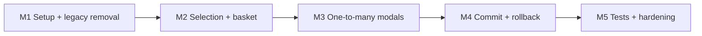

# Annotation Deletion Proposal

Guided soft-delete (mark erasable) for OCRA’s decomposed annotation model (geometry, data, link). Symmetric to the creation wizard in `doc/a07-annotation-creation.md`.

## Status and scope

| Milestone | Scope | Status |
| --------- | ----- | ------ |
| M1 | Remove card/bulk triplet delete; expandable Delete setup | **Done** |
| M2 | Selection phase + link view integration | **Done** |
| M3 | One-to-many disambiguation modals | **Done** |
| M4 | Sequential commit, OCC, still-linked guard, rollback | **Done** |
| M5 | Tests, docs sync, hardening | **Done** |

**Dependency order:** M1 → M2 → M3 → M4 → M5 (each milestone should be mergeable and manually testable before the next).

**Wizard exclusivity:** While the delete wizard is active, the create wizard must be disabled (and vice versa). Normal view/edit continues when neither wizard is active.

- **Replaces**: per-card delete and bulk delete on annotation data rows (`markAnnotationTripletErasable` in `AnnotationPanelEditor.tsx`).
- **Related docs**:
  - `doc/a00-annotation-model.md` — weak/strong lifecycle, no primitive cascades
  - `doc/a07-annotation-creation.md` — wizard pattern, link view modes, commit rollback
  - `doc/a01-collaborative-annotation-editing.md` — OCC, social locks
  - `doc/a06-active-annotations.md` — active vs focus mental model

### Behaviour summary (target)

- **Draft until confirm**: delete intent and selected candidates stay client-side until `Confirm delete`. Commit marks entities **erasable** via existing REST `PATCH …/erasable` endpoints (sequential, no monolithic API, no server transaction).
- **Soft delete only**: entities leave the default **active** set (`erasableAt` set); physical cleanup is a separate maintenance/structuring concern (`a00`).
- **No restore UI in v1**: undelete (`nonerasable`) may be added later; out of scope for this proposal.
- **Social locks**: entities under another user’s **editor** social lock cannot be added to the delete basket and cannot be committed.
- **Endpoint rule**: geometry or data cannot be marked erasable while any **non-erasable** link still references them. The client enforces this for **scene-visible** links in the basket; the **server** re-checks **project-wide** on geometry/data erasable (cross-scene links are invisible to a single-scene client — see [Cross-scene links](#cross-scene-links-and-server-still-linked-guard)).

### Non-goals (v1)

- Physical purge of weak entities
- Restore / undelete wizard
- New composite / transactional delete API (commit stays sequential per-entity calls; endpoint erasable gains a **still-linked** guard only)
- Deletion from OpenLIME viewer context menus (panel-driven wizard only)

---

## UI

### Entry point

Add a **Delete** button next to **Create** in the annotation panel (labels may be shortened to `Create` / `Delete` in annotation context).

The Delete button expands a setup section, mirroring the creation panel:

| Control | Purpose |
| ------- | ------- |
| Intent grid (2×2): **Link** \| **Link+Geo+Data** / **Link+Geo** \| **Link+Data** | Choose what to mark erasable and **immediately** enter selection |
| **Back** | Abort selection (discard confirm) |
| **Confirm delete** | Commit the delete basket (enabled when valid) |

There is **no separate Start delete** step: pressing an intent button sets the flags and starts selection in one action, so the user cannot select in the viewer/panel thinking deletion is already active.

After an intent is chosen, the user selects candidates in the viewer and/or panel. **Confirm delete** runs the commit algorithm below.

### Delete intent matrix

| Link | Geometry | Data | Meaning |
| ---- | -------- | ---- | ------- |
| ✓ | — | — | Link-only: mark selected links erasable; identify links by selecting geometry or data in `showAll` (no raw link list). Endpoints stay active |
| ✓ | ✓ | — | Remove selected geometries and their links (1:1 direct; 1:N via **fan-out warning** only — Data is off) |
| ✓ | — | ✓ | Remove selected data and their links (1:1 direct; 1:N via **fan-out warning** only — Geometry is off) |
| ✓ | ✓ | ✓ | Full triplet removal for resolved link set (1:N via **link resolution**) |
| — | ✓ | — | Geometry-only: mark selected geometries erasable; **links stay active** → Ghost rendering |
| — | — | ✓ | Data-only: mark selected data erasable; **links stay active** → Ghost rendering |
| — | ✓ | ✓ | **Invalid** — pick Geo or Data alone (or include Link) |

**Setup presets** include Link*, **Geo**, and **Data**. When Link is part of the intent, every endpoint in the basket must include all of its non-erasable links known in the scene. Endpoint-only intents intentionally leave those links so the endpoint becomes Ghost. The server allows geometry/data erasable while strong links remain.

**Link-only** is valid: mark selected links erasable without marking endpoints.

---

## Selection phase

### Link view mode

Reuse annotation link view modes from `a07` (`showAll`, `selectGeometry`, `selectData`):

| User intent | Link view mode | Where user selects |
| ----------- | -------------- | ------------------ |
| **Link+Geo** | `selectGeometry` (By geometry) | Viewer — one or more geometries; panel shows only data linked to basket geometries |
| **Link+Data** | `selectData` (By data) | Panel — one or more data rows; viewer shows only geometries linked to basket data |
| **Link** / **Link+Geo+Data** | `showAll` | Viewer **or** panel — select a geometry or a data row (not a raw link list) |

There is **no panel link list**. Links are `geometryId` + `dataId` pairs; showing them as opaque id pairs is not understandable. For **Link-only** intent, the user identifies links by selecting an endpoint in `showAll` mode:

| Incident non-erasable links on selected item | Behaviour |
| -------------------------------------------- | --------- |
| **0** | Inform the user that no links are incident on this entry; nothing is added to the basket |
| **1** | Add that link to the basket (endpoints stay out of the basket) |
| **N (>1)** | Open the [link resolution modal](#link-resolution-modal-link--geometry--data-or-link-only) to choose which links to remove |

For **Link+Geo**, an orphan geometry (0 non-erasable links) is added to the basket alone. For **Link+Data**, an orphan data record is added alone. Link is vacuous in both cases; no new delete preset is required. **Link+Geo+Data** does not apply to orphans — without a link there is no triplet to remove (selecting an orphan under that intent still only stages that one endpoint). Endpoints that still have links must include all of those links in the basket before Confirm is enabled.

During the delete wizard, link-view mode follows the intent above. Filtering is driven by the **basket** (not the normal focus set). Basket endpoints are **unioned** into the visible sets so already-selected candidates are never hidden mid-flow.

### Delete basket

Client-side draft (conceptual shape):

```ts
deletionDraft: {
  step: 'setup' | 'selecting' | 'committing';
  deleteLink: boolean;
  deleteGeometry: boolean;
  deleteData: boolean;
  candidateLinkIds: string[];
  candidateGeometryIds: string[];
  candidateDataIds: string[];
  selectionMessage: string | null;
  pendingResolution: DeletionPendingResolution | null;
}
```

**Confirm delete** runs from the `selecting` step (no separate confirm step). It is enabled only when:

1. At least one candidate exists in the basket.
2. Every one-to-many selection has been resolved (see below).
3. For every geometry/data in the basket, either it has **no** non-erasable links (orphan — allowed), or all **scene-visible** non-erasable links attached to that endpoint are also in the basket (when endpoint delete is requested). Counterpart endpoints added via “All” / “Let me select” must satisfy the same rule; if a counterpart still has other non-erasable links outside the basket, either omit it from the basket or keep Confirm disabled until those links are included or resolved.

Remote editor locks are **not** a Confirm-disable rule: they are re-checked at Confirm and pruned (see [Social locks](#social-locks)).

### Social locks

Match current panel delete behaviour at selection; at commit, prefer partial progress over a full abort:

- **Selection**: cannot add geometry, data, or link to the basket if another user holds an **editor** social lock on that entity or on a linked entity that would be affected.
- **Commit**: re-check editor locks immediately before the first write. If any basket candidate (or a linked entity that blocks it) is locked:
  1. Remove the locked entity from the basket.
  2. Remove every basket **link** that touches a removed entity.
  3. Drop any remaining geometry/data that no longer satisfies the endpoint–link rule on what is left.
  4. If the basket is empty after prune → do not commit; show a clear message.
  5. Otherwise commit the remaining set and summarize what was skipped (never silent).

Presence locks are informational only; editor locks are blocking for selection and for inclusion in the commit set.

---

## One-to-many disambiguation

When selecting an endpoint would affect more than one link, the user must resolve cardinality before the item is fully added to the basket.

### Which modal applies

| Intent (checkboxes) | 1:N trigger | Modal |
| ------------------- | ----------- | ----- |
| Geometry + Link (Data **off**) | Geometry has N non-erasable links | **Fan-out warning** (Yes / Cancel) |
| Data + Link (Geometry **off**) | Data has N non-erasable links | **Fan-out warning** (Yes / Cancel) |
| Link only | Selected geometry or data has N non-erasable links | **Link resolution** (All / None / Let me select) |
| Link + Geometry + Data | Either endpoint has N non-erasable links | **Link resolution** (All / None / Let me select) |

Rule of thumb:

- **Fan-out warning** — endpoint-led delete when **exactly one** endpoint type is marked erasable (Geometry + Link *or* Data + Link, not both). Yes removes that endpoint and **all** its links.
- **Link resolution** — when the user must pick which associations to remove: **Link-only** (endpoints stay), or **Link + Geometry + Data** (both endpoints may enter the basket).

Checkbox order does not matter: `Link + Geometry + Data`, `Data + Link + Geometry`, and `Geometry + Link + Data` are the same intent.

### Fan-out from geometry (1 geometry → N data)

Triggered when the user selects a geometry that has multiple non-erasable links **and** intent is **Geometry + Link with Data unchecked**.

Does **not** apply when **Data** is also checked (`Link + Geometry + Data`), nor for **Link-only** — use [Link resolution modal](#link-resolution-modal-link--geometry--data-or-link-only) instead.

**Modal:**

> A one-to-many element is selected. Do you want to delete it? All incoming links will be removed.

| Action | Effect |
| ------ | ------ |
| **Yes, delete anyway** | Add the geometry and **all** its non-erasable links to the basket |
| **Cancel** | Do not add this geometry; clear transient selection |

### Fan-out from data (1 data → N geometries)

Triggered when the user selects data linked to multiple geometries **and** intent is **Data + Link with Geometry unchecked**.

Does **not** apply when **Geometry** is also checked, nor for **Link-only** — use [Link resolution modal](#link-resolution-modal-link--geometry--data-or-link-only) instead.

Same warning modal and Yes / Cancel actions as geometry fan-out (add the data and **all** its non-erasable links on Yes).

### Link resolution modal (Link + Geometry + Data, or Link-only)

When one selected endpoint has multiple links and the user must choose which associations to remove. Used for:

- **Link-only** — select geometry or data in `showAll`; resolve which incident links to mark erasable (endpoints stay out of the basket)
- **Link + Geometry + Data** — resolve which associations (and counterpart endpoints) enter the basket

**Prompt:** *A one-to-many element is selected. Select which links you want to delete.*

| Option | Effect |
| ------ | ------ |
| **All** | Add all relevant links to the basket; also add counterpart endpoints **only if** Geometry / Data checkboxes are on **and** that endpoint’s remaining non-erasable links are all among the links just added (otherwise omit the endpoint and leave Confirm disabled until resolved) |
| **None** | Discard transient selection; nothing added (or remove the endpoint from the basket if it was already staged) |
| **Let me select** | Geometry-led: checklist modal of linked data. Data-led: non-modal viewer pick mode (OK/Cancel bar; panel shows only that data) |

**Let me select — data led, multiple geometries:**

1. Dismiss the link-resolution modal and enter **viewer pick mode** (non-modal).
2. Show a small **OK | Cancel** bar in viewer chrome (bottom) and matching controls in the deletion panel; live selection count.
3. In the viewer, show only geometries linked to the selected data; in the panel, show only that data row (others hidden).
4. User multi-selects geometries in the viewer (Ctrl/Cmd).
5. **OK** — add chosen links (and geometry ids **only if** Geometry is checked) to the basket; exit pick mode.
6. **Cancel** — discard pending resolution; nothing added; restore normal panel/viewer lists.

**Let me select — geometry led, multiple data:**

Same pattern with a checklist of linked data rows in a modal (selection happens in the UI, not the viewer). Add data ids to the basket **only if** Data is checked.

### Completion rule

Selection can continue while the basket contains only resolved 1:1 or explicitly resolved 1:N items. **Confirm delete** stays disabled until every basket entry satisfies the endpoint–link rule above.

---

## Commit: frontend and backend

### Terminology

- **Delete** in the UI means **mark erasable** (`erasableAt` / `erasableBy` set, `version` incremented).
- Primitive APIs act on **one document at a time**; no automatic cascade (`a00`).

### Commit order

Build the final delete set from the basket and checkboxes, then apply in this order (snapshot `expectedVersion` per entity at confirm time):

1. **Links** — `PATCH …/links/{linkId}/erasable` for each `candidateLinkIds`.
2. **Geometries** — only if `deleteGeometry` and geometry id is in basket **and** the client believes no remaining non-erasable links exist outside the basket (scene-local check).
3. **Data** — only if `deleteData` and data id is in basket **and** the same client-side check passes.

If setup is invalid (Geometry/Data without Link), commit never runs. **Link-only** (Link on, Geometry and Data off) uses step 1 alone — no endpoint erasable calls.

Order matters: mark selected links erasable **before** endpoints so that, for links already in the basket, the server’s project-wide still-linked check no longer sees them as strong.

### Cross-scene links and server still-linked guard

Client-side “all attached links are in the basket” is **necessary but not sufficient**.

Per `a00` [scene consistency rules](./a00-annotation-model.md#scene-consistency-rules), geometry and data may be scoped to a **scene** or an **asset**. Example:

- Asset-scoped data `D` linked to scene-scoped geometry `G1` in scene A and to geometry `G2` in scene B.
- The annotation store for scene A loads scene-visible entities only: it sees `D`, `G1`, and link `G1→D`, but **not** link `G2→D` (nor `G2`).

So a user deleting **Data** (+ links) in scene A can put every *visible* link to `D` in the basket and still leave a strong link in scene B. The same gap exists for asset-scoped geometry reused across scenes, and for other mixed scene/asset combinations.

**Therefore (v1):**

| Layer | Responsibility |
| ----- | -------------- |
| **Client** | Basket validation and confirm gating using **scene-visible** links only; do not send endpoint erasable if a known local non-erasable link is still outside the basket |
| **Server** | On `PATCH …/geometry/{id}/erasable` and `PATCH …/data/{id}/erasable`, reject the transition if **any** non-erasable `annotationLink` in the **project** still references that endpoint (after OCC checks). Suggested error codes: `annotation.geometry.still_linked` / `annotation.data.still_linked` (e.g. HTTP 409) |

Link erasable transitions stay as today (no still-linked check on the counterpart endpoint). Primitive APIs still do not cascade; the guard only refuses to weaken an endpoint that another strong link still keeps “in use.”

Note: `a00` allows any erasable combination at the database level for maintenance semantics (a weak endpoint may remain while a strong link keeps it alive). The deletion wizard’s **user** intent is stronger: marking Geometry/Data erasable means “remove this endpoint from active use,” which requires no remaining strong links. The server guard implements that product rule on the existing per-entity endpoints.

Today’s `markAnnotationGeometryErasable` / `markAnnotationDataErasable` do **not** implement this check yet — it is required backend work for M4 (see implementation milestones).

### OCC and server errors

Each erasable transition uses optimistic concurrency (`expectedVersion`). On failure:

| Condition | Behaviour |
| --------- | --------- |
| `409` version conflict | Stop commit; show refresh/retry message (same family as creation/edit) |
| `409` already erasable | Treat as success for that id or skip |
| `409` still linked (`*.still_linked`) | Stop commit; explain that the endpoint is still linked outside this scene (or outside the basket); keep basket; offer refresh. Links already marked erasable in this commit are rolled back like any partial failure |
| Entity not found | Stop commit; suggest refresh |
| Other errors | Stop commit; show API message |

**Modified by someone else** is expressed as a **version conflict** on that entity’s erasable transition.

**Still linked by another non-erasable link** is enforced on **both** sides: client (scene-visible basket rule) and server (project-wide guard on geometry/data erasable).

### Frontend after commit

| Outcome | Behaviour |
| ------- | ----------- |
| **Full success** | Remove marked entities from local store maps; clear delete draft and focus; entities disappear from active panel/viewer |
| **Failure before any write** | Keep basket and draft; show error |
| **Partial success** | Roll back successful marks via `mark*NonErasable` on entities this commit marked erasable; restore draft to pre-commit step; show error including rollback notice |
| **Scene reload during commit** | Abort; roll back any persisted marks; restore draft or clear wizard (mirror creation `generation` interrupt) |

Do **not** remove entities from local storage on failure.

### SSE / remote updates

If another user marks an entity erasable while the wizard is open, refresh or drop that id from the basket with a notice. If another user edits an entity in the basket, `expectedVersion` at confirm may 409 — user retries after refresh.

---

## Removal of legacy delete

- Remove delete button from individual annotation data cards.
- Remove bulk **Delete (N)** from the panel toolbar.
- Retain `markAnnotationTripletErasable` in the store only if still needed for tests or lab tooling; production UI uses the wizard commit path.

---

## Key modules (planned)

| Area | Path (expected) |
| ---- | ---------------- |
| Proposal / this doc | `doc/a08-annotation-deletion.md` |
| Types + default draft | `frontend/src/features/annotation-deletion/types.ts`, `createDefaultDeletionDraft.ts` |
| Validation + commit plan | `frontend/src/features/annotation-deletion/annotationDeletionValidation.ts`, `buildDeletionCommitPlan.ts` |
| Cardinality + errors | `frontend/src/features/annotation-deletion/annotationDeletionCardinality.ts`, `formatDeletionCommitError.ts` |
| Setup + basket UI | `frontend/src/features/annotation-deletion/AnnotationDeletionPanel.tsx` |
| Modals (M3) | `DeletionFanOutConfirmModal.tsx`, `DeletionLinkResolutionModal.tsx`, `DeletionCounterpartPickModal.tsx` (geometry-led checklist) |
| Viewer pick chrome (M3) | `DeletionGeometryPickBar.tsx` (data-led Let-me-select; non-modal) |
| Wizard hook | `frontend/src/features/annotation-deletion/useAnnotationDeletionWizard.ts` |
| Store draft + commit | `frontend/src/stores/AnnotationStore.ts` |
| Backend still-linked guard | `backend/src/services/annotation.service.ts`, annotation controllers/routes |
| Link view (intent-driven) | `frontend/src/features/annotation-link-view/useAnnotationLinkView.ts` |
| Panel shell | `frontend/src/routes/components/AnnotationPanelEditor.tsx` |
| Viewer wiring (M2/M3) | `Viewer2DPanel.tsx`, `Viewer3DPanel.tsx` |
| Social lock checks | `frontend/src/stores/annotation-social-locks.ts` (reuse) |
| Store tests | `frontend/src/stores/AnnotationStore.deletion.test.ts` |

---

## Testing (planned)

### Automated

| Suite | Command | Coverage |
| ----- | ------- | -------- |
| Frontend unit + store | `npm run test:unit` | Intent matrix, basket validation, cardinality, commit plan, `commitDeletionDraft` rollback/interrupt / `still_linked` handling |
| Backend erasable + still-linked | `npm run test:annotation-deletion` (M4/M5) or existing annotation API tests | Per-entity erasable, 409 OCC, **project-wide still_linked** on geometry/data |

Key test files (planned):

- `frontend/src/features/annotation-deletion/*.test.ts`
- `frontend/src/stores/AnnotationStore.deletion.test.ts`
- `backend/src/test/annotation-deletion.api.test.ts` (M4/M5 — include still_linked)

### Manual checklist

- [ ] Link-only: select geometry/data with 1 incident link → confirm → only that link erasable; endpoints remain active
- [ ] Link-only: select geometry/data with 0 links → message; nothing added
- [ ] Link-only: select geometry/data with N links → link resolution → chosen links only in basket
- [ ] Geometry + Link: select geometry 1:1 → confirm → geometry + link erasable
- [ ] Data + Link: select data 1:1 → confirm → data + link erasable
- [ ] Full triplet: Link + Geometry + Data, 1:1 selection
- [x] 1:N geometry, Geometry + Link only → fan-out warning → Yes adds geometry + all links; Cancel drops selection
- [x] 1:N geometry, Link + Geometry + Data → link resolution modal (not fan-out warning)
- [x] 1:N data, Data + Link only → fan-out warning
- [x] 1:N data + Geometry → link resolution → “Let me select” → viewer subset (non-modal OK/Cancel) → OK/Cancel
- [x] Link + Geometry + Data → link resolution modal (All / None / Let me select)
- [x] Geometry/Data checked without all links in basket → confirm disabled
- [x] Remote editor lock → cannot select or confirm
- [ ] 409 on commit → basket preserved, partial rollback message
- [ ] Cross-scene: asset data linked from two scenes → delete data in scene A after local links only → `still_linked`; after marking the other scene’s link erasable (or including it) → endpoint erasable succeeds
- [ ] Scene reload mid-commit → interrupt handling
- [ ] Regression: create wizard and normal edit unaffected while delete wizard inactive

---


## Implementation milestones

### Overview



| Milestone | Outcome | Touchpoints | PR note |
| --------- | ------- | ----------- | ------- |
| M1 | Delete panel expands; card/bulk delete gone | `AnnotationDeletionPanel`, `AnnotationPanelEditor`, store draft skeleton | Low risk; ship first |
| M2 | Intent button → pick items → basket list | `useAnnotationDeletionWizard`, link view, viewer/panel selection | Testable without server |
| M3 | 1:N warnings and link-resolution modals work | Modal components, transient selection state | Builds on M2 |
| M4 | Confirm delete persists; still-linked guard; failures roll back | `commitDeletionDraft`, backend `still_linked`, `revertDeletionCommitArtifacts` | Highest risk; isolate |
| M5 | Automated coverage + doc status **Done** | `*.test.ts`, manual checklist signed off | Can merge with M4 if small |

One PR per milestone is preferred. M5 may land with M4 when the commit PR already includes tests.

---

### M1 — Setup panel and legacy removal

**Goal:** Introduce the delete wizard shell and remove the old triplet delete entry points. No selection or server commit yet.

**Tasks**

1. **Feature scaffold** — create `frontend/src/features/annotation-deletion/`:
   - `types.ts` — `AnnotationDeletionDraft`, step union, basket ids
   - `createDefaultDeletionDraft.ts`
   - `annotationDeletionValidation.ts` — intent matrix (Link/Geometry/Data combos), `validateDeletionSetup()`
   - `AnnotationDeletionPanel.tsx` — 2×2 intent grid (starts selecting immediately), Back / Confirm delete
2. **Store skeleton** — in `AnnotationStore.ts`:
   - `deletionDraft`, `isDeletionWizardActive`, getters mirroring creation (`creationDraftState` pattern)
   - `initDeletionDraft()`, `updateDeletionDraft()`, `discardDeletionDraft()`, `beginDeletionWizard(intent)`, `advanceDeletionStep()`
   - Clear deletion draft on scene reload (`generation` bump), same as creation
3. **Context + hook** — `useAnnotationDeletionWizard.ts` exposing draft flags and store actions (mirror `useAnnotationCreationWizard.ts`)
4. **Panel integration** — `AnnotationPanelEditor.tsx`:
   - Add expandable **Delete** section next to Create
   - Wire `AnnotationDeletionPanel`
   - **Remove** per-card delete button and bulk **Delete (N)** toolbar control
   - Disable Create while delete wizard active; disable Delete while create wizard active
5. **Lock helper reuse** — export or add `isEntityBlockedForDeletion(...)` wrapping `annotation-social-locks.ts` (can stub “always allowed” until M2 if needed)

**Exit criteria**

- [x] Delete section expands/collapses; intent grid offers the four valid Link / Link+Geo / Link+Data / Link+Geo+Data presets
- [x] Pressing an intent button → step becomes `selecting` with that intent (no separate Start delete)
- [x] Back → discard confirm (mirror creation discard modal)
- [x] No delete buttons on data cards or bulk toolbar
- [x] Create and Delete wizards are mutually exclusive

**Not in M1:** viewer/panel selection wiring, modals, commit, basket UI beyond empty state placeholder.

---

### M2 — Selection phase and delete basket

**Goal:** User can build a delete basket via viewer/panel selection for 1:1 cases. Link view mode switches automatically. Social locks block selection.

**Tasks**

1. **Resolve link view mode from intent** — `resolveDeletionLinkViewMode(draft)`:
   - Geometry (+ Link) → `selectGeometry`
   - Data (+ Link) → `selectData`
   - Link only → `showAll` (select endpoints to identify links; no link list UI)
2. **Link view during deletion** — extend `useAnnotationLinkView.ts`:
   - Apply normal link-view filtering (mode from intent)
   - Drive focus anchors from the delete basket for Link+Geo / Link+Data
   - Union basket ids into visible sets so selected items stay visible
3. **Auto link view on intent start** — store or hook sets `linkViewMode` when entering `selecting`; restore previous mode on discard (optional, nice-to-have)
4. **Basket state + UI** — extend draft and panel:
   - `candidateLinkIds`, `candidateGeometryIds`, `candidateDataIds`
   - Basket summary list in `AnnotationDeletionPanel` (labels, remove-from-basket per row)
   - `validateDeletionBasket(draft, store)` — non-empty, endpoint–link rule for 1:1 only in M2
5. **Selection wiring (1:1 only)** — defer 1:N modals to M3; for now ignore or reject multi-link endpoints with a toast:
   - **Geometry path:** viewer selection → `addGeometryToDeletionBasket(geometryId)` adds geometry + its single non-erasable link (+ data id if Data checked and 1:1)
   - **Data path:** panel row toggle/click → `addDataToDeletionBasket(dataId)` symmetric
   - **Link-only path:** user selects a geometry (viewer) or data row (panel) in `showAll`. Count incident non-erasable links: **0** → message, nothing added; **1** → `addLinkToDeletionBasket(linkId)` (no endpoints); **N** → toast / defer to M3 link resolution
6. **Social locks at selection** — block add-to-basket when `isDataIdUnderRemoteEditorLock` / geometry equivalent applies; show same title/tooltip as current delete
7. **Confirm gating** — enable Confirm only when `validateDeletionBasket` passes (M2: 1:1 items only, all endpoint links in basket)
8. **Highlight** — optional `deletionHighlightGeometryIds` for basket geometries in viewer (mirror `creationHighlightGeometryIds`)

**Exit criteria**

- [x] Geometry + Link: select one geometry with exactly one link → basket shows geometry + link (+ data if checked)
- [x] Data + Link: select one data with exactly one link → basket correct
- [x] Link only: select geometry or data with exactly one incident link → basket shows that link only (no endpoints)
- [x] Link only: select geometry or data with zero links → user message; basket unchanged
- [x] Multi-link endpoint selection opens fan-out / link-resolution (M3)
- [x] Locked entity cannot enter basket
- [x] Link view mode switches when an intent button starts selection; basket items remain visible during wizard
- [x] Confirm still no-op or disabled message (commit is M4)

**Not in M2:** 1:N modals, server calls, rollback.

---

### M3 — One-to-many disambiguation

**Goal:** Full selection UX for fan-out cases and Link + Geometry + Data link resolution.

**Tasks**

1. **Cardinality helpers** — `annotationDeletionCardinality.ts`:
   - `linksForGeometry(geometryId)`, `linksForData(dataId)`, `isOneToMany(...)`
   - `expandBasketForAllLinks(endpointId, draft)` for “Yes, delete anyway” / “All”
2. **Warning modal** — `DeletionFanOutConfirmModal.tsx`:
   - Copy: one-to-many warning
   - Actions: Yes (add endpoint + all its non-erasable links) / Cancel (revert transient selection)
   - **Only** when intent is Geometry + Link (Data off) or Data + Link (Geometry off); never when both endpoint types are checked
3. **Link resolution modal** — `DeletionLinkResolutionModal.tsx`:
   - Actions: All / None / Let me select
   - Used for **Link-only** (N incident links; endpoints never added) and **Link + Geometry + Data**
   - **Let me select — geometry led:** checklist of linked data rows in modal
   - **Let me select — data led:** dismiss modal → `DeletionGeometryPickBar` + viewer subset + panel shows only the pending data row; OK/Cancel (see below)
4. **Viewer pick mode** — `pendingResolution.modal === 'pickCounterparts'` with `endpointKind === 'data'`:
   - Filter viewer to geometries linked to focused data (`useAnnotationLinkView`)
   - Filter panel to that data row only; highlight it
   - OK → merge chosen links/geometries into basket; Cancel → clear pending only
5. **Transient selection** — distinguish “focus in progress” vs “committed to basket” so Cancel on modals / pick bar does not corrupt basket
6. **Update validation** — `validateDeletionBasket` requires no unresolved pending fan-out; every endpoint in the basket has all scene-visible non-erasable links in `candidateLinkIds` (do not leave counterpart endpoints half-included after All / Let me select)
7. **Link-only 0/1/N wiring** — complete the Link-only path from M2: 0 → message; 1 → add link; N → open link resolution (endpoints never added)

**Exit criteria**

- [x] 1:N geometry, Geometry + Link only → fan-out warning → Yes / Cancel
- [x] 1:N geometry, Link + Geometry + Data → link resolution (not fan-out)
- [x] 1:N data, Data + Link only → fan-out warning
- [x] 1:N data + Geometry → link resolution → Let me select → viewer subset (non-modal OK/Cancel bar) → OK/Cancel
- [x] Link + Geometry + Data → resolution modal All / None / Let me select
- [x] Link only, 0 / 1 / N incident links → message / add link / resolution modal (endpoints never in basket)
- [x] None removes endpoint from basket
- [x] Confirm still disabled until basket fully resolved

**Not in M3:** server commit (stub Confirm with “coming in M4” ok during dev).

---

### M4 — Sequential commit, OCC, rollback

**Goal:** Confirm delete marks entities erasable via API with correct order, OCC, project-wide still-linked guard on endpoints, partial rollback, and interrupt handling.

**Tasks**

1. **Backend still-linked guard** — extend `markAnnotationGeometryErasable` / `markAnnotationDataErasable` (and controllers):
   - Inside the existing transaction, after loading the endpoint and before (or atomically with) the erasable write: query whether any `annotationLink` with `projectId`, matching `geometryId`/`dataId`, and `erasableAt === null` exists
   - If yes → fail with `still_linked` (map to HTTP 409 + codes `annotation.geometry.still_linked` / `annotation.data.still_linked`)
   - Do **not** add this check to link erasable
   - Add repository/service unit or API tests for: no remaining links → success; remaining link in another scene → reject; link marked erasable first then endpoint → success
2. **Build commit plan** — `buildDeletionCommitPlan(draft, store)` → ordered `{ links, geometries, data }` with versions snapshot at confirm time
3. **`commitDeletionDraft()`** in `AnnotationStore.ts`:
   - Guard: `step === 'selecting'`, basket valid, not `isDeleting` (new flag, mirror `isCreating`)
   - Set `step: 'committing'`
   - **Prune** remotely editor-locked basket entities (+ dependent links / uncovered endpoints); summarize skipped ids; abort only if nothing remains
   - Sequential `markLinkErasable` → `markGeometryErasable` → `markDataErasable` via existing `markEntityErasable` / `AnnotationApiClient`
   - Map `still_linked` via `formatDeletionCommitError` (cross-scene / still linked message + refresh hint)
   - On success: remove entities from local store maps (or rely on SSE + active-set filter); `deletionDraft = null`; `clearFocus()`
4. **Rollback** — `revertDeletionCommitArtifacts(marked)`:
   - Reverse order: restore endpoints/links to `nonerasable` only if this commit marked them (track `marked` set during commit)
   - Deletion rollback should call `mark*NonErasable` on entities successfully marked erasable during the failed commit (client methods: `markGeometryNonErasable`, etc.)
5. **Interrupt** — on `generation` change mid-commit: rollback marked set, restore draft to pre-commit step, message “interrupted by scene reload”
6. **Error UX** — `formatDeletionCommitError.ts` (mirror `formatCreationCommitError.ts`); include `still_linked`; show in delete panel `aria-live` region; disable buttons while committing
7. **Wire Confirm** — `AnnotationDeletionPanel` calls `commitDeletionDraft()`; show Saving… state
8. **Store context** — expose `commitDeletionDraft`, `isDeletionWizardActive`, deletion draft actions on `AnnotationStoreContext`
9. **SSE during wizard** — if remote mutation marks basket id erasable, remove from basket + toast; version bump on edit → user may 409 on confirm

**Exit criteria**

- [x] Link-only commit: only links marked erasable; endpoints remain in active set
- [x] Full triplet commit: links then geometry then data when all in basket
- [x] Simulated 409 mid-commit → rollback + error message + basket preserved
- [x] Endpoint erasable rejected when another scene still has a non-erasable link (`still_linked`); partial rollback of links marked in the same commit
- [x] After marking the only remaining strong link erasable, endpoint erasable succeeds
- [x] Scene reload mid-commit → interrupt message + rollback
- [x] Successful commit clears wizard and updates panel/viewer
- [x] Remote editor lock on a basket item at Confirm → prune that subgraph, commit the rest (or abort if empty) with a skip summary

**API surface**

- `PATCH /api/projects/{projectId}/annotations/links/{linkId}/erasable` — unchanged
- `PATCH /api/projects/{projectId}/annotations/geometry/{geometryId}/erasable` — **+ project-wide still-linked guard**
- `PATCH /api/projects/{projectId}/annotations/data/{dataId}/erasable` — **+ project-wide still-linked guard**

Each request body includes `expectedVersion` (same as edit/OCC elsewhere).

**Note:** Live SSE basket prune when a remote user marks a basket id erasable is deferred to M5 hardening (version conflicts still surface as 409 on Confirm).

---

### M5 — Tests, docs sync, hardening

**Goal:** Automated regression coverage and production-ready polish.

**Tasks**

1. **Unit tests** — `frontend/src/features/annotation-deletion/*.test.ts`:
   - Intent matrix / setup validation
   - `buildDeletionCommitPlan` order and endpoint–link rule
   - `validateDeletionBasket` (1:1, 1:N resolved, locked entity)
   - Cardinality helpers
   - `formatDeletionCommitError`
2. **Store integration tests** — `AnnotationStore.deletion.test.ts`:
   - Successful link-only, geometry+link, data+link, full triplet commits
   - Partial failure rollback (`markNonErasable` calls)
   - Interrupt on generation change
   - Create/delete wizard exclusivity
3. **Link view test** — deletion focus anchors + filtering for Link+Geo / Link+Data
4. **Backend** — `annotation-deletion.api.test.ts` covering erasable + **still_linked** (cross-scene remaining link); reuse patterns from `annotation-creation.api.test.ts`
5. **npm script** — `test:annotation-deletion` in root `package.json`
6. **Hardening pass:**
   - Discard confirm on Back matches creation copy
   - Keyboard / aria labels on basket and modals
   - Empty basket edge cases
   - Class filter interaction during delete wizard
7. **Doc sync** — set milestone table to **Done**; move manual checklist items to verified or leave open

**Exit criteria**

- [x] `npm run test:unit` includes deletion tests and passes
- [ ] Manual checklist (above) executed on 2D scene (3D for data-led geometry pick)
- [x] `doc/a08-annotation-deletion.md` status table updated to **Done** for M1–M5

---
