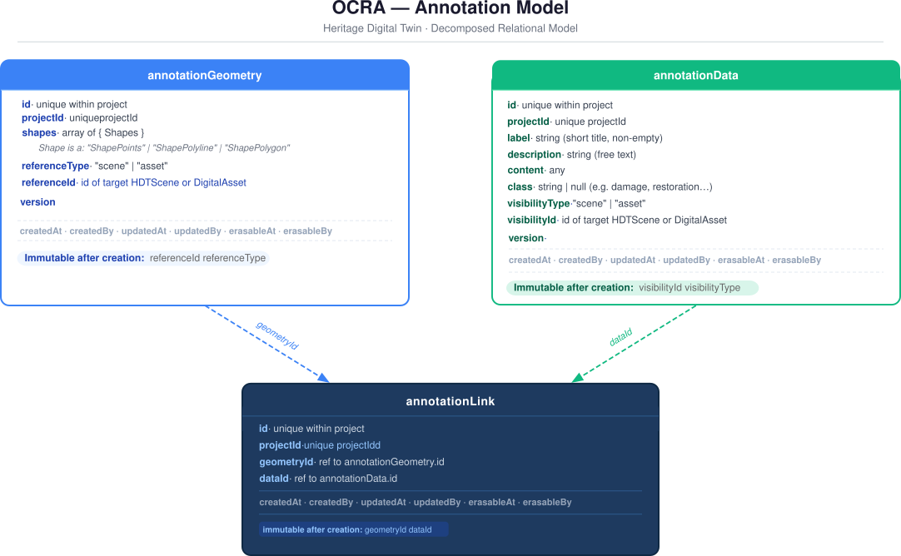

# Annotations in 3D Models

## Overview

This document defines the core concepts for the annotation system. It introduces a decomposed, relational data model.

The model separates three concerns:

- **Spatial placement** — where in 3D space the annotation is anchored, and to which scene or asset it refers (`annotationGeometry`)
- **Semantic content** — what the annotation conveys (`annotationData`)
- **Association** — the explicit, immutable link between **a single spatial anchor and a single semantic content** record (`annotationLink`)

A single geometry element can be associated with multiple annotation data records; a single annotation data record can be applied to multiple geometry elements. The `annotationLink` entity makes each association explicit, queryable, and independently manageable.



### Entity summary

| Entity | Role |
| --- | --- |
| `annotationGeometry` | Standalone 3D geometric shape anchored to a scene or asset |
| `annotationData` | Standalone semantic content, optionally scoped to a specific scene |
| `annotationLink` | Immutable join entity associating one geometry node with one data record |

---

## Data Model

### `annotationGeometry`

`annotationGeometry` is an independent entity that defines the 3D geometric shape of an annotation anchor and its binding to a scene or asset.

#### Fields

- `id: string`  
  Unique identifier of the geometry element within the project.

- `shapes: array of shape`  
  Ordered list of geometric primitives that together define the annotation anchor. Each element is an object with two fields:
  - `type: the type of the primitive`.
  - `data:` — data specific to the primitive type.
  A single `annotationGeometry` may contain one or more shapes of any combination of types. The common case is a single-element `shapes` array. Heterogeneous groups (e.g. a polygon and a set of sample points) are expressed by including multiple shapes in the same element.

- `referenceType: "scene" | "asset"`  
  Indicates whether this geometry is anchored to a scene or to a digital asset, defining the reference space for its coordinates and its visibility scope.

- `referenceId: string`  
  Identifier of the target `HDTScene` or `DigitalAsset`, depending on `referenceType`. This field determines the 3D reference space in which `geometryData` coordinates are expressed, and controls scene visibility.

- `createdAt: ISO 8601 timestamp`  
- `createdBy: user id`  
- `updatedAt: ISO 8601 timestamp`  
- `updatedBy: user id`

#### Shape types (examples)

| `type` | Description | `data` cardinality | Notes |
| --- | --- | --- | --- |
| `points` | Single point or multipoint | At least one `[x, y, z]` | `data.length == 1` is a single point; `data.length > 1` is a multipoint (disjoint sample locations) |
| `polyline` | Ordered open line | At least two `[x, y, z]` | |
| `polygon` | Ordered closed area | At least three `[x, y, z]` | Closure is implicit at application level |

All coordinates are expressed in the 3D reference space of the entity identified by `referenceId`.

#### Invariants

- `referenceType` must be `"scene"` or `"asset"`.
- `referenceId` must be a valid, existing identifier of an `HDTScene` or `DigitalAsset` at the time of creation.
- `shapes` must be a non-empty array of valid shapes.
- `referenceType` and `referenceId` are immutable after creation. `shapes[].type` is immutable per element; only `shapes[].data` may be updated. FIXME Definire dopo nella Shape.

#### JSON example

```json
{
    "id": "geom_abc123",
    "shapes": [
        {
            "type": "polygon",
            "data": [
                [0.42, 0.31, 0.12],
                [0.44, 0.31, 0.12],
                [0.44, 0.33, 0.12],
                [0.42, 0.33, 0.12]
            ]
        },
        {
            "type": "points",
            "data": [
                [0.43, 0.32, 0.12],
                [0.435, 0.315, 0.12]
            ]
        }
    ],
    "referenceType": "scene",
    "referenceId": "scene_id_main",
    "createdAt": "2026-03-11T10:00:00.000Z",
    "createdBy": "user-id-1",
    "updatedAt": "2026-03-11T10:00:00.000Z",
    "updatedBy": "user-id-1"
}
```

---

### `annotationData`

`annotationData` is an independent entity that holds the semantic content of an annotation. It exists independently of any specific geometry and can be linked to one or more geometry elements via `annotationLink`.

#### Fields

- `id: string`  
  Unique identifier of the annotation data element.

- `label: string`  
  Short label or title of the annotation. Must be concise and suitable for lists, legends, and quick-selection tools.

- `description: string`  
  Free-text description. May contain a detailed explanation, notes, or references.

- `class: string | null`  
  Optional classification label, for example `damage`, `restoration`, `material`, `diagnostic`. A controlled vocabulary for valid class values may be enforced at application level.

- `content: Object` The annotation content payload, with arbitrary structure and semantics defined an onthology. To be better defined.
- `privateToScene: string | null`  
  Scene-scope constraint for this data record.  
  - If `null`: the record is **global** and may be associated with geometry in any scene or asset context.  
  - If set to a `sceneId`: the record is **scene-private** and may only be associated with geometry that belongs to that specific scene context (see the scene consistency invariant in `annotationLink`).

- `createdAt: ISO 8601 timestamp`  
- `createdBy: user id`  
- `updatedAt: ISO 8601 timestamp`  
- `updatedBy: user id`

#### `privateToScene` semantics

| `privateToScene` | Scope | Reusability |
| --- | --- | --- |
| `null` | Global | May be linked to geometry in any scene or asset |
| `sceneId` | Scene-private | May only be linked to geometry referencing that scene, or to an asset contained in that scene |

#### Invariants

- If `privateToScene` is not null, it must be a valid existing `sceneId` at the time of creation.
- `label` must be a non-empty string.
- `privateToScene` is immutable after creation. To change the scene scope of a data record, the existing element must be deleted and a new one created.

#### JSON example

```json
{
    "id": "data_def456",
    "label": "Lacuna",
    "description": "Small loss of material on the lower left area.",
    "class": "damage",
    "privateToScene": "scene_id_main",
    "createdAt": "2026-03-11T10:00:00.000Z",
    "createdBy": "user-id-1",
    "updatedAt": "2026-03-11T10:00:00.000Z",
    "updatedBy": "user-id-1"
}
```

---

### `annotationLink`

`annotationLink` is a first-class join entity that represents the association between one `annotationGeometry` element and one `annotationData` element.

It carries no semantic content of its own. Its role is to make the geometry–data association explicit, auditable, and independently manageable.

`annotationLink` is **immutable after creation**: no update operation is defined. To modify an association, the existing link must be deleted and a new one created.

#### Fields

- `id: string`  
  Unique identifier of the link.

- `annotationGeometry: string`  
  Identifier of the `annotationGeometry` element referenced by this association.

- `annotationData: string`  
  Identifier of the `annotationData` element associated through this link.

- `createdAt: ISO 8601 timestamp`  
- `createdBy: user id`  
- `updatedAt: ISO 8601 timestamp`  
- `updatedBy: user id`

#### Invariants

1. **Referential integrity**  
   Both `annotationGeometry` and `annotationData` must reference existing entities at the time of creation and must remain valid throughout the link's lifetime.

2. **Uniqueness**  
  The pair (`annotationGeometry`, `annotationData`) must be unique within the system. A geometry element may not be linked to the same annotation data record more than once.

3. **Scene consistency**  
   If `annotationData.privateToScene` is not null, the following constraint must hold based on the `referenceType` of the referenced `annotationGeometry`:

   - If `annotationGeometry.referenceType == "scene"`:  
     `annotationData.privateToScene` must equal `annotationGeometry.referenceId`.

   - If `annotationGeometry.referenceType == "asset"`:  
     `annotationData.privateToScene` must be the `id` of a scene that contains the asset identified by `annotationGeometry.referenceId`.  

   This ensures that a scene-private data record is never associated with geometry that belongs to an unrelated scene context.

#### JSON example

```json
{
    "id": "link_ghi789",
    "annotationGeometry": "geom_abc123",
    "annotationData": "data_def456",
    "createdAt": "2026-03-11T10:00:00.000Z",
    "createdBy": "user-id-1",
    "updatedAt": "2026-03-11T10:00:00.000Z",
    "updatedBy": "user-id-1"
}
```

---

## Scene Annotation Index

### Purpose and derivation

The scene annotation index is a derived data structure that enables fast retrieval of the annotations visible in a given scene. It is not a ground truth: it can always be rebuilt from the project-level stores of `annotationGeometry`, `annotationData`, and `annotationLink`.

A geometry element (and any associated link) is visible in a scene according to the following rule:

| `referenceType` | `referenceId` | Condition for inclusion in scene index |
| --- | --- | --- |
| `"scene"` | `sceneId` | `sceneId == currentScene.id` |
| `"asset"` | `assetId` | The asset `assetId` is present in `currentScene` |

### Index maintenance

- When an `annotationGeometry` is **created**, its id must be added to the index of the affected scene(s).
- When an `annotationGeometry` is **deleted**, its id must be removed from the index of the affected scene(s).
- When an `annotationLink` is created or deleted, the scene annotation index is not directly modified: the index is based on geometry presence, not on link presence.
- When a **scene is deleted**, its scene annotation index is removed entirely. All `annotationGeometry` elements with `referenceType == "scene"` and `referenceId == deletedScene.id` must be handled according to the deletion policy described in the operations section.

### Index rebuild

The index for a given scene can be rebuilt at any time by scanning all `annotationGeometry` records and applying the visibility rules above. This operation is idempotent and can be used to recover from inconsistent states.

---

## Low-level DB Operations
FIXME  update single database. + 3DB
e interazione con altri DB di OCRA (project, scene, asset...) per validazione e risoluzione riferimenti.
Es. removeAnnotationsWithAsset(assetId) 
hasAnnotationAsset(assetId)
getAnnotationsForAsset(assetId)
### `annotationGeometry` operations

#### `id createAnnotationGeometry(shapes, referenceType, referenceId)`

Creates a new `annotationGeometry` element.

**Pre-conditions:**
- `referenceType` must be `"scene"` or `"asset"`.
- `referenceId` must be a valid, existing identifier of an `HDTScene` or `DigitalAsset` respectively.
- `shapes` must be a non-empty array.
- Each element of `shapes` must have a valid `type` and a `data` array satisfying the cardinality constraint for that type.

**Post-conditions:**
- `id` is contained into the DB.

**System actions:**
1. Generate a new unique `id`.
2. Set `createdAt`, `createdBy`, `updatedAt`, `updatedBy`.
3. Persist the element to the geometry store.
4. Add the new `id` to the scene annotation index of the affected scene(s).

---

#### `updateAnnotationGeometryShapes(geometryId, newShapes)`
Updates the `shapes` field of an existing `annotationGeometry` element.

`shapes` is the **only** mutable field. `referenceType` and `referenceId` are immutable after creation, as is `shapes[].type` for each existing primitive. To change the reference or the type of a primitive, the existing element must be deleted and a new one created (with all dependent links handled accordingly).

**Pre-conditions:**
- `geometryId` must reference an existing `annotationGeometry`.
- `newShapes` must be a non-empty array.
- Each element of `newShapes` must have a valid `type` and a `data` array satisfying the cardinality constraint for that type.

**System actions:**
1. Update `geometryData`.
2. Update `updatedAt`, `updatedBy`.

---

#### `deleteAnnotationGeometry(geometryId)` FIXME shallow e deep

Deletes an `annotationGeometry` element from the store.

This is a low-level operation. Before invoking it directly, all `annotationLink` records referencing this geometry must have been resolved. In practice, this operation is typically invoked as part of an `annotationLink` deletion sequence (shallow or deep) rather than independently.

**Pre-conditions:**
- `geometryId` must reference an existing `annotationGeometry`.
- No `annotationLink` must reference this `geometryId` at the time of deletion.

**System actions:**
1. Remove the element from the geometry store.

---

### `annotationData` operations

#### `createAnnotationData(label, description, class, privateToScene)`

Creates a new `annotationData` element.

**Pre-conditions:**
- `label` must be a non-empty string.
- If `privateToScene` is not null, it must be a valid existing `sceneId`.

**System actions:**
1. Generate a new unique `id`.
2. Set `createdAt`, `createdBy`, `updatedAt`, `updatedBy`.
3. Persist the element to the data store.

---

#### `updateAnnotationData(dataId, label, description, class, content)` 

FIXME 

Updates one or more mutable fields of an `annotationData` element.

**Permitted fields:** `label`, `description`, `class`.

**Immutable fields:** `id` . To change the scene scope, the element must be deleted and a new one created.

**Pre-conditions:**
- `dataId` must reference an existing `annotationData`.
- If `label` is included in the patch, it must be a non-empty string.

**System actions:**
1. Apply the patch to the permitted fields only.
2. Update `updatedAt`, `updatedBy`.

---

#### `deleteAnnotationData(dataId)` FIXME shallow e deep

Deletes an `annotationData` element from the store.

As with `deleteAnnotationGeometry`, this is a low-level operation. All `annotationLink` records referencing this data element must have been resolved before invocation.

**Pre-conditions:**
- `dataId` must reference an existing `annotationData`.

**System actions:**
1. Remove the element from the data store.

---

### `annotationLink` operations

#### `createAnnotationLink(annotationGeometryId, annotationDataId)`

Creates a new `annotationLink` associating one `annotationGeometry` element with one `annotationData` record.

**Pre-conditions (all must hold):**

1. `annotationGeometryId` must reference an existing `annotationGeometry`.
2. `annotationDataId` must reference an existing `annotationData`.
3. The pair (`annotationGeometryId`, `annotationDataId`) must not already exist as a link.
4. **Scene consistency**: if `annotationData.privateToScene` is not null:
   - Resolve the referenced `annotationGeometry`.
   - If `annotationGeometry.referenceType == "scene"`:  
     `annotationData.privateToScene` must equal `annotationGeometry.referenceId`.
   - If `annotationGeometry.referenceType == "asset"`:  
     `annotationData.privateToScene` must be a valid `sceneId` of a scene that contains the asset identified by `annotationGeometry.referenceId`.

**System actions:**
1. Generate a new unique `id`.
2. Set `createdAt`, `createdBy`, `updatedAt`, `updatedBy`.
3. Persist the link to the link store.

---

#### (No update operation)

`annotationLink` is immutable after creation. No fields may be modified.

To change an association, delete the existing link and create a new one.

---
#### `deleteAnnotationLinkShallow(linkId)`
cancellas solo il link

#### `deleteAnnotationLinkDeep(linkId)`

Deletes the `annotationLink` and performs conditional cleanup of the associated `annotationGeometry` and `annotationData`, based on whether they are still referenced.

**Sequence:**

1. Resolve the link: retrieve `annotationGeometryId` and `annotationDataId`.
2. Delete the `annotationLink` record.
3. **Geometry cleanup:**
   - Query all remaining `annotationLink` records with `annotationGeometry == annotationGeometryId`. FIXME mettere query
   - If none remain: invoke `deleteAnnotationGeometry(annotationGeometryId)`.
   - Otherwise: leave the geometry in place.
4. **Data cleanup:**
   FIXME identico a geometry

**Rationale:**  
A geometry that is no longer referenced by any link has no spatial role in the system and is safe to remove. A scene-private data record belongs by definition to a single scene context; when its last link is deleted, it loses its referent and should be cleaned up. A global data record that is still referenced by other links carries meaning in other contexts and must be preserved.  
This strategy is conservative: it removes provably unreferenced entities without affecting entities that remain in use.

---

## Utility and Query Operations

### Read operations

#### `getAnnotationLink(linkId)`

Returns a single `annotationLink` by identifier, including the resolved `annotationGeometry` and `annotationData` records.

---

#### `getAnnotationsForScene(sceneId)`

Returns all `annotationLink` records visible in a given scene.

A link is visible in a scene if its referenced `annotationGeometry` satisfies either of these conditions:

- `referenceType == "scene"` and `referenceId == sceneId`
- `referenceType == "asset"` and `referenceId` identifies an asset contained in the scene

This query is resolved from the scene annotation index or by rebuilding it from the geometry store when needed.

---

#### `getAnnotationsForAsset(assetId)`

Returns all `annotationLink` records whose referenced `annotationGeometry` has `referenceType == "asset"` and `referenceId == assetId`. This is a global lookup across all scenes.

---

#### `getAnnotationsForProject(projectId)`

Returns all `annotationLink` records associated with a given project. This is a full scan of the project-level annotation stores.

---

#### `getLinksForGeometry(geometryId)`

Returns all `annotationLink` records that reference a given `annotationGeometry`. Useful for determining whether a geometry element is orphaned or still in use.

---

#### `getLinksForData(dataId)`

Returns all `annotationLink` records that reference a given `annotationData`. Useful for determining whether a data record is orphaned or still in use.

---

#### `getAnnotationGeometry(geometryId)`

Returns a single `annotationGeometry` element by identifier.

---

#### `getAnnotationData(dataId)`

Returns a single `annotationData` element by identifier.

---

#### `getAnnotationsByShapeType(shapeType, sceneId?)`

Returns all `annotationLink` records whose referenced `annotationGeometry` contains at least one shape of the given `type` (`"points"`, `"polyline"`, or `"polygon"`). Optionally filtered to a specific scene. Useful for retrieving all point-based annotations or all area annotations within a context.

---

#### `getAnnotationsByClass(class, sceneId?)`

Returns all `annotationLink` records whose associated `annotationData.class` matches the given value. Optionally filtered to a specific scene.

---

#### `getAnnotationsByLabel(label, sceneId?)`

Returns all `annotationLink` records whose associated `annotationData.label` matches or contains the given string. Optionally filtered to a specific scene.

---

#### `searchAnnotations(query, sceneId?)`

Full-text search over `annotationData.label` and `annotationData.description`. Returns matching `annotationLink` records. Optionally scoped to a scene.

---

#### `getOrphanedGeometries()`

Returns all `annotationGeometry` elements that are not referenced by any `annotationLink`. Intended for diagnostic and cleanup purposes.

---

#### `getOrphanedData()`

Returns all `annotationData` elements that are not referenced by any `annotationLink`. Intended for diagnostic and cleanup purposes.

---

### Maintenance operations

#### `rebuildSceneAnnotationIndex(sceneId)`

Reconstructs the scene annotation index for a given scene from the ground truth geometry store by applying the visibility rules. Idempotent. Used after bulk operations, crashes, or data migrations to ensure index correctness.

---

#### `validateLink(linkId)`

Verifies all invariants for a given `annotationLink`:

1. Referential integrity of `annotationGeometry` and `annotationData`.
2. Uniqueness of the (`annotationGeometry`, `annotationData`) pair.
3. Scene consistency constraint on `annotationData.privateToScene`.

Returns a validation report listing any violated constraints.

---

#### `validateAllLinks()`

Runs `validateLink` on every `annotationLink` record in the system. Returns a list of invalid links with their violation details. Intended for data integrity audits and post-migration verification.

---

#### `deleteOrphanedGeometries()`

Deletes all `annotationGeometry` elements not referenced by any `annotationLink`. Updates affected scene annotation indexes. Safe to invoke during maintenance windows after bulk deletions.

---

#### `deleteOrphanedData()`

Deletes all `annotationData` elements not referenced by any `annotationLink`. Both global (`privateToScene == null`) and scene-private (`privateToScene != null`) unreferenced records are eligible for deletion.

---

#### `onSceneDeletion(sceneId)`

Handles all cascading cleanup when a scene is deleted.

**Sequence:**

1. Remove the scene annotation index.
2. Find all `annotationGeometry` elements with `referenceType == "scene"` and `referenceId == sceneId`.
3. For each such geometry, invoke `deleteAnnotationLinkShallow` or `deleteAnnotationLinkDeep` on all associated links, according to the configured deletion policy.
4. Invoke `deleteAnnotationGeometry` for each geometry identified in step 2.
5. Find all `annotationData` elements with `privateToScene == sceneId` that are no longer referenced by any `annotationLink` and delete them.
6. Remove from all other scene annotation indexes any `annotationGeometry` id that was deleted in step 4.

> **Note:** `annotationGeometry` elements with `referenceType == "asset"` are not affected by scene deletion; they remain valid in all other scenes containing the same asset.

---

#### `onAssetDeletion(assetId)`

Handles all cascading cleanup when a digital asset is deleted.

**Sequence:**

1. Find all `annotationGeometry` elements with `referenceType == "asset"` and `referenceId == assetId`.
2. For each such geometry, resolve and delete all associated `annotationLink` records (shallow or deep, according to policy).
3. Invoke `deleteAnnotationGeometry` for each geometry identified in step 1.
4. Update all scene annotation indexes that referenced those geometries.

---

### Aggregation and analytical operations

#### `countAnnotationsByClass(sceneId?)`

Returns a frequency map of annotation counts grouped by `annotationData.class`. Optionally scoped to a scene. Useful for dashboards, statistics, and annotation coverage reports.

---

#### `getAnnotationDataAuditInfo(dataId)`

Returns the audit fields for a given `annotationData` element: `createdAt`, `createdBy`, `updatedAt`, `updatedBy`. Intended for provenance and workflow tracking.

---

#### `getAnnotationGeometryAuditInfo(geometryId)`

Returns the audit fields for a given `annotationGeometry` element: `createdAt`, `createdBy`, `updatedAt`, `updatedBy`.

---

#### `getAnnotationLinkAuditInfo(linkId)`

Returns the audit fields for a given `annotationLink` element: `createdAt`, `createdBy`, `updatedAt`, `updatedBy`.

---

#### `exportAnnotationsForScene(sceneId, format?)`

Exports all annotations visible in a given scene as a structured document (e.g. JSON or CSV). Includes resolved geometry, data, and link records. Useful for reporting, archiving, or interoperability with external tools.

---

#### `importAnnotations(payload, sceneId?)`

Imports a structured set of annotation records (geometry, data, links) into the system, validating all invariants before persisting. Optionally scopes the import to a specific scene. Returns a summary of imported, skipped, and rejected records.

---

## Typical Access Patterns

- Retrieving all annotations visible in a given scene
- Retrieving all annotations associated with a given digital asset
- Retrieving a single annotation by `annotationLink` identifier
- Filtering annotations by class within a scene
- Searching annotations by label or free-text description
- Finding all data records associated with a given geometry element
- Finding all geometry elements associated with a given data record
- Identifying orphaned geometries and data after bulk deletions
- Validating referential integrity and invariants after import or migration
- Rebuilding scene annotation indexes after a crash or migration
- Exporting all annotations for a scene for external reporting

---
