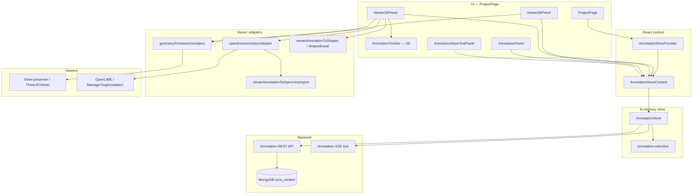

# Annotation system — current status

Top-down view of how OCRA handles annotations today: purpose, layers, main classes, and what works in production vs what is still planned.

For the target active-selection contract see [a06-active-annotations.md](./a06-active-annotations.md). Store sync, OCC, SSE, and write protocols are summarized in §5 and §5.4 below.

---

## 1. Purpose

OCRA treats annotations as **three decoupled MongoDB entities** per project:

| Entity       | Role                                                                            |
| ------------ | ------------------------------------------------------------------------------- |
| **Geometry** | Shapes in scene or asset space (`ShapePoints`, `ShapePolyline`, `ShapePolygon`) |
| **Data**     | Semantic fields (label, description, class, vocabulary content)                 |
| **Link**     | Many-to-many join between geometry and data                                     |

The editor keeps a **local replica** of the current scene’s annotations, updates it optimistically, persists via REST, and stays aligned with other users through **SSE**. The UI does not treat “one link = one row”; the **viewer** works on geometries and the **panel** on data, with focus and highlights bridging the two.

---

## 2. Layered architecture

**Data flow (simplified):**

1. **Load** scene bundle (REST) → populate `AnnotationStore` maps.
2. **Connect** SSE → apply remote mutations into the same maps.
3. **Query** `SelectionCriteria` → **active** geometry / data / link sets + indexes.
4. **Focus** (UI clicks) → `focusedGeometryIds` / `focusedDataIds` → viewer highlights + label emphasis.
5. **Viewers** map active geometries to `ViewerAnnotation` DTOs and render; user edits call store writes → REST → SSE.
6. **Social locks** (advisory) — editors announce presence on a resource; peers see indicators and warnings; locks do not block REST writes (OCC still governs conflicts).

---

## 3. Domain model (`shared/`)

Canonical Zod schemas and types (not the same as viewer DTOs):

| Artifact   | Path                          | Notes                                                                          |
| ---------- | ----------------------------- | ------------------------------------------------------------------------------ |
| Schemas    | `shared/annotation-schema.ts` | Validation for API and persistence                                             |
| Types      | `shared/annotation-types.ts`  | `AnnotationGeometry`, `AnnotationData`, `AnnotationLink`, `AnnotationShape`, … |
| Events     | `shared/annotation-events.ts` | SSE mutation and social-lock payloads                                          |
| Viewer DTO | `shared/scene-types.ts`       | `ViewerAnnotation` — rendering-only (`point` / `line` / `area`)                |

Geometries are scoped by `referenceType` + `referenceId` (scene or asset). Data has visibility scope and can be shared across scenes in a project. All entities carry `**version`** (OCC), `**erasableAt` / `erasableBy**` (soft delete), and audit fields.

---

## 4. Backend (summary)

Repositories under `backend/src/repositories/annotation-*.repository.ts` read/write the three MongoDB collections in `ocra_content`. Routes expose scene bundles, CRUD, erasable marks, and an SSE stream keyed by project + scene.

The frontend does not talk to Mongo directly; it uses `**AnnotationApiClient**` (`frontend/src/services/AnnotationApiClient.ts`) and `**AnnotationEventsService**` (`frontend/src/services/AnnotationEventsService.ts`) for REST + SSE.

---

## 5. Frontend store layer

### 5.1 `AnnotationStore` (`frontend/src/stores/AnnotationStore.ts`)

In-memory maps:

- `geometries`, `data`, `links` — full loaded snapshot for the current scene (data map can grow with `loadProjectData()`).
- Meta: `loadedDataScopes`, `loadingScopes`, `allProjectDataLoaded`.
- Guards: `generation` (stale async discard), `isSaving`, `isCreating`.

**Main operations:**

| Operation                            | Effect                                                                            |
| ------------------------------------ | --------------------------------------------------------------------------------- |
| `loadScene(sceneId)`                 | REST bundle → maps; then SSE connect                                              |
| `createAnnotation(input)`            | New geometry + data + link (or link to `existingDataId`)                          |
| `updateGeometry(id, shapes)`         | OCC geometry PATCH                                                                |
| `updateData(id, input)`              | OCC data PATCH (one write updates all linked geometries’ semantics)               |
| `mark*Erasable` / `mark*NonErasable` | Soft delete / restore per kind                                                    |
| `loadProjectData()`                  | Merge all project data for link-to-existing pickers (store API ready; limited UI) |
| SSE handlers                         | Merge remote creates/updates/deletes into maps                                    |

Writes are optimistic local-first with version checks; conflicts surface via `onConflict`.

### 5.2 Active selection (`frontend/src/stores/annotation-selection.ts`)

`**SelectionCriteria`** — declarative filter (geometry / data / link predicates, `includeErasable`, `linkMode`).

**Current default UX:** `includeErasable: false` (hide soft-deleted entities by default). This is enforced in `AnnotationStore` defaults and in scene/project loads.

`**evaluateActiveSelection(maps, criteria, sceneId)`** → `**ActiveAnnotationSelection**`:

- Three ID sets: `geometryIds`, `dataIds`, `linkIds`
- Materialized maps: `geometriesById`, `dataById`, `linksById`
- Relationship indexes: `linksByGeometryId`, `linksByDataId`, `geometryIdsByDataId`, `dataIdsByGeometryId`

Helpers include `buildGeometryLabelDisplay`, `getActiveResolvedTriples`, `getActiveGeometriesForData`, etc.

**Not in UI yet:** a query builder GUI. A “show/hide erased” toggle previously existed in the panel but is intentionally disabled/commented out for now; restore/recovery flows will reintroduce UI controls later.

### 5.3 `AnnotationStoreContext` (`frontend/src/context/AnnotationStoreContext.tsx`)

`**AnnotationStoreProvider`** wraps the project viewer area in `ProjectPage` (when a scene is selected). Exposes:

- Store ref, `revision` (React re-render tick)
- **Loaded:** `allGeometries`, `allData`, `allLinks`
- **Active:** `activeGeometries`, `activeData`, `activeLinks`, `activeAnnotationSelection`, `selectActiveAnnotations`
- **Focus:** `focusedGeometryIds`, `focusedDataIds`, `focusGeometry` / `focusData` / `clearFocus`, …
- **Writes:** `createAnnotation`, `updateGeometry`, `updateData`, `mark*`, `loadProjectData`, `loadScene`
- **Realtime:** `realtimeState`, `eventLog`, `activeSocialLocks`, `currentStreamId`
- **Social locks:** `startEditorLock` / `stopEditorLock` (REST notify → SSE broadcast)
- **Focus guard:** `setFocusSelection` runs through `runSelectionWithLockGuard`; conflicts open a provider-level modal (`AnnotationMessageModalCatalog.lockConflict`) with *Cancel* / *Continue anyway*

`getActiveResolvedTriples` and similar helpers exist on the store class but are **not** yet exposed on context (callers use `store` ref in the lab).

### 5.4 Collaborative editing — social locks (current)

**Backend** (`backend/src/lib/annotation-events.ts`): in-memory map of active locks per SSE connection; `POST .../annotations/events/social-lock/start|stop` publishes `annotation.social_lock.started|stopped`. Locks are cleared when a stream disconnects. Types in `shared/annotation-events.ts`: `AnnotationSocialLockState`, `lockKind: 'presence' | 'editor'`, optional `resourceType` + `resourceId` (`geometry` | `data` | `link`).

**Advisory only** — social locks do not reject writes. Concurrent edits still resolve via **OCC** (`version` / 409) and SSE merges. Locks exist for UX: show who is editing, warn before selecting/editing the same triplet, disable destructive actions where appropriate.

| Source                   | When lock is published                                                        | Stopped when                             |
| ------------------------ | ----------------------------------------------------------------------------- | ---------------------------------------- |
| **AnnotationPanel**      | User opens data edit modal (`startEditorLock('data', …)`)                     | Save, cancel, unmount                    |
| **Viewer2DPanel**        | Focused geometry ids change (`startEditorLock('geometry', …)` per focused id) | Focus changes, panel unmount             |
| **Presence** (API ready) | Optional scene-wide / scoped presence via `AnnotationEventsService`           | Not wired in production panel/viewer yet |

**Peer UX**

| Surface                    | Behaviour                                                                                                                                                                                                         |
| -------------------------- | ----------------------------------------------------------------------------------------------------------------------------------------------------------------------------------------------------------------- |
| **Selection / focus**      | `collectSelectionConflicts` ignores locks from `currentStreamId` (own session). Remote **editor** lock on overlapping geometry/data/link → modal before applying focus; user may continue anyway.                 |
| **AnnotationPanel banner** | When current focus overlaps remote editor locks, shows who is editing (geometry/data/link aware, expands focus to linked triple).                                                                                 |
| **Panel list styling**     | Rows under any editor lock (local or remote, including linked geometry) use `backgroundUnderEditing` / `textUnderEditing` from `annotationStyles.ts`.                                                             |
| **Panel delete**           | Per-row and bulk delete **disabled** when a **remote** editor lock covers that data row or linked geometry/link (`annotation-social-locks.ts`). Grayed trash icon + tooltip.                                      |
| **2D viewer**              | Remote geometry editor locks → `applyOpenLimeUnderEditing` → OpenLIME `structuralClasses.underEditing` (red glow in `OPENLIME_ANNOTATION_STYLE_CONFIG`). Own locks are not styled as under-editing in the canvas. |
| **Edit snapshots (2D)**    | While dragging vertices, `editSnapshotsRef` blocks store shape sync for that geometry; geometry PATCH uses `expectedVersion` from snapshot; 409 opens modal and holds snapshot until dismissed.                   |

**Helpers:** `frontend/src/stores/annotation-social-locks.ts` — `isDataIdUnderRemoteEditorLock`, `areAnyDataIdsUnderRemoteEditorLock`, `isDataIdUnderEditorLock`, `linkedResourcesForData`.

OCC and social-lock behaviour: optimistic local-first writes, version guards, advisory locks (§5.4). Demo timeline: `AnnotationApiDemoCard` on the API demo page.

---

## 6. UI integration (`ProjectPage`)

`ProjectPage` mounts `**AnnotationStoreProvider`** with `projectId` and `selectedSceneId`.

| URL mode     | Viewer                           | Panel             |
| ------------ | -------------------------------- | ----------------- |
| `?mode=3d`   | `Viewer3DPanel`                  | `AnnotationPanel` |
| `?mode=2d`   | `Viewer2DPanel` (RTI / OpenLIME) | `AnnotationPanel` |
| `?mode=test` | `AnnotationStoreTestPanel` (lab) | —                 |

The old `**AnnotationProvider**` / `**AnnotationContext**` / frontend `**AnnotationService**` (scene.json `PUT` persistence) have been **removed**. Production paths use only `AnnotationStoreProvider`.

---

## 7. Viewer adapters (`frontend/src/adapters/annotation-store/`)

Bridge **domain geometries** ↔ **viewer DTOs** without pulling OpenLIME/three-presenter into the store.

| Module                                | Responsibility                                                                                                          |
| ------------------------------------- | ----------------------------------------------------------------------------------------------------------------------- |
| `geometryToViewerAnnotation.ts`       | `AnnotationGeometry` → `ViewerAnnotation`; `getViewerHighlightGeometryIds`; comma-joined label from linked data + focus |
| `viewerAnnotationToShapes.ts`         | OpenLIME/three events → `AnnotationShape[]` for persistence                                                             |
| `shapesEqual.ts`                      | Skip redundant geometry PATCH when shapes unchanged (2D)                                                                |
| `viewerAnnotationToOpenLimeImport.ts` | JSON-LD + SVG for polylines/polygons; vertex-handle repair detection                                                    |
| `openlimeAnnotationAdapter.ts`        | `syncOpenLimeAnnotations`, OpenLIME selection helpers, edit-mode helpers                                                |

### 7.1 3D — `Viewer3DPanel` + `ThreeJSViewer`

- Renders **active geometries** via `activeGeometriesToViewerAnnotations` → `renderAnnotations(ViewerAnnotation[])`.
- **Create:** double-click / point-pick → `createAnnotation` with `ShapePoints`.
- **Selection / focus:** syncs with panel; uses three-presenter `AnnotationManager` for highlight where available.
- **Labels:** single string on `ViewerAnnotation.label` (joined / `(no data)`); **no** `setGeometryLabels` multi-label API yet (see a06).

### 7.2 2D — `Viewer2DPanel` + `OpenLIMEViewer`

- **Store → canvas:** `syncOpenLimeAnnotations` keeps OpenLIME layer aligned with active geometries.
  - **All shapes:** `importAnnotations` (JSON-LD + SVG), so store sync does **not** emit OpenLIME `create` events.
  - Imported SVG includes a hit target and **vertex handles** for polyline/polygon editing.
  - Imported annotations are parsed immediately (SVG → `elements`) so OpenLIME can apply styles without waiting for a later prefetch cycle.
  - **Remote geometry changes:** if vertices differ from OpenLIME (`viewerGeometryMatchesOpenLime`), annotation is deleted and re-imported (applies to **all** types including points).
  - **Missing handles:** older imports without `annotation-vertex-handles` are re-imported.
  - Does **not** call `updateAnnotation` on sync (avoids SSE feedback loops).
- **Canvas → store:** `onAnnotationCreated` / `onAnnotationUpdated` → `createAnnotation` / `updateGeometry` (guarded by `isStoreSyncRef`, `shapesEqual`).
- **Selection:** canvas ↔ `focusedGeometryIds` / `focusedDataIds` via `setFocusSelection` (includes social-lock guard); empty canvas selection clears panel focus.
  - Panel-driven selection enables the OpenLIME pencil tool (`enableEditing(true)`) so viewer clicks emit `selectionChange` and keep the panel in sync. Programmatic pencil enable skips OpenLIME `pencilEnabled` → `deselectAll` so panel selection is not cleared on the next frame.
  - Viewer2D filters out programmatic selection-change events using an “expected ids” guard (`expectedProgrammaticSelectionRef`), to avoid swallowing real user selections after sync.
- **Editable:** points and polylines/polygons drawn in OpenLIME or imported from store (vertex drag → `editStart` snapshot → `update` → store PATCH).
- **Toolbar:** see §7.4. Replaces the old OpenLIME keyboard overlay for create/edit mode.
- **OpenLIME vendored tweaks (performance / UX):** `enableState: false`, `singleEditMode: true`, camera `Transform` idle completion, `LayerSvgAnnotation.prefetch` / label layout cache, `UIBasic.updateMenu` not tied to canvas `update` (layer menu only refreshes on visibility/mode changes).

### 7.3 OpenLIME classes and labels (ManagerSvgAnnotation)

OCRA currently uses **structural state only**, not semantic classes (Pattern A: `semanticClass` stays null).

| Mechanism                            | Used in OCRA? | How                                                                                                                                                                              |
| ------------------------------------ | ------------- | -------------------------------------------------------------------------------------------------------------------------------------------------------------------------------- |
| **Manager defaults**                 | Yes           | OpenLIME built-in `defaultFill` / `defaultStroke` (not overridden in `OpenLIMEViewer`)                                                                                           |
| `**semanticClasses`**                | No            | No map in viewer config; `AnnotationData.class` not mapped to `semanticClass`                                                                                                    |
| `**structuralClasses.selected**`     | Yes           | Focus → `layer.selected` → highlight (`OPENLIME_ANNOTATION_STYLE_CONFIG.selected`)                                                                                               |
| `**structuralClasses.underEditing**` | Yes (remote)  | `applyOpenLimeUnderEditing` for geometries with a **remote** editor social lock (`setAnnotationStructuralClass('underEditing')`). Local vertex drag does not set `anno.editing`. |
| `**structuralClasses.default`**      | Config only   | Not auto-applied; idle shadow from `_getClassStyle` CSS `drop-shadow`                                                                                                            |
| **Labels**                           | Yes           | `anno.label` from store / create; panel `updateData` triggers resync                                                                                                             |
| **Selected label text**              | Yes           | When focused/selected, label `fill` matches `structuralClasses.selected.stroke` (`#fed802`)                                                                                      |

Wiring: `frontend/src/config/annotationStyles.ts` (`OPENLIME_ANNOTATION_STYLE_CONFIG`), `OpenLIMEViewer.tsx`, `openlimeAnnotationAdapter.ts` (sync, selection, `applyOpenLimeUnderEditing`), `viewerAnnotationToOpenLimeImport.ts`.

### 7.4 Annotation type toolbar (`AnnotationToolbar`) — 2D

Reusable React control for choosing how the user interacts with the OpenLIME annotation layer. **3D does not mount this yet** (3D create path remains point-only via three-presenter).

| Piece   | Path                                                           | Role                                                                                                                                  |
| ------- | -------------------------------------------------------------- | ------------------------------------------------------------------------------------------------------------------------------------- |
| UI      | `frontend/src/components/AnnotationToolbar.tsx`                | Four modes: **Point**, **Line**, **Area**, **Edit** (Bootstrap icons, dark floating bar)                                              |
| Mapping | `frontend/src/adapters/openlime-viewer/openlimeToolbarMode.ts` | `point` → disk marker; `line` → open polyline; `area` → closed polyline; `edit` → `enableEditing(true)` + `manager.setMode('edit')`   |
| Host    | `Viewer2DPanel.tsx`                                            | Renders toolbar **only when** OpenLIME pencil is active (`pencilActive` from `onPencilActiveChange` / `OpenLIMEViewer.enableEditing`) |

**Visibility:** bottom-centred overlay (`zIndex: 100`); not shown until the viewer is ready and the user has enabled annotations (OpenLIME pencil / UIBasic). Toolbar mode state lives in `Viewer2DPanel` (`toolbarMode`); changing mode calls `applyOpenLimeToolbarMode` on the live `ManagerSvgAnnotation`.

**Goals:** shared component for a future 3D toolbar (same `AnnotationToolbarMode` type); centralize create/edit mode instead of keyboard shortcuts in OpenLIME.

---

## 8. Annotation panel (`AnnotationPanel`)

- Lists `**activeData`** (not a flat “resolved triple” list).
- Per row: label, description, **linked geometry count**, edit modal (`updateData`), delete (`markDataErasable`).
- **Focus:** row click (with Ctrl multi-select) → `focusData` → viewer highlights linked geometries via `getViewerHighlightGeometryIds`.
- **Bulk:** delete focused data rows, clear focus (bulk delete disabled if any focused row is under **remote** editor lock).
- **Realtime** badge from `realtimeState`.
- **Collaboration:** banner when focused selection overlaps remote editor locks; list rows styled when under edit; delete guarded as in §5.4.
- **Edit modal:** publishes **data** editor lock for the row being edited; handles 409 / remote delete via `AnnotationMessageModalCatalog`.

**Store supports but panel does not expose yet:** link/unlink UI (`createAnnotation({ existingDataId })`, `markLinkErasable`), geometry list tab, `loadProjectData` picker, presence-lock UI.

---

## 9. Lab (`AnnotationStoreTestPanel`)

`?mode=test` — counts (loaded vs active), SSE log, scripted CRUD/erasable/loadProjectData tests. Scripts live in `frontend/src/routes/components/annotation-test/scripts.ts`.

---

## 10. Supported functionality (current)

| Area                                                            | Supported                                                 |
| --------------------------------------------------------------- | --------------------------------------------------------- |
| Scene load + SSE sync                                           | Yes                                                       |
| OCC writes + conflict handling                                  | Yes                                                       |
| Decoupled geometry / data / link                                | Yes                                                       |
| Active query (default hides erasable)                           | Yes                                                       |
| UI focus (panel ↔ viewer)                                       | Yes                                                       |
| 3D point create + render active geometries                      | Yes                                                       |
| 2D point / polyline / polygon create, edit vertices, store sync | Yes                                                       |
| 2D store → canvas import (all shape types)                      | Yes                                                       |
| 2D remote geometry + label sync                                 | Yes (geometry re-import; label patch)                     |
| 2D annotation toolbar (point / line / area / edit)              | Yes (`AnnotationToolbar` in `Viewer2DPanel`)              |
| Panel edit/delete data                                          | Yes                                                       |
| Soft delete (erasable) all three kinds                          | Store + API; panel uses data side                         |
| Social locks — editor announce + SSE                            | Yes                                                       |
| Social locks — selection conflict modal                         | Yes (provider; focus / `setFocusSelection`)               |
| Social locks — remote under-edit styling (panel + 2D canvas)    | Yes                                                       |
| Social locks — delete disabled under remote edit                | Yes (panel)                                               |
| Social locks — enforce at API (reject writes)                   | **No** — advisory + OCC only                              |
| Presence lock UI in production viewers                          | **No** (API + demo card only)                             |
| Multi-label per geometry (a06 `labels[]` / `selected[]`)        | **No** — comma-joined single label in adapters            |
| Selection criteria GUI                                          | **No**                                                    |
| Panel link/unlink                                               | **No** (store ready)                                      |
| 3D polylines/polygons                                           | **No** (points only for create)                           |
| 3D annotation toolbar                                           | **No** (reuse `AnnotationToolbar` planned)                |
| OpenLIME semantic classes (`AnnotationData.class` → viewer)     | **No** — structural `selected` / `underEditing`; see §7.3 |
| Legacy scene.json annotation `PUT` path                         | Removed (was unused on 3d/2d/test)                        |

---

## 11. Mental model: active vs focus

| Concept    | Driven by                                       | Used for                                                   |
| ---------- | ----------------------------------------------- | ---------------------------------------------------------- |
| **Active** | `SelectionCriteria` → `selectActiveAnnotations` | Which entities appear in viewer/panel at all               |
| **Focus**  | User clicks (panel or viewer)                   | Highlights, which data labels are emphasized on geometries |

Rule of thumb from a06: **query** narrows the working set; **focus** narrows emphasis within that set.

---

## 12. Planned / not done (roadmap)

1. **Centralized annotation styles (2D + 3D)** — `annotationStyles.ts` / `OPENLIME_ANNOTATION_STYLE_CONFIG` is the 2D source of truth; extend to three-presenter so RTI and 3D match. Target: shared module referenced by both adapters; wire `AnnotationData.class` → OpenLIME semantic classes (§12 item 8).
2. **Multi-label in viewers** — `buildGeometryLabelDisplay` → per-viewer `setGeometryLabels` (3D three-presenter, 2D OpenLIME).
3. **Label style variants (team decision)** — OpenLIME `labelStyle` overrides (`textFillSelected`, under-editing label colours); align with panel `UNDER_EDITING_COLOR` vs canvas `underEditing` stroke.
4. **Collaboration** — optional presence indicators in panel/viewer; stronger OpenLIME-side block when geometry is remotely locked (today: React modal + styling + delete guard only); optional server-side enforcement (not just advisory).
5. **3D toolbar + shapes** — mount `AnnotationToolbar` on `Viewer3DPanel`; polylines/polygons create/edit; dedicated adapter module.
6. **Panel** — link/unlink, optional geometry rows, expose `getActiveResolvedTriples` on context.
7. **Query UI** — editor for `SelectionCriteria`.
8. **Semantic classes** — map `AnnotationData.class` → OpenLIME `semanticClasses`.
9. **Cleanup** — ~~legacy provider/service~~ done; HDT scene.json annotation fields remain read-only legacy.
10. **Tests** — e2e on store path + multi-user social-lock scenarios (optional).

---

## 13. Key files (quick index)

| Layer           | Path                                                                                               |
| --------------- | -------------------------------------------------------------------------------------------------- |
| Spec (active)   | `doc/a06-active-annotations.md`                                                                    |
| This status doc | `doc/annotation-current-status.md`                                                                 |
| Types / events  | `shared/annotation-types.ts`, `shared/scene-types.ts`, `shared/annotation-events.ts`               |
| Store           | `frontend/src/stores/AnnotationStore.ts`                                                           |
| Selection       | `frontend/src/stores/annotation-selection.ts`                                                      |
| Social helpers  | `frontend/src/stores/annotation-social-locks.ts`                                                   |
| Styles          | `frontend/src/config/annotationStyles.ts`                                                          |
| Context         | `frontend/src/context/AnnotationStoreContext.tsx`                                                  |
| API / SSE       | `frontend/src/services/AnnotationApiClient.ts`, `AnnotationEventsService.ts`                       |
| Adapters        | `frontend/src/adapters/annotation-store/`*                                                         |
| 2D toolbar      | `frontend/src/components/AnnotationToolbar.tsx`, `adapters/openlime-viewer/openlimeToolbarMode.ts` |
| 3D UI           | `frontend/src/routes/components/Viewer3DPanel.tsx`, `adapters/three-presenter/ThreeJSViewer.tsx`   |
| 2D UI           | `frontend/src/routes/components/Viewer2DPanel.tsx`, `adapters/openlime-viewer/OpenLIMEViewer.tsx`  |
| Panel           | `frontend/src/routes/components/AnnotationPanel.tsx`                                               |
| Lab             | `frontend/src/routes/components/AnnotationStoreTestPanel.tsx`                                      |
| Wiring          | `frontend/src/routes/ProjectPage.tsx`                                                              |
| Backend locks   | `backend/src/lib/annotation-events.ts`, `backend/src/controllers/annotation.controller.ts`         |

---

## 14. Quick verification

| Mode         | What to check                                                                                                                                                                                        |
| ------------ | ---------------------------------------------------------------------------------------------------------------------------------------------------------------------------------------------------- |
| `?mode=test` | Loaded vs active counts, SSE log                                                                                                                                                                     |
| `?mode=2d`   | Toolbar: point / line / area / edit; pencil shows toolbar; create/edit shapes; panel select + social-lock modal; remote lock → underEditing style + disabled delete; two-browser editor lock overlap |
| `?mode=3d`   | Point create; panel multi-select; viewer Ctrl multi-select; active geometries render; social-lock modal on conflicting focus                                                                         |

