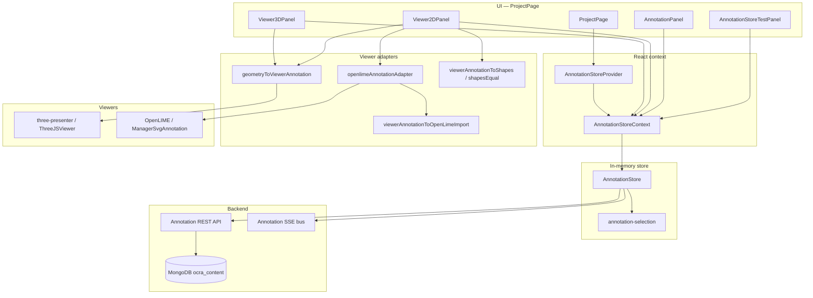

# Annotation system — current status

Top-down view of how OCRA handles annotations today: purpose, layers, main classes, and what works in production vs what is still planned.

For the target active-selection contract see [a06-active-annotations.md](./a06-active-annotations.md). For store sync, OCC, SSE, and write protocols see [anno-frontend.md](./anno-frontend.md).

---

## 1. Purpose

OCRA treats annotations as **three decoupled MongoDB entities** per project:

| Entity       | Role                                                                            |
| ------------ | ------------------------------------------------------------------------------- |
| **Geometry** | Shapes in scene or asset space (`ShapePoints`, `ShapePolyline`, `ShapePolygon`) |
| **Data**     | Semantic fields (label, description, class, vocabulary content)                 |
| **Link**     | Many-to-many join between geometry and data                                     |

The editor keeps a **local replica** of the current scene’s annotations, updates it optimistically, persists via REST, and stays aligned with other users through **SSE**. The UI does not treat “one link = one row”; the **viewer** works on geometries and the **panel** on data, with focus and highlights bridging the two.

---

## 2. Layered architecture

**Data flow (simplified):**

1. **Load** scene bundle (REST) → populate `AnnotationStore` maps.
2. **Connect** SSE → apply remote mutations into the same maps.
3. **Query** `SelectionCriteria` → **active** geometry / data / link sets + indexes.
4. **Focus** (UI clicks) → `focusedGeometryIds` / `focusedDataIds` → viewer highlights + label emphasis.
5. **Viewers** map active geometries to `ViewerAnnotation` DTOs and render; user edits call store writes → REST → SSE.

---

## 3. Domain model (`shared/`)

Canonical Zod schemas and types (not the same as viewer DTOs):

| Artifact   | Path                          | Notes                                                                          |
| ---------- | ----------------------------- | ------------------------------------------------------------------------------ |
| Schemas    | `shared/annotation-schema.ts` | Validation for API and persistence                                             |
| Types      | `shared/annotation-types.ts`  | `AnnotationGeometry`, `AnnotationData`, `AnnotationLink`, `AnnotationShape`, … |
| Events     | `shared/annotation-events.ts` | SSE mutation and social-lock payloads                                          |
| Viewer DTO | `shared/scene-types.ts`       | `ViewerAnnotation` — rendering-only (`point` / `line` / `area`)                |

Geometries are scoped by `referenceType` + `referenceId` (scene or asset). Data has visibility scope and can be shared across scenes in a project. All entities carry `**version`** (OCC), `**erasableAt` / `erasableBy`** (soft delete), and audit fields.

---

## 4. Backend (summary)

Repositories under `backend/src/repositories/annotation-*.repository.ts` read/write the three MongoDB collections in `ocra_content`. Routes expose scene bundles, CRUD, erasable marks, and an SSE stream keyed by project + scene.

The frontend does not talk to Mongo directly; it uses `**AnnotationApiClient**` (`frontend/src/services/AnnotationApiClient.ts`) and `**AnnotationEventsService**` (`frontend/src/services/AnnotationEventsService.ts`) for REST + SSE.

---

## 5. Frontend store layer

### 5.1 `AnnotationStore` (`frontend/src/stores/AnnotationStore.ts`)

In-memory maps:

- `geometries`, `data`, `links` — full loaded snapshot for the current scene (data map can grow with `loadProjectData()`).
- Meta: `loadedDataScopes`, `loadingScopes`, `allProjectDataLoaded`.
- Guards: `generation` (stale async discard), `isSaving`, `isCreating`.

**Main operations:**

| Operation                            | Effect                                                                            |
| ------------------------------------ | --------------------------------------------------------------------------------- |
| `loadScene(sceneId)`                 | REST bundle → maps; then SSE connect                                              |
| `createAnnotation(input)`            | New geometry + data + link (or link to `existingDataId`)                          |
| `updateGeometry(id, shapes)`         | OCC geometry PATCH                                                                |
| `updateData(id, input)`              | OCC data PATCH (one write updates all linked geometries’ semantics)               |
| `mark*Erasable` / `mark*NonErasable` | Soft delete / restore per kind                                                    |
| `loadProjectData()`                  | Merge all project data for link-to-existing pickers (store API ready; limited UI) |
| SSE handlers                         | Merge remote creates/updates/deletes into maps                                    |

Writes are optimistic local-first with version checks; conflicts surface via `onConflict`.

### 5.2 Active selection (`frontend/src/stores/annotation-selection.ts`)

`**SelectionCriteria`** — declarative filter (geometry / data / link predicates, `includeErasable`, `linkMode`).

**Current default UX:** `includeErasable: false` (hide soft-deleted entities by default). This is enforced in `AnnotationStore` defaults and in scene/project loads.

`**evaluateActiveSelection(maps, criteria, sceneId)`** → `**ActiveAnnotationSelection**`:

- Three ID sets: `geometryIds`, `dataIds`, `linkIds`
- Materialized maps: `geometriesById`, `dataById`, `linksById`
- Relationship indexes: `linksByGeometryId`, `linksByDataId`, `geometryIdsByDataId`, `dataIdsByGeometryId`

Helpers include `buildGeometryLabelDisplay`, `getActiveResolvedTriples`, `getActiveGeometriesForData`, etc.

**Not in UI yet:** a query builder GUI. A “show/hide erased” toggle previously existed in the panel but is intentionally disabled/commented out for now; restore/recovery flows will reintroduce UI controls later.

### 5.3 `AnnotationStoreContext` (`frontend/src/context/AnnotationStoreContext.tsx`)

`**AnnotationStoreProvider`** wraps the project viewer area in `ProjectPage` (when a scene is selected). Exposes:

- Store ref, `revision` (React re-render tick)
- **Loaded:** `allGeometries`, `allData`, `allLinks`
- **Active:** `activeGeometries`, `activeData`, `activeLinks`, `activeAnnotationSelection`, `selectActiveAnnotations`
- **Focus:** `focusedGeometryIds`, `focusedDataIds`, `focusGeometry` / `focusData` / `clearFocus`, …
- **Writes:** `createAnnotation`, `updateGeometry`, `updateData`, `mark*`, `loadProjectData`, `loadScene`
- **Realtime:** `realtimeState`, `eventLog`

`getActiveResolvedTriples` and similar helpers exist on the store class but are **not** yet exposed on context (callers use `store` ref in the lab).

---

## 6. UI integration (`ProjectPage`)

`ProjectPage` mounts `**AnnotationStoreProvider`** with `projectId` and `selectedSceneId`.

| URL mode     | Viewer                           | Panel             |
| ------------ | -------------------------------- | ----------------- |
| `?mode=3d`   | `Viewer3DPanel`                  | `AnnotationPanel` |
| `?mode=2d`   | `Viewer2DPanel` (RTI / OpenLIME) | `AnnotationPanel` |
| `?mode=test` | `AnnotationStoreTestPanel` (lab) | —                 |

The old `**AnnotationProvider`** / `**AnnotationContext**` / frontend `**AnnotationService**` (scene.json `PUT` persistence) have been **removed**. Production paths use only `AnnotationStoreProvider`.

---

## 7. Viewer adapters (`frontend/src/adapters/annotation-store/`)

Bridge **domain geometries** ↔ **viewer DTOs** without pulling OpenLIME/three-presenter into the store.

| Module                                | Responsibility                                                                                                          |
| ------------------------------------- | ----------------------------------------------------------------------------------------------------------------------- |
| `geometryToViewerAnnotation.ts`       | `AnnotationGeometry` → `ViewerAnnotation`; `getViewerHighlightGeometryIds`; comma-joined label from linked data + focus |
| `viewerAnnotationToShapes.ts`         | OpenLIME/three events → `AnnotationShape[]` for persistence                                                             |
| `shapesEqual.ts`                      | Skip redundant geometry PATCH when shapes unchanged (2D)                                                                |
| `viewerAnnotationToOpenLimeImport.ts` | JSON-LD + SVG for polylines/polygons; vertex-handle repair detection                                                    |
| `openlimeAnnotationAdapter.ts`        | `syncOpenLimeAnnotations`, OpenLIME selection helpers, edit-mode helpers                                                |

### 7.1 3D — `Viewer3DPanel` + `ThreeJSViewer`

- Renders **active geometries** via `activeGeometriesToViewerAnnotations` → `renderAnnotations(ViewerAnnotation[])`.
- **Create:** double-click / point-pick → `createAnnotation` with `ShapePoints`.
- **Selection / focus:** syncs with panel; uses three-presenter `AnnotationManager` for highlight where available.
- **Labels:** single string on `ViewerAnnotation.label` (joined / `(no data)`); **no** `setGeometryLabels` multi-label API yet (see a06).

### 7.2 2D — `Viewer2DPanel` + `OpenLIMEViewer`

- **Store → canvas:** `syncOpenLimeAnnotations` keeps OpenLIME layer aligned with active geometries.
  - **All shapes:** `importAnnotations` (JSON-LD + SVG), so store sync does **not** emit OpenLIME `create` events.
  - Imported SVG includes a hit target and **vertex handles** for polyline/polygon editing.
  - Imported annotations are parsed immediately (SVG → `elements`) so OpenLIME can apply styles without waiting for a later prefetch cycle.
  - **Remote geometry changes:** if vertices differ from OpenLIME (`viewerGeometryMatchesOpenLime`), annotation is deleted and re-imported (applies to **all** types including points).
  - **Missing handles:** older imports without `annotation-vertex-handles` are re-imported.
  - Does **not** call `updateAnnotation` on sync (avoids SSE feedback loops).
- **Canvas → store:** `onAnnotationCreated` / `onAnnotationUpdated` → `createAnnotation` / `updateGeometry` (guarded by `isStoreSyncRef`, `shapesEqual`).
- **Selection:** canvas ↔ `focusedGeometryIds` / `focusedDataIds`; empty canvas selection clears panel focus.
  - Panel-driven selection enables the OpenLIME pencil tool (`enableEditing(true)`) so viewer clicks emit `selectionChange` and keep the panel in sync.
  - Viewer2D filters out programmatic selection-change events using an “expected ids” guard (`expectedProgrammaticSelectionRef`), to avoid swallowing real user selections after sync.
- **Editable:** points and polylines/polygons drawn in OpenLIME or imported from store (vertex drag → `update` → store PATCH).

---

## 8. Annotation panel (`AnnotationPanel`)

- Lists `**activeData`** (not a flat “resolved triple” list).
- Per row: label, description, **linked geometry count**, edit modal (`updateData`), delete (`markDataErasable`).
- **Focus:** row click (with Ctrl multi-select) → `focusData` → viewer highlights linked geometries via `getViewerHighlightGeometryIds`.
- **Bulk:** delete focused data rows, clear focus.
- **Realtime** badge from `realtimeState`.

**Store supports but panel does not expose yet:** link/unlink UI (`createAnnotation({ existingDataId })`, `markLinkErasable`), geometry list tab, `loadProjectData` picker.

---

## 9. Lab (`AnnotationStoreTestPanel`)

`?mode=test` — counts (loaded vs active), SSE log, scripted CRUD/erasable/loadProjectData tests. Scripts live in `frontend/src/routes/components/annotation-test/scripts.ts`.

---

## 10. Supported functionality (current)

| Area                                                            | Supported                                      |
| --------------------------------------------------------------- | ---------------------------------------------- |
| Scene load + SSE sync                                           | Yes                                            |
| OCC writes + conflict handling                                  | Yes                                            |
| Decoupled geometry / data / link                                | Yes                                            |
| Active query (default hides erasable)                           | Yes                                            |
| UI focus (panel ↔ viewer)                                       | Yes                                            |
| 3D point create + render active geometries                      | Yes                                            |
| 2D point / polyline / polygon create, edit vertices, store sync | Yes                                            |
| 2D store → canvas import (all shape types)                      | Yes                                            |
| 2D remote geometry + label sync                                 | Yes (geometry re-import; label patch)          |
| Panel edit/delete data                                          | Yes                                            |
| Soft delete (erasable) all three kinds                          | Store + API; panel uses data side              |
| Multi-label per geometry (a06 `labels[]` / `selected[]`)        | **No** — comma-joined single label in adapters |
| Selection criteria GUI                                          | **No**                                         |
| Panel link/unlink                                               | **No** (store ready)                           |
| 3D polylines/polygons                                           | **No** (points only for create)                |
| Social lock UI from panel                                       | **No**                                         |
| Legacy scene.json annotation `PUT` path                         | Removed (was unused on 3d/2d/test)             |

---

## 11. Mental model: active vs focus

| Concept    | Driven by                                       | Used for                                                   |
| ---------- | ----------------------------------------------- | ---------------------------------------------------------- |
| **Active** | `SelectionCriteria` → `selectActiveAnnotations` | Which entities appear in viewer/panel at all               |
| **Focus**  | User clicks (panel or viewer)                   | Highlights, which data labels are emphasized on geometries |

Rule of thumb from a06: **query** narrows the working set; **focus** narrows emphasis within that set.

---

## 12. Planned / not done (roadmap)

1. **Multi-label in viewers** — `buildGeometryLabelDisplay` → per-viewer `setGeometryLabels` (3D three-presenter, 2D OpenLIME).
2. **Panel** — link/unlink, optional geometry rows, expose `getActiveResolvedTriples` on context.
3. **Query UI** — editor for `SelectionCriteria`.
4. **3D** — draw/edit polylines and polygons, dedicated adapter module.
5. **Cleanup** — ~~legacy provider/service~~ done; any remaining scene.json annotation fields in HDT payloads are read-only legacy data, not the editor write path.
6. **Tests** — e2e on store path (optional).

---

## 13. Key files (quick index)

| Layer             | Path                                                                                              |
| ----------------- | ------------------------------------------------------------------------------------------------- |
| Spec (active)     | `doc/a06-active-annotations.md`                                                                   |
| Spec (store/sync) | `doc/anno-frontend.md`                                                                            |
| This status doc   | `doc/annotation-current-status.md`                                                                |
| Types             | `shared/annotation-types.ts`, `shared/scene-types.ts`                                             |
| Store             | `frontend/src/stores/AnnotationStore.ts`                                                          |
| Selection         | `frontend/src/stores/annotation-selection.ts`                                                     |
| Context           | `frontend/src/context/AnnotationStoreContext.tsx`                                                 |
| API / SSE         | `frontend/src/services/AnnotationApiClient.ts`, `AnnotationEventsService.ts`                      |
| Adapters          | `frontend/src/adapters/annotation-store/`*                                                        |
| 3D UI             | `frontend/src/routes/components/Viewer3DPanel.tsx`, `adapters/three-presenter/ThreeJSViewer.tsx`  |
| 2D UI             | `frontend/src/routes/components/Viewer2DPanel.tsx`, `adapters/openlime-viewer/OpenLIMEViewer.tsx` |
| Panel             | `frontend/src/routes/components/AnnotationPanel.tsx`                                              |
| Lab               | `frontend/src/routes/components/AnnotationStoreTestPanel.tsx`                                     |
| Wiring            | `frontend/src/routes/ProjectPage.tsx`                                                             |

---

## 14. Quick verification

| Mode         | What to check                                                                                                               |
| ------------ | --------------------------------------------------------------------------------------------------------------------------- |
| `?mode=test` | Loaded vs active counts, SSE log                                                                                            |
| `?mode=2d`   | Create/edit point and polyline; panel select in create mode; canvas deselect clears panel; remote point move updates canvas |
| `?mode=3d`   | Point create; panel multi-select; viewer Ctrl multi-select; active geometries render                                        |

