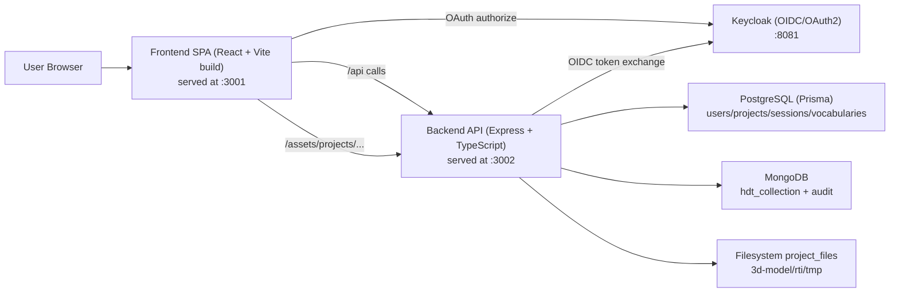

# OCRA Architecture

Last validated against code: 2026-02-26.

## Scope

This document describes runtime architecture and system boundaries.
For canonical entity definitions, see [data-model.md](./data-model.md).

## Source of Truth

- Frontend app shell and routing:
  - `frontend/src/main.tsx`
  - `frontend/src/App.tsx`
- Backend app and route mounting:
  - `backend/src/app.ts`
  - `backend/src/routes/index.ts`
- Data model and persistence:
  - `backend/prisma/schema.prisma`
  - `backend/src/services/hdt-metadata.service.ts`
  - `backend/src/services/audit.service.ts`

## Runtime Topology

## Frontend

- SPA built with React + React Router.
- Authentication bootstrap starts at `/` (`App.tsx`) and redirects authenticated users to protected routes.
- Protected routes are wrapped by `RequireAuth`.
- 3D rendering uses `three-presenter` through:
  - `frontend/src/adapters/three-presenter/ThreeJSViewer.tsx`
  - `frontend/src/adapters/three-presenter/OcraFileUrlResolver.ts`
- Model files are resolved to backend static URLs:
  - `/assets/projects/<projectId>/3d-model/<assetPath>`

## Backend

- Express application created in `backend/src/app.ts`.
- API base path: `/api`.
- Static project assets served from:
  - `/assets/projects` -> `PROJECT_FILES_PATH` (default `/app/project_files` in container).
- Main route modules mounted in `backend/src/routes/index.ts`:
  - `/oauth`
  - `/sessions`
  - `/users`
  - `/projects`
  - `/admin`
  - `/vocabularies`
  - HDT routes under `/projects/:projectId/...`

## Persistence Responsibilities

- PostgreSQL (Prisma):
  - `User`, `Session`, `Project`, `ProjectRole`, `Vocabulary`
  - Authorization and membership decisions.
- MongoDB:
  - HDT aggregate (`hdt_collection`): metadata, digital assets, scenes
  - Audit events (audit collection).
- Filesystem:
  - Binary payloads under `project_files/<projectId>/{3d-model,rti,tmp}`.

## Key Request Flows

## 1) Authentication (OAuth2 PKCE + server-side session)

1. Frontend starts PKCE and redirects to Keycloak.
2. Keycloak redirects browser back with authorization code.
3. Frontend calls `POST /api/oauth/token` (backend proxy).
4. Backend exchanges code with Keycloak.
5. Frontend calls `POST /api/sessions` with `userProfile + tokens`.
6. Backend persists user/session in PostgreSQL and sets `session_id` cookie.

## 2) Project and HDT content management

1. Project registry and memberships are read from PostgreSQL.
2. HDT document is managed through `/api/projects/:projectId/hdt...` routes (MongoDB).
3. Assets are represented in HDT (`digitalAssets[]`) and stored as files on disk.
4. Scenes are stored in HDT and served via `/api/projects/:projectId/scenes/:sceneId`.

## 3) 3D asset retrieval at runtime

1. Frontend receives scene/model references including `projectId`.
2. `OcraFileUrlResolver` converts model paths to `/assets/projects/...`.
3. Backend serves static files directly from `project_files`.

## Current Route Conventions

- Public/unauthenticated:
  - OAuth token exchange proxy: `/api/oauth/token`
  - Health: `/health`, `/api/health`
  - Static assets: `/assets/projects/...`
- Authenticated:
  - Sessions, users, projects, vocabularies, HDT APIs.
- Manager-restricted:
  - Project mutations, HDT creation/update, HDT asset and scene mutations.

## Legacy Notes

- Legacy scene endpoints under `/api/projects/:projectId/scene` are intentionally disabled in routes.
- Production scene state is derived from MongoDB HDT scene data, not legacy scene file endpoints.

## Deployment Modes

- Docker Compose mode:
  - Frontend `:3001`, Backend `:3002`, Keycloak `:8081`, PostgreSQL `:5432`, MongoDB `:27017`.
- Local mixed mode:
  - External services started via `npm run services:start`.
  - Frontend/backend run locally with workspace scripts.
