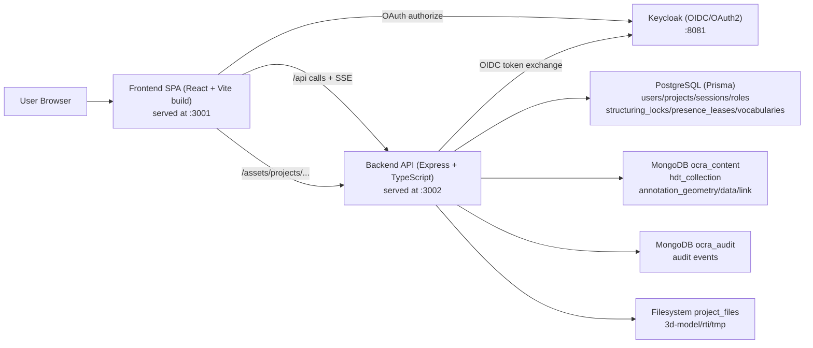

# OCRA Architecture

## Scope

This document describes runtime architecture and system boundaries.
For canonical entity definitions, see [data-model.md](./data-model.md).

## Source of Truth

- Frontend app shell and routing:
  - `frontend/src/main.tsx`
  - `frontend/src/App.tsx`
- Backend app and route mounting:
  - `backend/src/app.ts`
  - `backend/src/routes/index.ts`
- Data model and persistence:
  - `backend/prisma/schema.prisma`
  - `backend/src/services/hdt-metadata.service.ts`
  - `backend/src/services/audit.service.ts`

## Runtime Topology

## Frontend

- SPA built with React + React Router.
- Authentication bootstrap starts at `/` (`App.tsx`) and redirects authenticated users to protected routes.
- Protected routes are wrapped by `RequireAuth`.
- 3D rendering uses `three-presenter` through:
  - `frontend/src/adapters/three-presenter/ThreeJSViewer.tsx`
  - `frontend/src/adapters/three-presenter/OcraFileUrlResolver.ts`
- 2D/RTI rendering uses OpenLIME (git submodule at `frontend/openlime`, branch `ocra-integration`) through:
  - `frontend/src/adapters/openlime-viewer/OpenLIMEViewer.tsx`
- Model and RTI files are resolved to backend static URLs:
  - `/assets/projects/<projectId>/3d-model/<assetPath>`
  - `/assets/projects/<projectId>/rti/<assetPath>`
- Real-time annotation events are received via SSE (`AnnotationEventsService`).
- Project structuring lock state is coordinated via SSE (`ProjectStructuringCoordinator`).

## Backend

- Express application created in `backend/src/app.ts`.
- API base path: `/api`.
- Static project assets served from:
  - `/assets/projects` -> `PROJECT_FILES_PATH` (default `/app/project_files` in container).
- Main route modules mounted in `backend/src/routes/index.ts`:
  - `/oauth` — public PKCE token exchange proxy
  - `/sessions` — session create/destroy
  - `/users` — user profile and management
  - `/projects` — project registry, structuring lock, presence leases
  - `/projects/:projectId/hdt/...` — HDT metadata, assets, scenes (HDT routes)
  - `/projects/:projectId/annotations/...` — annotation CRUD and SSE event stream
  - `/sparql-proxy` — SPARQL proxy (mounted at root)
  - `/admin` — admin-only user management
  - `/vocabularies` — vocabulary registry
- Two independent SSE buses, both over plain HTTP (no WebSockets):
  - Annotation events (`/api/projects/:projectId/annotations/events`): mutation broadcasts and social locks, managed by `backend/src/lib/annotation-events.ts`.
  - Structuring events (`/api/projects/:projectId/structuring/events`): lock state changes, managed by `backend/src/lib/structuring-events.ts`.

## Persistence Responsibilities

- PostgreSQL (Prisma):
  - `User`, `Session`, `Project`, `ProjectRole`, `Vocabulary` — identity, authorization, project registry.
  - `StructuringLock` — database-backed project-wide exclusive lock, heartbeat TTL 30 s, `draining → exclusive` state machine.
  - `ProjectPresenceLease` — expiring session-scoped activity leases used for structuring drain coordination.
- MongoDB `ocra_content`:
  - `hdt_collection` — one HDT aggregate per project: `physicalObjectMetadata`, `digitalAssets[]`, `scenes[]`.
  - `annotation_geometry`, `annotation_data`, `annotation_link` — three independent annotation collections with OCC (`version`) and soft-delete (`erasableAt`/`erasableBy`).
- MongoDB `ocra_audit`:
  - Audit events (login, logout, file uploads).
- Filesystem:
  - Binary payloads under `project_files/<projectId>/{3d-model,rti,tmp}`.

## Key Request Flows

## 1) Authentication (OAuth2 PKCE + server-side session)

1. Frontend starts PKCE and redirects to Keycloak.
2. Keycloak redirects browser back with authorization code.
3. Frontend calls `POST /api/oauth/token` (backend proxy).
4. Backend exchanges code with Keycloak.
5. Frontend calls `POST /api/sessions` with `userProfile + tokens`.
6. Backend persists user/session in PostgreSQL and sets `session_id` cookie.

## 2) Project and HDT content management

1. Project registry and memberships are read from PostgreSQL.
2. HDT document is managed through `/api/projects/:projectId/hdt...` routes (MongoDB).
3. Assets are represented in HDT (`digitalAssets[]`) and stored as files on disk.
4. Scenes are stored in HDT and served via `/api/projects/:projectId/scenes/:sceneId`.

## 3) Asset retrieval at runtime

1. Frontend receives scene/model references including `projectId`.
2. `OcraFileUrlResolver` converts model paths to `/assets/projects/<projectId>/3d-model/...`.
3. For RTI assets, OpenLIME resolves paths to `/assets/projects/<projectId>/rti/...`.
4. Backend serves static files directly from `project_files` via `express.static`.

## 4) Annotation real-time flow

1. Frontend creates `AnnotationApiClient({ projectId, sceneId })` and calls `connectRealtime()`.
2. Client opens SSE connection to `/api/projects/:projectId/annotations/events?sceneId=...`.
3. Server registers the stream in the in-memory annotation event bus.
4. On annotation mutation (create/update/erasable), the backend broadcasts an `annotation.mutated` SSE event to all registered streams for the project, filtered by impacted scene/asset.
5. Frontend updates local state on `onMutation`.
6. Social lock start/stop signals are sent via `POST .../annotations/events/social-lock/start|stop` and broadcast as `annotation.social_lock.started|stopped` events.

## 5) Structuring lock flow

1. Manager calls `POST /api/projects/:projectId/structuring/start` → lock created in `draining` state.
2. Active presence leases expire (heartbeat TTL); lock transitions to `exclusive`.
3. Manager performs structural operations (scene/asset mutations, membership changes).
4. Manager calls `POST /api/projects/:projectId/structuring/stop` → lock released.
5. State transitions are broadcast via the structuring SSE bus to all connected sessions.

## Current Route Conventions

- Public/unauthenticated:
  - OAuth token exchange proxy: `/api/oauth/token`
  - Health: `/health`, `/api/health`
  - Project listing and metadata: `GET /api/projects`, `GET /api/projects/:projectId` (public projects only for anonymous)
  - Static assets: `/assets/projects/...` (served by `express.static`, no auth check at HTTP level)
- Authenticated (`requireAuth` middleware):
  - Sessions, users, admin, vocabularies, all HDT and annotation APIs.
- Manager-restricted (requires project `manager` role or `sys_admin`):
  - Project mutations, HDT creation/update, asset and scene mutations.
  - Structural operations additionally require an active `StructuringLock`.

## Legacy Notes

- Legacy scene endpoints under `/api/projects/:projectId/scene` are intentionally disabled in routes.
- Production scene state is derived from MongoDB HDT scene data, not legacy scene file endpoints.

## Deployment Modes

- Docker Compose mode:
  - Frontend `:3001`, Backend `:3002`, Keycloak `:8081`, PostgreSQL `:5432`, MongoDB `:27017`.
- Local mixed mode:
  - External services started via `npm run services:start`.
  - Frontend/backend run locally with workspace scripts.

---

*Last reviewed: 2026-05-20*
