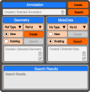

# OCRA - Viewer Connection

## Software Layers

- **OCRA**
    - Reusable code for the viewers
- **OCRA-Viewer-Middleware**
    - Connection between OCRA and the Viewer
- **Viewer**
    - The specific rendering engine (e.g., OpenLIME for 2D, 3JS Viewer for 3D) and all features that can be maintained internally in it

## Annotator above the middlewares or inside the middlewares?

There are 2 possibilities:
1. **A generic annotator**, used inside OCRA
    - relies on OCRA-OpenLIME Middleware for managing 2D annotations
    - relies on OCRA-3JS-Viewer Middleware for managing 3D annotations
    - In this case, OCRA-OpenLIME Middleware and OCRA-3JS-Viewer Middleware are very simple and contain little annotation logic, which is shared between the two by the generic annotator
    - ✅ A common (coarse) interface must be defined that can be implemented by both middlewares
    - ✅ Less code duplication
    - ❌ Risk of having to implement specific functions for the 2 cases that struggle to adapt to the common interface
    - ❌ Less independence between the two development teams (2D and 3D)
2. **Two middlewares, one for OpenLIME and one for 3JS Viewer, which contain 2 separate annotators internally**. Depending on the type of annotation (2D or 3D), one middleware or the other is used.
    - ❌ More code duplication
    - ❌ Trying to replicate the same types of interfaces in both middlewares
    - ✅ Simpler pattern, does not require a very strict agreement between the 2 middlewares
    - ✅ More independent development between the 2 development teams (2D and 3D)
    - ✅ Possibility of using common modules between the 2 middlewares (e.g., DB access layer or annotation data visualization interface)

## Where to manage annotation reference, creation, link?

### Annotation Reference: Scene | Asset

Currently, annotation coordinates in the Viewer are expressed relative to the scene only.
In which Layer should we manage the annotation reference system?

#### Viewer

1. ❌ Modify the code to have two reference systems. They will probably not be needed in the future
2. ✅ When loading/exporting an annotation in the Viewer, keep the geometric data as is without modifications

#### OCRA-Middleware

1. ✅ Keep everything relative to the scene in the Viewer (as it is now)
2. ✅ It will probably not be necessary to have differentiation (scene | asset) in the Viewer in the future
3. ✅ Simple work on the Middleware,
    1. When exporting an annotation from the Viewer: if it belongs to the scene keep the coordinates, if it belongs to an asset export them with the inverse of the asset matrix.
    2. When loading an annotation into the Viewer: if it belongs to the scene keep the coordinates, if it belongs to an asset apply the asset matrix to it

---

### Annotation Creation
Where to choose what the created annotation refers to? Scene or asset, and if so which asset?

#### Viewer   
1. ❌ Makes sense only if there is separate scene/asset management inside the Viewer 
2. ❌ Need a GUI that defines whether scene or asset, probably don't want to maintain it in the Viewer
3. ✅ Could use a click on the model to choose the reference asset 

#### OCRA
1. ✅ Don't modify the Viewer  
2. ✅ Can select the reference asset through a dropdown menu  
3. ✅ Have an external interface behavior that can be shared between viewers

---

### Annotation Link
Where to manage the complete representation of an annotation as a triple (geometry, data, link)? Build it natively into the Viewer or keep it in the Middleware?

#### Viewer
1. ❌ The Viewer's structure must be heavily modified, coupling the viewer too much to OCRA's application concepts.
2. ❌ Risk of "tight coupling": The Viewer should remain an agnostic rendering engine.
3. ✅ Makes communication apparently simpler (direct passing of objects), but at a high architectural cost.

#### OCRA-Viewer-Middleware
1. ✅ Optimal "Adapter" pattern approach: decouples the viewer from the business logic.
2. ✅ The Viewer continues to handle only geometries and opaque IDs.
3. ✅ The real representation is within OCRA, while the middleware handle the communication with the viewer.
4. ⚠️ Requires the middleware to maintain a map (dictionary) to synchronize the Viewer's geometric IDs with OCRA's Data and Link concepts.

---

### Proposed Choices: 
- Annotation Architecture: **OCRA-Annotator** (OCRA contains the annotator)
- Annotation Reference: **OCRA-Viewer-Middleware** (local/global coordinates management)
- Annotation Creation: **OCRA** (UI and hooking logic to scene/asset)
- Annotation Link: **OCRA-Viewer-Middleware** (management of data-link-geometry triple map)

---

## Proposed Modifications for the Viewer 

### Foreground / Background Assets

Allow the Viewer to load scenes with foreground and background assets
- foreground assets: editable
- background assets: not editable

Manage 2 or more groups of assets with separate specifications:
- Rendering mode
- Editable / Not editable annotations
    - Annotations Rendering Mode
    - Annotations Visibility
    - Lock for non-editable annotations
- Other possible features per asset group

---


## Implementation Notes: OCRA-Viewer Middleware (Annotation Layer)

To implement the connection via Middleware while keeping the Viewer agnostic, the following implementation steps are proposed:

### 1. ID Mapping (Synchronization Map)
The Middleware will need to maintain an internal state (e.g., a Map or Dictionary in TypeScript) that associates the IDs generated or used internally by the Viewer for geometries to the full annotation IDs in OCRA (or to the entire triples):
```typescript
// Conceptual example
const annotationMap = new Map<ViewerGeometryId, OcraAnnotationId>();
```

### 2. Annotation CRUD Synchronization
- **Read/Render**: When OCRA passes a list of annotations to display, the Middleware iterates them. For each annotation, it extracts the geometry, applies any transformation (if related to an asset) and sends it to the Viewer, saving the mapping `[ViewerGeometryId -> OcraAnnotationId]`.
- **Create**: When the user starts drawing an annotation on the Viewer, it will generate a local geometry ID. The Middleware will receive this event, send the creation request and save the complete triple in the OCRA DB, updating its map.
- **Update**: If the user modifies an existing geometry in the Viewer by dragging its vertices, the viewer emits an `onGeometryChange(geometryId, newCoords)` event. The Middleware intercepts the event, uses the map to trace back to the `OcraAnnotationId` and notifies OCRA of the update.
- **Delete**: Deletion via UI sends a notification to the Middleware, which instructs the Viewer to remove the related geometry while also removing the entry from the internal map.

### 3. Reference Systems Transformation (Scene vs Asset)
Since the Viewer works in the global reference system of the scene:
- During **Load/Render** towards the Viewer: if the annotation belongs to an Asset, the Middleware applies the Asset's transformation matrix (from local to global space) before sending it to the Viewer.
- During **Save/Update** towards OCRA: the Middleware intercepts the modifications made in global space on the Viewer, and applies the Asset's inverse matrix to them (from global to local) before passing them to OCRA for saving.

## Annotation operations

### Annotation creation

Given the decomposition of an annotation into three separate entities, the user must be able to create them independently via three distinct operations: 
1. Create annotationGeometry 
2. Create annotationData
3. Create annotationLink

For creating an annotation the user needs to select or create an annotationGeometry and an annotationData, then create an annotationLink referencing them.

- Creation of an `annotationGeometry` is performed within the viewer. Once the `referenceType` and `referenceId` are selected, the user can draw the geometry. 
- Creation of an `annotationData` is performed within an OCRA modal window. Once the `visibilityType` and `visibilityId` are selected, the user can create the data setting all the desired fields.
- Creation of an `annotationLink` is performed within OCRA. Once the `annotationGeometry` and the `annotationData` are selected, the user can create the link.

The desired interface should be able to **mix and match creation and selection of geometry or data** items.

The proposed user interface is given by this diagram



Diagram colors: blue: labels; light orange: options; orange: buttons; gray: disabled buttons; light gray: selected | created item descriptions;

### Workflow description

The proposed interface allows the user to create an `annotationGeometry`, an `annotationData`, or an `annotationLink`, via three dedicated `Create` buttons.
It can be used as a simple interface to create a single object or as an advanced interface to create a new annotation as a triple (geometry, data, link).
Before creating a Link, the interface permits to choose for both geometry and data if it is a new object or an existing one. 
The interface provides the option to select the reference scene or asset for the annotation geometry and the visibility type (scene or asset) for the annotation data.

The query button shows a modal window to perform the search query.
Selected items will be used for the annotationLink creation.

The standard annotation workflow, which creates both a new geometry and new data (default option), is initiated by selecting "New" for both fields and clicking "Create Annotation". The user will first be prompted to draw the geometry in the Viewer, followed by an OCRA modal window to input the data. Once both are completed, the `annotationLink` is automatically generated.

If one of the two is selected as existing, the user will be prompted to create the other one, and then the annotationLink is created.

The query modal window should be implemented as a separate component that can be used by the user to search for existing items.

### Annotation operations (search, update, delete)
The interface presents in the same window interfaces for geometry, data and link, with a search button for each of them, allowing the user to switch between them as needed.
Query results for `annotationGeometry`, `annotationData` and `annotationLink` are showed in the bottom window (one searched cathegory at a time). From this window presenting the list of queried items the user can select one item that can be used for link, edit or delete operations.
Selected annotation informations will be displayed in the corresponding geometry, data and link fields.

All operations (search,create,update,delete) can be performed on geometry, data and link, except the update operation on link, that require to be deleted and created again linking other primitives

| Operation | annotationGeometry | annotationData | annotationLink |
| --- | --- | --- | --- |
| Search | Yes | Yes | Yes |
| Create | Yes | Yes | Yes |
| Update | Yes | Yes | No |
| Delete | Yes | Yes | Yes |


#### Search Geometry
A search geometry operation is performed by the user selecting the search button in the geometry field. 
It will identify a set of `annotationGeometry`, each identified by a unique `ocraAnnotationGeometryId`.
The user can select one `annotationGeometry` from the list of identified `annotationGeometry`.

The selected geometry will be displayed in the corresponding geometry field.

⚠️ Think of showing in the search result a tree structure with, for each geometry, the list of linked data.


#### Search Data
A search data operation is performed by the user selecting the search button in the data field. 
It will identify a set of `annotationData` each identified by a unique `ocraAnnotationDataId`.
The user can select one `annotationData` from the list of identified `annotationData`.

The selected data will be displayed in the corresponding data field.

⚠️ Think of showing in the search result a tree structure with, for each data, the list of linked geometries.


#### Search Annotation
A search annotation operation is performed by the user selecting the search button in the annotation field. 
It will identify a set of `annotationLink` each identified by a unique `ocraAnnotationLinkId`.
The user can select one `annotationLink` from the list of identified `annotationLink`.
The selected annotation will be displayed in the corresponding annotation field.

In such a case also corresponding geometry and data will be displayed in the corresponding fields.

⚠️ Think if the annotationLink could be displayd with the linked geometry and data labels in the same line.


#### Update Geometry
Selected geometry can be updated in the viewer.
Geometry chages are saved in the viewer and then sent to OCRA, where are saved in the database.

#### Update Data
Selected data can be updated in a modal window
Data chages are sent to OCRA, where are saved in the database.

#### Delete Geometry

Geometry is deleted with a deep delete operation which will delete all the annotationLinks referencing the geometry.
If the data referenced by the link does not have other references **it could be deleted too**.

⚠️ Think if it is the desired behaviour or if it should be optional

#### Delete Data

Data is deleted with a deep delete operation which will delete all the annotationLinks referencing the data.
If the geometry referenced by the link does not have other references **it could be deleted too**.

⚠️ Think if it is the desired behaviour or if it should be optional

#### Delete Annotation

Annotation is deleted with a deep delete operation. which will delete all the annotationLinks referencing the annotation.
If the geometry referenced by the link does not have other references they will be deleted too.
If the data referenced by the link does not have other references they will be deleted too.

⚠️ Think if it is the desired behaviour or if it should be optional


### Annotation geometry Creation
**This operation is performed in the 2D and 3D viewers. It will have different implementations, but hopefully proposing the same interface**

1. User selects the reference scene or asset for the annotation geometry
2. In the viewer the user creates one or more shapes of different types representing the geometry.
    - user selects the type of shape primitive
    - user draws the shape primitive
    - user confirms the shape primitive
    - buttons permit to: select another shape, delete the last shape, edit, finish and save the geometry, cancel the operation
3. OCRA onGeometryCreation(shapes, viewerAnnotationId) is called with the list of shapes and the reference scene or asset. OCRA
    - creates the annotationGeometry and returns the ocraAnnotationGeometryId
    - updates the map viewerAnnotationId -> ocraAnnotationGeometryId
    - saves the annotationGeometry in the database
    - returns the ocraAnnotationGeometryId to the viewer

### Annotation Data Creation

User is prompted with a modal window which permits to fill all desired fields of the annotationData.

This function is called directly from OCRA.
At the end OCRA creates the annotationData and store it in the database

### Annotation Link Creation

1. User selects if creating new or selecting existing annotationGeometry and annotationData
    - In case of choosing existing items, user is prompted to select the desired existing annotationGeometry and annotationData
2. User press create Annotation button
3. Creation process require to create the new annotationGeometry and or annotationData (as previously selected). Geometry and data that need to be created are handled through previous workflows.
4. OCRA onLinkCreation(annotationGeometryId, annotationDataId) is called.
    - OCRA creates the annotationLink and returns the ocraAnnotationLinkId
    - OCRA saves the annotationLink in the database


