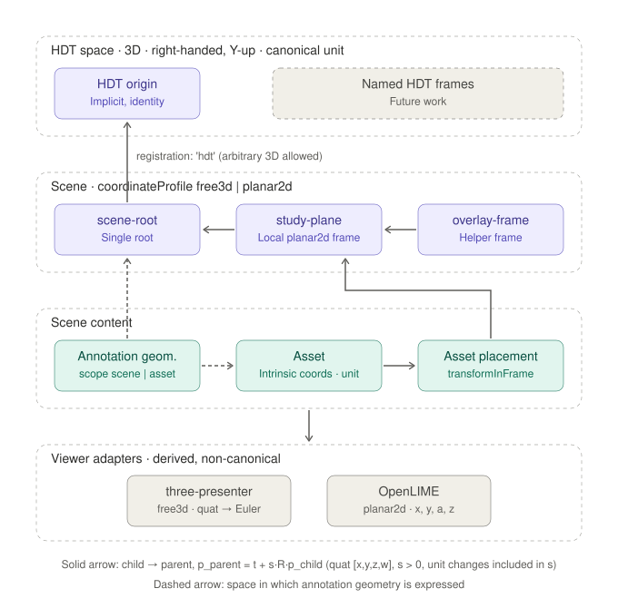

# OCRA Reference Frames for HDTs, Scenes, Assets, and Annotation Geometry

This document proposes a canonical reference-frame model for OCRA HDTs, scenes, assets, and annotation geometry.
It is intended as a design document for a future implementation deliverable.

OCRA is currently under active development, so this proposal favors a clean and coherent model over backward-compatible extensions.

## Status

This is a proposal, not yet the implemented canonical storage format.

Today, OCRA already stores asset placement information in scenes, but it does so using a viewer-oriented flat transform model:

- 3D scenes use asset-level `position`, `rotation`, and `scale`
- 2D scenes also reuse the same fields, but OpenLIME only supports a planar subset of those transforms
- annotation geometry is expressed in viewer coordinates, without a first-class reference-frame model shared with scene assets

In the current implementation, the result is workable for current features, but the conceptual model is incomplete:

- there is no explicit HDT-wide spatial basis shared by scenes
- scene frames are still implicit in flat asset transforms
- asset-local coordinates and scene coordinates are not clearly separated
- axis conventions and measurement units are not declared
- 2D and 3D adapters enforce different transform rules
- annotation geometry does not yet have a canonical anchoring model shared with scene asset placement

This proposal addresses that gap.

The proposal is deliberately staged.
The first deliverable introduces a single HDT spatial basis and explicit scene-local frame trees.
A richer graph of named, shared HDT frames is described as [future work](#future-work-named-hdt-frames).

## Goals

The reference-frame system should:

- define an HDT-wide spatial basis explicitly
- define scene coordinates explicitly, rather than implicitly through viewer adapters
- declare axis conventions, handedness, and measurement units
- work for both 3D and 2D scenes
- support both minimal scenes with a single asset and complex spatial reconstructions with many distributed assets
- allow hierarchical frames inside a scene
- allow multiple scenes of the same HDT to share a common spatial basis
- provide a canonical basis for asset placement
- provide a canonical basis for annotation geometry anchoring
- make viewer-specific constraints explicit and validated
- keep camera/view state separate from scene structure

## Non-Goals

This proposal does not define:

- camera persistence
- rendering configuration details
- a complete migration plan for all existing scene JSON payloads
- a full annotation data-model redesign
- a graph of named HDT-level frames in the first deliverable (see [Future Work](#future-work-named-hdt-frames))

Those topics depend on this model, but are separate concerns.

## Conceptual Model



The core idea is that OCRA should describe spatial structure as a tree of reference frames plus placements of assets and geometries within those frames.

There are four different concerns:

1. HDT space: the single shared 3D spatial basis of the HDT.
2. Scene structure: scene-local frames, organized as a tree with exactly one root, optionally registered into the HDT space.
3. Scene content placement: where an asset is placed within a scene-local frame.
4. Geometry anchoring: which scope and frame an annotation geometry is expressed in.

These concerns should not be merged.

## Reference Frames

A reference frame is a named coordinate system defined relative to another reference frame.

Examples:

- the root scene frame
- a wall frame
- a table frame
- a reconstructed object frame
- a document page frame
- a 2D imaging plane frame

Frames are semantic and structural. They are not viewer state.

## HDT Space and Scene Frames

The proposal distinguishes two structural levels:

- the HDT space, a single 3D coordinate system shared by all scenes of the HDT
- scene-local frames, owned by a specific scene

The HDT space is 3D by definition.
It represents the global spatial basis of the documented object or environment, such as:

- the physical object reference system
- a reconstruction-wide origin
- a museum installation layout
- a retable, manuscript, wall, or architectural reference system

Planar behavior is introduced only at the scene level, in scenes and scene-local frames that represent planar supports such as walls, panels, pages, or RTI/image-aligned surfaces.

Not all scenes are equal.
Some scenes are:

- local working views
- partial reconstructions
- 2D documentary compositions
- alternative alignments of the same assets

For that reason, a scene can be either:

- **registered**: its root frame is placed in the HDT space, so its content is spatially comparable with every other registered scene of the same HDT
- **local**: its root frame is not related to the HDT space, and the scene is a self-contained working space

In the first deliverable the HDT space has no internal structure: it is just an origin, a set of axes, and a unit.
Registered scenes relate to one another only through the transforms of their root frames into that space.

## Frame Tree vs. Flat Asset Transforms

The current flat model is sufficient only when every asset is placed directly in a single implicit scene coordinate system.

That becomes limiting when:

- multiple assets belong to the same physical support
- assets need to be aligned relative to a shared wall, panel, or object surface
- annotations should survive asset re-registration
- 2D and 3D viewers need a common model
- scene semantics matter, not just raw display transforms

With a frame tree:

- shared local contexts become explicit
- transforms can be composed structurally
- placement logic is separated from asset identity and remains scene-owned
- annotation geometry can attach to meaningful frames instead of incidental viewer coordinates

## Axis Conventions

All canonical coordinate systems in OCRA (HDT space, scene frames, and the intrinsic space of 3D assets unless declared otherwise) are:

- **right-handed**
- **Y-up**: `+Y` is the vertical direction, pointing up
- **`+Z` toward the observer** of a planar support: for a planar frame, the support lies in the local XY plane and its visible face looks towards `+Z`

This is the convention of Three.js, so the 3D adapter needs no axis swap.
It is also the convention of the OpenLIME scene and layer coordinate systems (origin at the center, `+X` right, `+Y` up), so the 2D adapter needs no axis swap either.
An identity-registered `planar2d` scene is therefore a vertical plane facing the default Three.js camera, and it looks the same in OpenLIME.

Assets produced by pipelines that use a different convention (for example Z-up photogrammetry or GIS data) are handled by their placement transform, not by redefining the canonical axes.

### Intrinsic Space of 2D Assets

The intrinsic space of 2D assets (images, RTI datasets, derived raster layers) is the **OpenLIME layer space**:

- unit: pixel of the full-resolution image
- origin: center of the image
- `+X` to the right, `+Y` up, `+Z` toward the observer

Raster coordinates (the OpenLIME "image" space, also used by SVG annotations) have their origin at the top-left corner and `+Y` pointing down.
For an image of `w × h` pixels, a raster position `(u, v)` maps to the intrinsic point:

```txt
(x, y, z) = (u - w/2, h/2 - v, 0)
```

This is exactly the mapping implemented by OpenLIME in `CoordinateSystem.fromLayerToImage` and its inverse.

The Y-down to Y-up mapping is a reflection.
It cannot be expressed by a similarity transform with positive scale, nor by a rotation without leaving the XY plane (a 180° rotation about X is a tilt, which `planar2d` forbids).
For this reason it is never part of a stored transform: it is fixed once, by this definition, and applied by viewer adapters when converting to and from raster or SVG coordinates.

Choosing the layer space rather than the raster space as canonical has three advantages:

- an OCRA asset placement of a 2D asset is exactly an OpenLIME layer transform (layer to scene), without any correction
- in Three.js, the same image rendered on a `PlaneGeometry(w, h)` (centered at the origin, lying in XY, facing `+Z`) occupies exactly the intrinsic space, so the same placement works in both viewers
- rotation and scale in a placement act around the center of the image, which is the natural pivot for alignment in both viewers

The mapping depends on the full-resolution image size `w × h`.
That size is part of the asset metadata, and a re-processing of the asset that changes its dimensions (for example a crop) must be treated as a new intrinsic space, with its asset-scoped geometry converted accordingly.

## Proposed Canonical Transform Type

The proposed canonical transform for scene frames and asset placements is a 3D similarity transform:

```ts
type Vec3 = [number, number, number];
type Quat = [number, number, number, number]; // [x, y, z, w]

type SimilarityTransform3 = {
  translation: Vec3;
  rotation: Quat;
  scale: number;
};
```

This means:

- translation is always 3D
- rotation is always stored as a quaternion
- scale is uniform and positive

The quaternion component order is `[x, y, z, w]`.
This matches the convention used by Three.js and makes `[0, 0, 0, 1]` the identity rotation.

## Units and Geometric Scale

The spatial model distinguishes clearly between:

- unit of measurement
- geometric scale

These are related mathematically, but they do not express the same concept.

A unit of measurement describes the physical meaning of coordinates in a spatial context.
Examples:

- an HDT may use meters to contextualize an object inside a church
- a study scene may use millimeters for fine inspection and measurement
- a 2D asset uses pixels, whose physical size may or may not be known
- a 3D mesh may use millimeters, meters, inches, or an unknown unit

Geometric scale, instead, is part of a transform.
It describes how coordinates of one frame are mapped into another.

### Units Are Semantic, Scales Are Explicit

In OCRA, **units are metadata and never take part in transform composition**.
Every factor needed to go from one space to another, including the factor between two different units, is stored explicitly in the `scale` of the corresponding transform.

For example, a scene in millimeters registered in an HDT in meters has `scale: 0.001` in the transform of its root frame.

This choice keeps the model simple and robust:

- composition is pure arithmetic on stored data; any consumer (viewer adapters, backend, export, measurement tools) can compose transforms without knowing about units
- a forgotten unit conversion cannot silently produce a 1000× error, because there is no implicit conversion to forget
- it follows the practice of the main 3D formats: glTF and Three.js have no units at all, and USD records `metersPerUnit` as metadata without applying it automatically when composing layers

Units still matter: they give coordinates their physical meaning, they drive measurement display, and they allow OCRA to [check](#unit-consistency-validation) that stored scales are coherent.

### Unit Declarations

```ts
type LengthUnit = {
  metersPerUnit: number; // e.g. 0.001 for millimeters, 0.0254 for inches
  symbol?: string;       // display label, e.g. 'mm', 'in'
};
```

A unit is defined by its size in meters, not by a closed list of names.
Any length unit is therefore supported, metric or not (inches, feet, Vienna inches for historical drawings, and so on), without a conversion table in the core model.

Declarations:

- the HDT space declares `unit: LengthUnit | null`
- a scene declares `unit?: LengthUnit | null`; if omitted, it inherits the HDT unit
- all frames of a scene share the scene unit; units never change inside a scene frame tree
- a digital asset declares `unit: LengthUnit | null` for its intrinsic space
- `null` means **uncalibrated**: coordinates have no known physical size

For a 2D asset, the intrinsic coordinates are always pixels, and `unit` states the physical size of one pixel when it is known (for example `{ metersPerUnit: 0.0001 }` for 0.1 mm per pixel).
For a 3D asset, `unit` states the unit of its model space, or `null` if it is unknown.

### Unit Presets

The only conversion table in OCRA is a list of presets used by the user interface, defined once in `shared/`:

```ts
const LENGTH_UNIT_PRESETS: Record<string, LengthUnit> = {
  mm: { metersPerUnit: 0.001, symbol: 'mm' },
  cm: { metersPerUnit: 0.01, symbol: 'cm' },
  m: { metersPerUnit: 1, symbol: 'm' },
  in: { metersPerUnit: 0.0254, symbol: 'in' },
  ft: { metersPerUnit: 0.3048, symbol: 'ft' },
};
```

Presets are a convenience for editing and display.
Stored data always contains the full `LengthUnit`, so it remains interpretable if the preset list changes.

### Expected Scale Between Units

When both sides of a transform have a known unit, the scale that corresponds to a pure change of unit is:

```txt
expectedScale(child, parent) = child.metersPerUnit / parent.metersPerUnit
```

For example, from millimeters to meters `0.001 / 1 = 0.001`, and from inches to millimeters `0.0254 / 0.001 = 25.4`.

OCRA uses this value in two places only, never in composition:

- **editing**: when a scene is registered in the HDT, or a calibrated asset is placed in a scene, the editor proposes `expectedScale` as the initial `scale`
- **validation**: the stored `scale` is compared with `expectedScale`; any remaining factor is a geometric scaling, which on a link between two calibrated spaces usually reveals a calibration or registration error

When at least one side is uncalibrated, there is no expected scale.
The stored `scale` is then itself the calibration: for example, the placement scale of an uncalibrated RTI in a millimeter scene states how many millimeters a pixel covers.
It should be edited and audited as a calibration rather than as a visual resize, and once known it should preferably be recorded as the unit of the asset.

### Changing a Unit

Since units are not applied automatically, changing the unit of a scene or of the HDT is an explicit editing operation, with two possible meanings:

- **relabel**: the numbers stay the same and the declared unit was wrong; the scene changes physical size, and the unit consistency check will report the scales that no longer match
- **convert**: the physical geometry stays the same; the editor multiplies all coordinates expressed in that space (frame translations, placement scales, scene-scoped annotation vertices) by the conversion factor, and divides the scale of the link to the parent accordingly

Converting touches annotation data, so the unit of a scene should be chosen when the scene is created and changed only rarely.

## Transform Composition

The reference-frame model is useful only if transform composition is explicit and predictable.

Each `transformToParent` maps coordinates from a child frame to its parent frame.
Given a point `p_child` expressed in the child frame, the corresponding point in the parent frame is:

```txt
p_parent = t + s R p_child
```

where:

- `t` is the translation vector expressed in the parent frame, in parent units
- `R` is the rotation from child frame to parent frame
- `s` is the positive uniform scale, including any change of unit

This means:

- scale is applied in the child-local frame
- rotation is applied in the child-local frame
- translation is applied last and is expressed in the parent frame

The document assumes a consistent parent-relative composition model:

- each frame stores its transform to its parent
- each asset placement stores its transform to its owning scene frame
- each scene root stores its transform to the HDT space, if the scene is registered
- global coordinates are obtained by walking upward through the tree and composing all parent-relative transforms

If a transform from frame `C` to frame `B` is written as:

```txt
T_CB(p) = t_CB + s_CB R_CB p
```

and a transform from frame `B` to frame `A` is written as:

```txt
T_BA(p) = t_BA + s_BA R_BA p
```

then the composed transform from `C` to `A` is:

```txt
T_CA = T_BA ∘ T_CB
```

which means:

```txt
T_CA(p) = T_BA(T_CB(p))
```

and yields:

```txt
s_CA = s_BA s_CB
R_CA = R_BA R_CB
t_CA = t_BA + s_BA R_BA t_CB
```

This is the composition rule that OCRA should use throughout the reference-frame system.
The parent always appears on the left.

For an asset placed in a scene frame `F_n`, whose ancestors are `F_{n-1}, …, F_1` up to the scene root `F_0`, the effective transform to the HDT space is therefore:

```txt
T_asset→HDT = T_F0→HDT ∘ T_F1→F0 ∘ … ∘ T_Fn→Fn-1 ∘ T_asset→Fn
```

This has several practical consequences:

- moving a parent frame moves all of its descendants
- a scene can be re-registered in the HDT space by changing only the transform of its root frame, because every scene frame descends from the root
- measurements and geometry exports can be computed in asset, frame, scene, or HDT coordinates by choosing how far composition is evaluated

For planar 2D scenes, the same logic still applies.
The difference is only that the allowed transforms are constrained to the planar subset.

## Similarity Transform

The proposal intentionally excludes:

- non-uniform scale
- shear
- reflections
- arbitrary 4x4 matrices as canonical storage

Reasons:

- OpenLIME already behaves as a uniform-scale planar system
- scene-frame semantics become harder to reason about with arbitrary affine transforms
- composition and validation remain simpler
- annotation geometry behaves more predictably
- the model stays compatible with both 3D viewers and 2D viewers

The only reflection OCRA needs, the raster Y-down convention, is absorbed by the definition of the intrinsic space of 2D assets (see [Axis Conventions](#intrinsic-space-of-2d-assets)).

If a future requirement truly needs arbitrary affine transforms, that should be introduced as a deliberate extension, not as the default canonical model.

## Proposed Spatial Model

### HDT Spatial Model

```ts
type HdtSpatialModel = {
  unit: LengthUnit | null;
  version: number;
};
```

Semantics:

- the HDT space is right-handed and Y-up, as defined in [Axis Conventions](#axis-conventions)
- `unit` is the global measurement unit of the HDT, or `null` if the HDT space is uncalibrated
- `version` supports OCC on spatial-model writes, consistently with the rest of OCRA content

In the first deliverable the HDT space has no named sub-frames.
Its origin is the implicit root of every registered scene.

### Scene Frame

```ts
type FrameConstraint = 'free3d' | 'planar2d';

type SceneFrame = {
  id: string;
  label: string;
  parentFrameId?: string;
  transformToParent: SimilarityTransform3;
  constraint?: FrameConstraint;
};
```

Semantics:

- `id` is stable and unique within the scene
- `label` is user-facing
- `parentFrameId` defines the scene-local frame tree
- `transformToParent` maps coordinates from the frame to its parent
- `constraint` declares which transform subset is valid in that frame

If `constraint` is absent, the frame is unconstrained and should be treated as equivalent to `free3d`.

Every scene frame tree has exactly one root:

- the root frame is the only frame without `parentFrameId`
- every other frame has a `parentFrameId` that references a frame of the same scene
- the root's `transformToParent` is its registration into the HDT space if the scene is registered, and must be the identity if the scene is local

A single root is essential.
It guarantees that the scene root is the common ancestor of every scene frame, so re-registering the root moves the whole scene, scene coordinates are well defined, and planarity can be validated entirely inside the scene.

### Asset Placement

```ts
type SceneAssetPlacement = {
  assetId: string;
  sceneFrameId: string;
  transformInFrame: SimilarityTransform3;
};
```

Semantics:

- `assetId` identifies the digital asset
- `sceneFrameId` identifies the scene-local frame where the asset is placed
- `transformInFrame` maps asset-local coordinates to the chosen scene-local frame; its `scale` includes the change from the asset unit to the scene unit, or the asset calibration if the asset is uncalibrated (see [Units](#expected-scale-between-units))

Asset placements are always owned by a scene.
An asset is never placed directly in the HDT space.

### Digital Asset Spatial Metadata

```ts
type DigitalAssetSpatialInfo =
  | { dimensionality: '2d'; width: number; height: number; unit: LengthUnit | null }
  | { dimensionality: '3d'; unit: LengthUnit | null };
```

This metadata belongs to the digital asset in the HDT asset pool, not to scenes.
2D assets declare the full-resolution size needed by the [raster mapping](#intrinsic-space-of-2d-assets), and optionally the physical size of one pixel as `unit`.
3D assets use their model space as-is (see [Model Origin Handling](#model-origin-handling)).

### Scene Description Skeleton

```ts
type SceneCoordinateProfile = 'free3d' | 'planar2d';

type SceneRegistration = 'hdt' | 'local';

type SceneDescriptionV2 = {
  id: string;
  label: string;
  coordinateProfile: SceneCoordinateProfile;
  registration: SceneRegistration;
  unit?: LengthUnit | null;
  rootSceneFrameId: string;
  frames: SceneFrame[];
  assetPlacements: SceneAssetPlacement[];
};
```

This is intentionally focused on scene structure and placement.
Rendering options, environment settings, and viewer state should remain separate sections.

`registration` declares whether the scene root is placed in the HDT space (`'hdt'`) or is a self-contained working space (`'local'`).
Only registered scenes can be compared or combined spatially with other scenes.

`coordinateProfile` is a scene-level summary of the intended interaction model.
It does not redefine the HDT space.
In particular, a `planar2d` scene is still registered inside the global 3D HDT space through its root frame.
Its purpose is not to replace frame-level constraints, but to express the operational mode of the scene as a whole.

In practice, `coordinateProfile` can be used to:

- select the appropriate viewer mode, such as planar 2D interaction versus free 3D interaction
- define the expected editing and navigation behavior of the scene
- enable scene-level validation rules that apply to the whole composition
- classify the scene explicitly without having to infer its intent only from the frame tree

In a `planar2d` scene, every non-root frame is implicitly `planar2d`, and only 2D assets may be placed.
Placing a 3D asset in a planar scene is rejected, because the planar viewer adapter cannot represent it.

`unit` declares the measurement unit of the scene.
If omitted, it inherits from the HDT spatial model.

The frame tree remains the geometric source of truth.
`coordinateProfile` is a scene-level declaration about how that geometry is intended to be used.

In this proposal, `assetPlacements` is keyed effectively by `assetId` within a scene.
That means a scene may contain at most one placement for a given asset.
If OCRA later needs multiple placements of the same asset inside one scene, the model should introduce an explicit `placementId` rather than overloading `assetId`.

### HDT Description Skeleton

```ts
type HdtDocumentSpatialDescription = {
  spatialModel: HdtSpatialModel;
  scenes: SceneDescriptionV2[];
};
```

This makes the ownership boundary explicit:

- the HDT space belongs to the HDT aggregate
- scene frames belong to one scene
- asset placements belong to one scene
- assets participate in an HDT only through their placement inside one or more scenes

## Example

```ts
const scene = {
  id: 'scene-01',
  label: 'North Wall Documentation',
  coordinateProfile: 'planar2d',
  registration: 'hdt',
  rootSceneFrameId: 'scene-origin',
  frames: [
    {
      id: 'scene-origin',
      label: 'Scene Origin',
      transformToParent: {
        translation: [0, 0, 0],
        rotation: [0, 0, 0, 1],
        scale: 1,
      },
    },
    {
      id: 'wall-01-frame',
      label: 'Wall 01',
      parentFrameId: 'scene-origin',
      transformToParent: {
        translation: [10, 0, 0],
        rotation: [0, 0, 0, 1],
        scale: 1,
      },
    },
  ],
  assetPlacements: [
    {
      assetId: 'asset-rti-01',
      sceneFrameId: 'wall-01-frame',
      transformInFrame: {
        translation: [0, 0, 0],
        rotation: [0, 0, 0, 1],
        scale: 0.002, // calibration: 1 px = 0.002 scene units
      },
    },
  ],
};
```

## Coordinate Semantics

The proposal distinguishes clearly between the following coordinate domains:

- asset-local (intrinsic) coordinates
- scene-frame coordinates
- scene-root coordinates
- HDT coordinates
- viewer coordinates
- image/pixel (raster) coordinates

Only the first four belong in the canonical spatial model.

Viewer coordinates and raster coordinates are adapter-level concerns.

## Asset-Local Coordinates

Each asset has its own intrinsic coordinate system.

Examples:

- a 3D mesh has vertex coordinates in model space
- an RTI/image asset uses the centered, Y-up layer space defined above
- a derived layer shares the intrinsic space of the asset it is derived from, when it has the same pixel grid

The spatial model should not redefine those intrinsic coordinates beyond the axis and unit declarations above.
Instead, each scene places the asset-local coordinate system into one of its own scene-local frames.

## Annotation Geometry Anchoring

The same reference-frame model should be reused for annotation geometry, but with a different scope from scene asset placement.
As described in the annotation model, annotation geometry lives in the reference space of a scene or of a digital asset, not directly in the HDT space.

The key distinction is between:

- the owning scope of the geometry resource
- the frame, inside that scope, in which the coordinates are expressed

This matches the current annotation model in `doc/a00-annotation-model.md`, where `referenceType` and `referenceId` identify the owning scene or asset of the geometry record itself.

The canonical geometry anchoring structure is:

```ts
type GeometryAnchor =
  | { scope: 'scene'; sceneId: string; frameId?: string }
  | { scope: 'asset'; assetId: string };

type Geometry3D = {
  anchor: GeometryAnchor;
  vertices: Vec3[];
};
```

This means:

- annotation geometry is always owned by a declared scene or asset scope
- geometry does not depend on transient viewer state
- geometry can remain stable across viewer adapters
- geometry can attach either to a scene reference space or to an asset reference space, depending on the use case

Coordinate rules:

- for scene-scoped geometry, coordinates are expressed in the frame `frameId`; if `frameId` is omitted, they are expressed in the scene root frame ("scene coordinates")
- for asset-scoped geometry, coordinates are expressed in the intrinsic space of the asset
- for 2D assets and for frames of `planar2d` scenes, vertices have `z = 0`

The optional `frameId` is introduced now, although it may remain unused at first, because it is what allows scene-scoped annotations to follow a support when its frame is re-registered.
An annotation on a wall frame moves with the wall; an annotation expressed in scene-root coordinates does not.
Adding the field now avoids a later migration of the annotation collections.

The discriminated union also makes the two scopes structurally distinct: `sceneId` and `assetId` are typed separately instead of being conflated into a single `referenceId`.

In practical terms:

- geometry with scene scope is expressed in scene coordinates, or in a named scene frame
- geometry with asset scope is expressed in the intrinsic coordinate space of the asset
- for 2D assets such as RTI datasets and images, that is the centered, Y-up layer space; the OpenLIME adapter converts it to and from the raster (SVG) coordinates used by its annotation editor
- for 3D assets, the intrinsic asset space is the model space of the mesh

This suggests that OCRA does not need a heavy shared abstraction for intrinsic asset spaces immediately.
Scene scope and asset scope are sufficient, provided that each asset type documents what its intrinsic coordinate space means.

## 2D and 3D Profiles

The proposal supports both 3D and 2D scenes through explicit constraints.
The HDT space remains 3D; the planar profile applies to scenes and scene-local frames that represent planar supports or planar interaction spaces.

### `free3d`

The `free3d` profile allows:

- any 3D translation
- any unit quaternion rotation
- any positive uniform scale

This profile is appropriate for:

- reconstructed 3D scenes
- objects placed in open 3D space
- general-purpose 3D composition

### `planar2d`

The `planar2d` profile is a constrained subset of the 3D transform model.

It allows:

- translation only in the XY plane
- rotation only around the Z axis
- positive uniform scale

It forbids:

- translation along Z
- tilt around X
- tilt around Y
- non-uniform scale

A planar rotation by angle `θ` (counter-clockwise, seen from `+Z`) is stored as the quaternion `[0, 0, sin(θ/2), cos(θ/2)]`.

This profile is appropriate for:

- RTI scenes
- image-aligned documentary scenes
- layered 2D acquisition products
- wall planes, manuscript pages, and other planar supports

## Validation Rules

The scene model should be validated structurally and geometrically.

### General Validation

- `unit` must be present on the HDT spatial model, either as a `LengthUnit` or as `null`
- every `metersPerUnit` must be finite and strictly greater than zero
- `rootSceneFrameId` must exist in scene `frames`
- exactly one scene frame has no `parentFrameId`, and it is the frame referenced by `rootSceneFrameId`
- every `frame.id` must be unique within the scene
- every `parentFrameId` must reference an existing frame of the same scene
- the frame tree must be acyclic
- if `registration` is `'local'`, the root `transformToParent` must be the identity
- every `assetPlacements[].assetId` must reference an existing asset
- every `assetPlacements[].sceneFrameId` must reference an existing scene-local frame
- in a `planar2d` scene, every placed asset must be a 2D asset
- every 2D asset must declare a positive `width` and `height`
- every quaternion must be finite and non-zero
- every quaternion should be normalized during validation or canonicalization
- every scale must be finite and strictly greater than zero

### Unit Consistency Validation

For every link whose two sides both have a known unit, OCRA compares the stored scale `s` with the [expected scale](#expected-scale-between-units):

- scene root → HDT space, for registered scenes, with the scene unit and the HDT unit
- scene frame → parent scene frame, where both sides share the scene unit, so the expected scale is `1`
- asset → scene frame, with the asset unit and the scene unit

If `|s / expectedScale - 1|` exceeds a configured tolerance (for example `1e-3`), OCRA reports a **warning**, not an error.
Real registrations always carry a small residual, and a scale mismatch may also be intentional; the warning makes it visible and auditable instead of rejecting the data.

Links with an uncalibrated side are not checked, because their scale is the calibration itself.

### Root Frame Validation

The scene root of a registered scene does not need to be identity.
That transform is precisely what expresses where the scene sits in the HDT space, and it may include arbitrary 3D orientation even for a `planar2d` scene.

### `planar2d` Validation

For a frame or placement constrained as `planar2d`:

- `translation[2]` must be `0` within a configured tolerance
- rotation must represent only a Z-axis rotation within a configured tolerance
- scale must be positive

In practice, validation should use numerical tolerances rather than exact equality.

Example tolerance policy:

- `abs(z) <= 1e-9` for planar translation checks
- quaternion components corresponding to X and Y tilt near zero within tolerance

### Composition Validation

If a frame is `planar2d`, its effective transform to the scene root must also be planar.
Because every scene frame descends from the single root, this check involves only scene-local transforms, and is fully decided by the scene itself.

In particular, OCRA should reject:

- a `planar2d` frame attached under a tilted `free3d` frame
- a nominally 2D scene that becomes effectively non-planar through composition

The scope boundary is:

- `planar2d` composition validation applies from each frame up to, but excluding, the scene root registration
- the scene root transform into the HDT space may include arbitrary 3D orientation

This is what allows a planar scene to be positioned on an arbitrarily oriented support in the global 3D HDT space, such as an inclined wall, a retable panel, or an architectural surface.
Since that registration is owned by the scene, no change outside the scene can make it non-planar.

## Canonicalization Rules

To keep data stable and diff-friendly, OCRA should canonicalize transforms on write.

Suggested canonicalization:

- normalize quaternions, with a non-negative `w` component
- map nearly-zero numeric noise to exact zero when safe
- canonicalize the root transform of local scenes to identity
- canonicalize positive scale values
- reject `-0` style output in serialized JSON if possible

Canonicalization should make equivalent transforms serialize the same way whenever practical.

## Relationship With OpenLIME

OpenLIME uses an explicit chain of coordinate systems (`CoordinateSystem.js`):

- canvas HTML: origin top-left, Y down
- viewport: origin bottom-left, Y up
- center: origin at the viewport center, Y up
- scene: origin at the dataset center, Y up; placed by the camera transform
- layer: origin at the layer center, Y up; placed in the scene by the layer transform
- image and layout: origin top-left, Y down

Its 2D transform (`Transform.js`) maps a point as:

```txt
p' = (x, y) + z R(a) p
```

with translation `x, y`, rotation angle `a` in degrees (counter-clockwise, standard in a Y-up system), and uniform scale `z`.
This is exactly the planar restriction of the OCRA convention `p_parent = t + s R p_child`.

The OCRA canonical model maps onto OpenLIME as follows:

| OCRA | OpenLIME |
|---|---|
| 2D asset intrinsic space | layer space |
| asset placement composed up to the scene root | layer transform |
| scene-root coordinates | scene space |
| raster/SVG annotation coordinates | image space |

Conversions performed by the OpenLIME adapter:

- planar transform: `x = t[0]`, `y = t[1]`, `z = s`, `a = 2 atan2(q[2], q[3])` converted to degrees
- raster to intrinsic: `(u, v) → (u - w/2, h/2 - v, 0)`, and back

This is important because OCRA should not expose OpenLIME's internal 2D transform shape as the canonical scene model.
OpenLIME should be treated as one viewer adapter, not as the domain model.

### Units and Measurement Tools

OpenLIME follows the same principle as OCRA: units never take part in transforms.

- each layer has a `pixelSize`, the physical size of one pixel in millimeters (`0` when unknown); OCRA reads it from the `pixelSizeInMM` field of the RTI header
- the `Units` class (`ScaleBar.js`) holds a conversion table to millimeters, used only to format measurements for display
- OpenLIME has no notion of a scene unit: `ScaleBar` computes the real size of a screen pixel as `pixelSize / cameraZoom`, and `Ruler` multiplies lengths measured in scene coordinates by `pixelSize`

Both tools therefore assume that one scene unit is one pixel of a single layer, placed with scale `1`.
In OCRA this is not true: scene coordinates are expressed in the scene unit, and layers are placed with their calibration scale.

The mapping is:

| OCRA | OpenLIME |
|---|---|
| `asset.unit.metersPerUnit` | `layer.pixelSize / 1000` |
| placement scale `s` (composed up to the scene root) | `layer.transform.z` |
| `scene.unit.metersPerUnit` | *no equivalent* |

To keep measurements correct, the adapter passes to `ScaleBar` and `Ruler` the size of **one scene unit** in millimeters, not the pixel size of an asset:

```txt
measurePixelSize = scene.unit.metersPerUnit × 1000
```

For a millimeter scene this is `1`.
With this value `Ruler` converts scene-coordinate lengths correctly, and `ScaleBar` stays correct because the camera zoom maps scene coordinates to the screen.
Scenes with several assets at different resolutions, or with scaled layers, are measured consistently.
If the scene is uncalibrated (`unit: null`), no `pixelSize` is passed and the tools report lengths in scene units, labeled as pixels by OpenLIME.

The per-layer `pixelSize` should still be set from the asset unit, so that layer-level information remains available, but it must not drive the scene-level measurement tools.

Camera zoom limits need no special handling: OpenLIME computes them from the scene bounding box and from the minimum layer scale (`Camera.updateBounds`), so layer scales different from `1` are supported.

This replaces the current behavior of the OCRA adapter, which passes to `ScaleBar` the pixel size of the first asset that declares one, and is therefore wrong for every other asset whose resolution or placement scale differs.

## Relationship With three-presenter

The proposed OCRA transform semantics are also compatible with `three-presenter`, and therefore with the standard local-transform model of Three.js.
Because OCRA, OpenLIME, and Three.js share the same right-handed, Y-up convention, no axis conversion is needed between any of them.

In practice, `three-presenter` applies model transforms through:

- local position
- local rotation
- local scale

This corresponds to the standard Three.js local object transform, where a child object is transformed relative to its parent.
That is compatible with the OCRA convention adopted in this document:

```txt
p_parent = t + s R p_child
```

and with the parent-relative composition rule:

```txt
T_CA = T_BA ∘ T_CB
```

Therefore, an OCRA frame tree can be adapted naturally to a Three.js scene graph:

- each OCRA frame corresponds to a local transform relative to its parent
- each asset placement corresponds to a local transform relative to its owning scene frame, with its scale copied as-is
- global coordinates are obtained by composing local transforms upward through the hierarchy

The same holds for 2D assets shown in 3D.
If an image is rendered in Three.js on a `PlaneGeometry(w, h)`, that plane is centered at the origin, lies in XY, and faces `+Z`, so it coincides with the OpenLIME layer space.
A `planar2d` scene can then be shown in both viewers from the same placements, and a 2D asset can be placed in a `free3d` scene without any special case.

Some aspects of the current `three-presenter` API are broader than the canonical model and must be handled by the adapter:

### Rotation Representation

The OCRA proposal uses quaternions as the canonical persisted representation for rotation.
By contrast, `three-presenter` currently exposes model rotations as Euler triples, in degrees or radians (with auto-detection when the unit is not declared).

This does not create a mathematical incompatibility, but it does mean that:

- OCRA keeps quaternions as the canonical format
- the `three-presenter` adapter converts quaternions to Euler angles in radians, always declaring the unit, so auto-detection is never triggered
- a future refinement could apply quaternions directly in the Three.js layer for closer alignment with the canonical model

### Scale Representation

`three-presenter` accepts a single number or a per-axis `[x, y, z]` scale.
The adapter always emits a uniform scale; non-uniform scale is never produced from the canonical model.

### Model Origin Handling

`three-presenter` also exposes an `origin` behavior such as `model_coord` versus `model_center`.
This is useful in practice, but it is not the same thing as a canonical frame transform in the OCRA reference-frame model.

In particular:

- `model_coord` is naturally compatible with the idea that the asset keeps its intrinsic reference space
- `model_center` shifts the model by its bounding-box center at load time, an offset that depends on the loaded geometry and is not recorded anywhere

For this reason, the canonical intrinsic space of a 3D asset is always its `model_coord` space, and the adapter always uses `model_coord`.
If centering is desired, it should be computed once and stored as an explicit translation in the placement.

## Relationship With the Current OCRA Scene Model

Today, OCRA persists scene asset placement using flat fields such as:

- `position`
- `rotation`
- `scale`

That format is useful as a temporary storage and adapter shape, but it is not expressive enough to model:

- a shared HDT spatial basis
- named hierarchical scene-local frames
- canonical geometry anchoring
- declared units and axis conventions
- explicit 2D profile constraints

For this reason, the current flat placement format should be considered transitional.
More specifically, the current scene schema still represents rotation as Euler angles and still allows scale shapes that are broader than the proposed canonical model.
The proposal in this document deliberately narrows that shape to quaternions plus positive uniform scale so that frame composition remains mathematically unambiguous across 2D and 3D viewers.

Scene-level presentation metadata such as `isDefault` is not part of the spatial model itself.
It should remain in the broader HDT document structure as scene metadata, outside the canonical spatial fields described by `SceneDescriptionV2`.

## Why Quaternions in Canonical Storage

Quaternions are proposed for canonical storage because they:

- avoid Euler-angle ambiguity
- compose cleanly
- work naturally in 3D and in constrained 2D subsets
- reduce the need for unit flags such as `deg` versus `rad`

Euler angles may still be exposed in editing UIs for usability, but they should not be the canonical persisted representation.

## Why Uniform Scale Only

Uniform scale is proposed because it keeps frame semantics simple.

A reference frame is easier to interpret when it preserves angles and relative proportions.
That matters for:

- geometry reuse
- annotation stability
- predictable coordinate composition
- interoperability between 2D and 3D adapters

If a specific asset needs non-uniform deformation, that should be treated as an exceptional asset-specific rendering concern, not as the default scene-frame language.

This choice is compatible with explicit measurement units: a change of unit is itself a uniform scale, stored explicitly and checked against the declared units (see [Units](#expected-scale-between-units)).

## Recommended Implementation Direction

When OCRA implements this proposal, the preferred direction is:

1. introduce canonical transform, frame, placement, and asset-spatial types in shared schema
2. validate them in backend and shared runtime schemas
3. adapt 3D and 2D viewers from the canonical model, including the raster-to-layer mapping for 2D assets
4. keep old flat transform fields only as temporary derived compatibility data if needed
5. align annotation geometry anchoring with the same reference-system concepts, while preserving its scene-or-asset scope

This order keeps the architecture coherent and avoids maintaining parallel scene models longer than necessary.

## Example: HDT in Meters, Study Scene in Millimeters

Consider a retable documented in a global HDT spatial model used to contextualize it on the altar of a church.
At the HDT level, meters may be the most appropriate unit because the object is related to a larger architectural environment.

A separate 2D study scene may instead use millimeters because:

- it focuses on close inspection
- it needs fine-grained measurements
- its interaction tools benefit from a smaller unit

Conceptually:

- the HDT spatial model uses meters
- the study scene uses millimeters
- the RTI is calibrated at 0.1 mm per pixel
- the study scene is registered in the HDT space by its root frame

For example:

```ts
const hdtDocumentSpatialDescription = {
  spatialModel: {
    unit: { metersPerUnit: 1, symbol: 'm' },
    version: 1,
  },
  scenes: [
    {
      id: 'retable-study-scene',
      label: 'Retable Study',
      coordinateProfile: 'planar2d',
      registration: 'hdt',
      unit: { metersPerUnit: 0.001, symbol: 'mm' },
      rootSceneFrameId: 'scene-root',
      frames: [
        {
          id: 'scene-root',
          label: 'Scene Root',
          transformToParent: {
            translation: [2.5, 0.8, 1.2], // HDT units (m)
            rotation: [0, 0, 0, 1],
            scale: 0.001, // mm → m
          },
        },
        {
          id: 'study-plane',
          label: 'Study Plane',
          parentFrameId: 'scene-root',
          transformToParent: {
            translation: [0, 0, 0], // scene units (mm)
            rotation: [0, 0, 0, 1],
            scale: 1,
          },
          constraint: 'planar2d',
        },
      ],
      assetPlacements: [
        {
          assetId: 'retable-rti', // asset unit: { metersPerUnit: 0.0001 } (0.1 mm per pixel)
          sceneFrameId: 'study-plane',
          transformInFrame: {
            translation: [0, 0, 0],
            rotation: [0, 0, 0, 1],
            scale: 0.1, // px (0.1 mm) → mm
          },
        },
      ],
    },
  ],
};
```

The important point is semantic:

- the HDT remains globally expressed in meters
- the scene operates in millimeters
- `scene-root.transformToParent.scale` is `0.001`, stored explicitly; it equals the expected scale `0.001 / 1`, so the unit consistency check passes
- the placement scale `0.1` equals the expected scale `0.0001 / 0.001` between the calibrated pixel and the millimeter
- if the RTI were uncalibrated (`unit: null`), the same `0.1` would be stored, but it would be the only record of the calibration and would not be checked
- composing the chain gives `0.1 × 1 × 0.001 = 0.0001`: one pixel covers 0.1 mm in the HDT space, without any implicit conversion
- since the intrinsic space of the RTI is centered, the center of the image lands at the origin of `study-plane`

## Example: Retable Reconstruction With Two Compartments and Two Scenes

To make the model concrete, consider an HDT with two 2D assets.
Each asset represents one compartment of a retable.
Each asset has its own intrinsic image space and its own asset-local coordinates.
The goal is to place them next to each other in order to reconstruct their original position in the retable.

Two registered scenes share the same HDT space:

- `retable-reconstruction-scene`: a scene that shows both compartments together
- `left-compartment-study-scene`: a scene dedicated to the left compartment

### Conceptual Structure

The HDT space:

- a single origin in millimeters, at the center of the left compartment

The reconstruction scene:

- `scene-root`: registered at the HDT origin
- `left-panel-plane` and `right-panel-plane`: the original locations of the compartment centers, children of the root
- a helper frame for comparison guides

The study scene:

- `scene-root`: registered at the location of the left compartment in the HDT space
- a study plane and a helper overlay frame

### Example Model

```ts
const hdtDocumentSpatialDescription = {
  spatialModel: {
    unit: { metersPerUnit: 0.001, symbol: 'mm' },
    version: 1,
  },
  scenes: [
    {
      id: 'retable-reconstruction-scene',
      label: 'Retable Reconstruction',
      coordinateProfile: 'planar2d',
      registration: 'hdt',
      rootSceneFrameId: 'scene-root',
      frames: [
        {
          id: 'scene-root',
          label: 'Scene Root',
          transformToParent: {
            translation: [0, 0, 0],
            rotation: [0, 0, 0, 1],
            scale: 1,
          },
        },
        {
          id: 'left-panel-plane',
          label: 'Left Panel Plane',
          parentFrameId: 'scene-root',
          transformToParent: {
            translation: [0, 0, 0],
            rotation: [0, 0, 0, 1],
            scale: 1,
          },
        },
        {
          id: 'right-panel-plane',
          label: 'Right Panel Plane',
          parentFrameId: 'scene-root',
          transformToParent: {
            translation: [1200, 0, 0],
            rotation: [0, 0, 0, 1],
            scale: 1,
          },
        },
        {
          id: 'comparison-guide-frame',
          label: 'Comparison Guide',
          parentFrameId: 'scene-root',
          transformToParent: {
            translation: [0, -200, 0],
            rotation: [0, 0, 0, 1],
            scale: 1,
          },
        },
      ],
      assetPlacements: [
        {
          assetId: 'asset-left-rti',
          sceneFrameId: 'left-panel-plane',
          transformInFrame: {
            translation: [0, 0, 0],
            rotation: [0, 0, 0, 1],
            scale: 0.1,
          },
        },
        {
          assetId: 'asset-right-rti',
          sceneFrameId: 'right-panel-plane',
          transformInFrame: {
            translation: [0, 0, 0],
            rotation: [0, 0, 0, 1],
            scale: 0.1,
          },
        },
      ],
    },
    {
      id: 'left-compartment-study-scene',
      label: 'Left Compartment Study',
      coordinateProfile: 'planar2d',
      registration: 'hdt',
      rootSceneFrameId: 'scene-root',
      frames: [
        {
          id: 'scene-root',
          label: 'Scene Root',
          transformToParent: {
            translation: [0, 0, 0], // same location as left-panel-plane in the HDT space
            rotation: [0, 0, 0, 1],
            scale: 1,
          },
        },
        {
          id: 'left-study-plane',
          label: 'Left Study Plane',
          parentFrameId: 'scene-root',
          transformToParent: {
            translation: [0, 0, 0],
            rotation: [0, 0, 0, 1],
            scale: 1,
          },
        },
        {
          id: 'detail-overlay-frame',
          label: 'Detail Overlay',
          parentFrameId: 'left-study-plane',
          transformToParent: {
            translation: [50, 40, 0],
            rotation: [0, 0, 0, 1],
            scale: 1,
          },
        },
      ],
      assetPlacements: [
        {
          assetId: 'asset-left-rti',
          sceneFrameId: 'left-study-plane',
          transformInFrame: {
            translation: [0, 0, 0],
            rotation: [0, 0, 0, 1],
            scale: 0.1,
          },
        },
      ],
    },
  ],
};
```

### Practical Interpretation

The meaning of this example is:

- the HDT defines a shared reconstruction space
- the reconstruction scene defines one frame per compartment, representing its original place in the retable
- the study scene is registered in the same HDT space, at the location of the left compartment
- each scene may still define additional local helper frames for overlays, guides, or temporary composition

This separation is useful because it lets OCRA distinguish:

- the digital asset identity
- the calibration of each asset (pixel to millimeter)
- the placement of each asset in its compartment frame
- the registration of each scene in the shared HDT space
- the scene-specific local structure used only by one scene

If one asset later needs a better crop alignment, scale correction, or planar registration update, only its placement changes.
If the whole reconstruction must be moved in the HDT space, only the root of the reconstruction scene changes.

There is one limitation, and it is deliberate.
The location of the left compartment is known in two places: as `left-panel-plane` in the reconstruction scene, and as the root registration of the study scene.
The two values are consistent in this example, but nothing in the model ties them together: if the compartment position is refined in one scene, the other must be updated by hand.
Sharing that structure once, by name, is exactly what [named HDT frames](#future-work-named-hdt-frames) would add.

### Annotation Implications

In the same example:

- an annotation internal to the left compartment may be anchored to `{ scope: 'scene', sceneId: 'left-compartment-study-scene' }`
- an annotation about the right compartment in the reconstruction may be anchored to `{ scope: 'scene', sceneId: 'retable-reconstruction-scene', frameId: 'right-panel-plane' }`, so that it follows the compartment if its position is refined
- an annotation about the retable composition as a whole may be anchored to the reconstruction scene, in scene-root coordinates
- a geometry defined directly on the image of a compartment uses `{ scope: 'asset', assetId: 'asset-left-rti' }`

Because both scenes are registered in the same HDT space, geometry from one scene can be transformed into the other by composing through the HDT space.

## Implementation in the OCRA Ecosystem

This section proposes how the reference-frame model should be implemented across OCRA storage, backend APIs, and derived viewer payloads.

### Current OCRA Persistence Baseline

Today, OCRA already has a clear split of responsibilities:

- PostgreSQL stores projects, users, memberships, and other relational application data
- MongoDB stores the HDT content document and the annotation collections
- project file storage stores uploaded 3D and RTI assets
- viewer scene descriptions are generated by the backend as derived payloads

In the current backend implementation:

- the HDT document is stored in MongoDB in `hdt_collection`
- scenes are embedded inside that HDT document
- scene asset placement is currently stored as flat `position`, `rotation`, and `scale`
- annotation geometry, annotation data, and annotation links are already stored as separate MongoDB resources
- 2D annotation vertices are stored in OpenLIME image (raster) coordinates, as produced by the SVG annotation editor: origin top-left, Y down, `z = 0`

This is a good starting point.
The main missing piece is not a new database technology, but a better canonical spatial structure inside the HDT content model.

### Recommended Persistence Strategy

The preferred implementation is:

- keep the canonical spatial model inside the existing HDT MongoDB document
- do not introduce a new PostgreSQL table family for frames or placements
- do not make viewer-specific `scene.json` payloads canonical
- keep annotation resources in their existing collections

In practice, the HDT document should evolve from:

- digital asset pool
- flat scene definitions

to:

- digital asset pool, with spatial metadata per asset
- HDT spatial model
- scene descriptions that contain scene-local frame trees and asset placements

This means no separate database is required for the first implementation.

### Suggested MongoDB Shape

Conceptually, the HDT MongoDB document should contain a dedicated spatial section.
One coherent shape would be:

```ts
type HdtDocumentV2 = {
  projectId: string;
  physicalObjectMetadata: PhysicalObjectMetadata;
  digitalAssets: (DigitalAsset & { spatial: DigitalAssetSpatialInfo })[];
  spatialModel: HdtSpatialModel;
  scenes: SceneDescriptionV2[];
  createdAt?: Date | string;
  updatedAt?: Date | string;
  createdBy?: string;
  updatedBy?: string;
};
```

With this structure:

- the HDT space is declared once, at HDT scope
- each scene keeps only its own local frame tree and asset placements
- asset placement remains scene-owned
- the backend can validate the full spatial structure in one aggregate document

This is preferable to separate `scene_frames` collections in the first deliverable because:

- the HDT document is already the aggregate root for scene structure
- most operations need cross-validation between assets, scenes, and frames
- keeping the structure embedded avoids transactional fragmentation across multiple Mongo documents
- OCRA is still under active development, so a coherent aggregate is better than premature normalization

Separate collections may become useful only later if OCRA needs one or more of the following:

- partial document loading for very large HDTs
- independent versioning of spatial subgraphs
- high-frequency collaborative scene-structure editing
- frame-level history or provenance records

### Relationship With Annotation Storage

The annotation persistence model does not need a parallel redesign.

In the near term:

- `annotationGeometry` continues to store `referenceType` and `referenceId`
- an optional `referenceFrameId` is added for scene-scoped geometry, corresponding to `frameId` in [GeometryAnchor](#annotation-geometry-anchoring)
- scene-scoped geometry without `referenceFrameId` is expressed in scene-root coordinates
- asset-scoped geometry resolves to an asset, and is expressed in its intrinsic space

The field name `referenceId` is kept to stay aligned with the current annotation payload shape.
In semantic terms, it corresponds to `sceneId` for scene-scoped geometry and to `assetId` for asset-scoped geometry.

### Derived Viewer Payloads

The spatial model stored in MongoDB should be canonical.
Viewer payloads should remain derived artifacts produced by adapters.

That means:

- `three-presenter` should receive a derived scene description generated from the canonical spatial model
- OpenLIME should receive a derived 2D scene/view description generated from the same canonical spatial model
- viewer payloads must not become the source of truth for frame semantics

This is important because:

- the canonical model needs concepts that current viewers do not expose directly
- different viewers flatten the frame tree in different ways
- viewer payloads are implementation-specific projections, not the shared project model

### Recommended Backend API Evolution

The current backend already exposes scene and scene-asset endpoints under `/api/projects/{projectId}/hdt/...`.
The new spatial model should extend that family rather than introduce a disconnected API namespace.

Recommended read endpoints:

- `GET /api/projects/{projectId}/hdt/spatial-model`
- `GET /api/projects/{projectId}/hdt/scenes/{sceneId}/frames`
- `GET /api/projects/{projectId}/hdt/scenes/{sceneId}/frames/{frameId}`
- `GET /api/projects/{projectId}/hdt/scenes/{sceneId}/asset-placements`
- `GET /api/projects/{projectId}/hdt/scenes/{sceneId}/asset-placements/{assetId}`

Recommended write endpoints:

- `PUT /api/projects/{projectId}/hdt/spatial-model`
- `POST /api/projects/{projectId}/hdt/scenes/{sceneId}/frames`
- `PUT /api/projects/{projectId}/hdt/scenes/{sceneId}/frames/{frameId}`
- `DELETE /api/projects/{projectId}/hdt/scenes/{sceneId}/frames/{frameId}`
- `POST /api/projects/{projectId}/hdt/scenes/{sceneId}/asset-placements`
- `PUT /api/projects/{projectId}/hdt/scenes/{sceneId}/asset-placements/{assetId}`
- `DELETE /api/projects/{projectId}/hdt/scenes/{sceneId}/asset-placements/{assetId}`

In this granular API, `GET/PUT /api/projects/{projectId}/hdt/spatial-model` operates only on `HdtSpatialModel`.
Scene-local frames and asset placements are managed through the dedicated scene endpoints listed above.

Every write carries the expected `version` of the resource it modifies and fails with a conflict if the stored version differs, consistently with the OCC model already used by annotation resources.

These endpoint shapes intentionally assume at most one placement per `assetId` within a given scene.
If OCRA later needs repeated placements of the same asset in one scene, these endpoints should move to `.../asset-placements/{placementId}` and the data model should introduce a dedicated placement identifier.

### Why Add Dedicated Spatial Endpoints

Dedicated spatial endpoints are preferable to updating whole scenes blindly because they:

- reduce accidental overwrites during concurrent editing
- let the backend validate operations at the right structural level
- make audit events more meaningful
- avoid mixing environment settings, labels, and spatial mutations in one opaque payload

For example:

- renaming a scene is not the same class of operation as rewiring a frame parent
- changing a background color is not the same class of operation as moving an asset registration
- deleting a scene frame must trigger referential validation against child frames, placements, and frame-anchored annotations

### Minimal API Option

If OCRA wants a smaller first step, a reduced API is still acceptable.

Minimum viable addition:

- `GET /api/projects/{projectId}/hdt/spatial-model`
- `PUT /api/projects/{projectId}/hdt/spatial-model`

Under that approach:

- the frontend edits the whole spatial description as one aggregate
- the backend performs full validation before persistence
- the `PUT` must carry the expected `version`, otherwise concurrent editors silently overwrite each other's work
- existing scene create/update endpoints can remain temporarily available

In this minimal option, `GET/PUT /api/projects/{projectId}/hdt/spatial-model` operates on the full `HdtDocumentSpatialDescription`, meaning both the HDT spatial model and the scene-level structures together.

This is simpler to implement, but it should be treated as an intermediate step.
As soon as frame editing becomes interactive, more granular spatial endpoints will be preferable.

### Validation Responsibilities

Validation should happen in both shared runtime schemas and backend service logic.

Shared schema validation should cover:

- required field shape
- finite numeric values
- quaternion length constraints
- positive uniform scale
- legal `planar2d` transform subsets
- identity root transform for local scenes

Backend aggregate validation should cover:

- root existence and uniqueness
- parent existence
- acyclic frame trees
- planarity of composed `planar2d` chains relative to the scene root
- asset placement references to existing scene frames and assets
- compatibility between scene profile and asset dimensionality
- uniqueness of `assetPlacements[].assetId` within each scene
- prevention of deleting frames that are still referenced by frames, placements, or annotations
- OCC version checks

### Migration Strategy

The migration should be structural, not additive.

Recommended path:

1. define canonical shared schemas for `SimilarityTransform3`, `SceneFrame`, `SceneAssetPlacement`, `SceneDescriptionV2`, `DigitalAssetSpatialInfo`, and `HdtSpatialModel`
2. evolve the MongoDB HDT document shape to include the canonical spatial model, and record `width` and `height` for every 2D asset
3. migrate each existing scene into a frame tree with a single identity root, marked `registration: 'local'` unless its alignment with other scenes is known
4. migrate existing flat scene asset transforms into canonical `assetPlacements` (Euler to quaternion, scale to uniform, `model_center` offsets to explicit translations)
5. convert existing 2D annotation geometry from raster coordinates to the intrinsic layer space, `(u, v) → (u - w/2, h/2 - v)`, and move that conversion into the OpenLIME annotation adapter
6. update backend services so viewer payloads are generated from the canonical spatial model only
7. update scene editing APIs to read and write the canonical model
8. add the optional `referenceFrameId` to annotation geometry

During migration, the old flat `position` / `rotation` / `scale` representation may still be emitted as a derived compatibility projection for current viewers, but it should no longer be treated as canonical stored structure.

### Recommended First Deliverable

A realistic first deliverable for OCRA would be:

- add `spatialModel` (unit and version) to the HDT MongoDB document
- add spatial metadata, including image size, to digital assets
- upgrade `scenes[]` to the single-root frame-tree structure
- keep scene storage embedded in the HDT document
- expose `GET` and `PUT` for `/hdt/spatial-model`, with OCC
- keep viewer scene export fully derived
- store 2D annotation geometry in the intrinsic layer space
- add the optional frame reference to annotation geometry, even if the UI does not use it yet

This gives OCRA a clean canonical reference system without forcing an unnecessary database split too early.

## Future Work: Named HDT Frames

The first deliverable gives all registered scenes a common basis: the HDT space.
That is enough to put different scenes in the same reference system.
It does not let scenes share **structure** inside that space.

As shown in the [retable example](#practical-interpretation), a meaningful location such as "the left compartment" must be repeated in every scene that uses it, and kept consistent by hand.

A natural extension is a graph of named HDT frames, owned by the HDT and shared by all its scenes:

```ts
type HdtFrame = {
  id: string;
  label: string;
  parentFrameId?: string; // another HDT frame; absent only for the HDT root
  transformToParent: SimilarityTransform3;
};

type HdtSpatialModel = {
  unit: LengthUnit | null;
  version: number;
  rootHdtFrameId: string;
  frames: HdtFrame[];
};
```

With it:

- the HDT root frame replaces the implicit HDT origin of the first deliverable, and is always the identity
- HDT frames describe the semantic structure of the documented object (retable, compartments, walls, installation layout)
- a registered scene root attaches to any HDT frame through a `parentHdtFrameId`, instead of always attaching to the HDT origin
- several scenes attached to the same HDT frame are re-registered together by changing that frame only
- annotations and measurements can be expressed relative to named HDT structure

Design constraints that should be preserved:

- only the scene root may attach to an HDT frame; all other scene frames stay inside the scene tree, so that the single-root guarantees of the first deliverable still hold
- HDT frames are always `free3d`; planarity stays a scene-level concern
- assets are never placed directly in HDT frames; placements remain scene-owned
- HDT frame edits affect every attached scene, so they need referential validation (no deletion of an attached frame) and meaningful audit events

This extension is backward-compatible with the first deliverable.
The existing implicit HDT origin becomes the HDT root frame, and every existing registered scene root becomes attached to it with its current transform unchanged.

It should be introduced when OCRA has concrete HDTs with several registered scenes sharing the same physical structure.

### Other Future Extensions

- explicit `placementId`, to allow repeated placements of the same asset in one scene
- per-placement metadata such as confidence, provenance, or registration method
- separate MongoDB collections for spatial structures, if HDT documents become too large or require independent versioning

## Open Questions

The following decisions should be resolved in the implementation deliverable:

- whether OCRA should preserve some technical helper frames produced by calibration, registration, or photogrammetry pipelines when those frames are stable and useful across scenes, or keep such pipeline-specific frames outside the core scene model
- whether OCRA should model the intrinsic reference space of each asset explicitly as a common concept, or keep those details specific to each asset type such as 3D meshes, RTI datasets, and images

For the last point, a reasonable near-term choice is:

- keep the concept of asset-scoped geometry explicit
- keep the detailed definition of intrinsic asset coordinates asset-type-specific, within the shared axis and unit declarations
- defer any attempt to introduce a single unified `AssetReferenceSpace` abstraction until a concrete cross-type need appears

## Summary

The proposed direction is to make reference frames first-class in OCRA.

The canonical scene model should:

- declare a single HDT space with explicit axes (right-handed, Y-up, shared with Three.js and OpenLIME) and unit
- represent each scene as a tree of named frames with a single root, optionally registered in the HDT space
- place assets into those frames using 3D similarity transforms
- use the OpenLIME layer space (centered, Y-up, pixels) as the intrinsic space of 2D assets
- treat units as semantic metadata, store every scale explicitly, and check scales against units
- support both `free3d` and `planar2d` through explicit constraints
- reuse the same frame identity system for annotation geometry
- keep viewer-specific coordinate systems, including the raster Y-down convention, as adapter concerns

Named, shared HDT frames are the natural next step once several scenes need to share the same physical structure.

This provides a cleaner foundation for future scene editing, scene validation, 2D/3D interoperability, and annotation anchoring.
